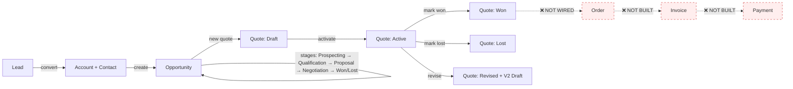
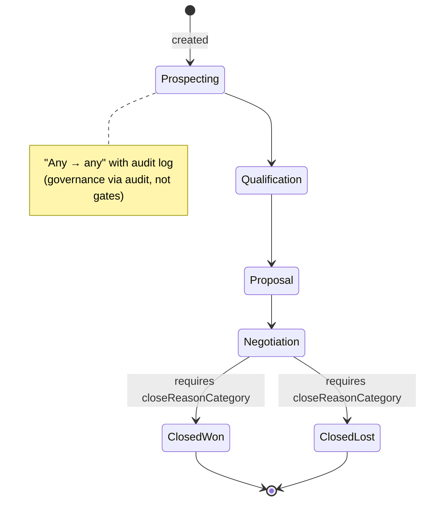
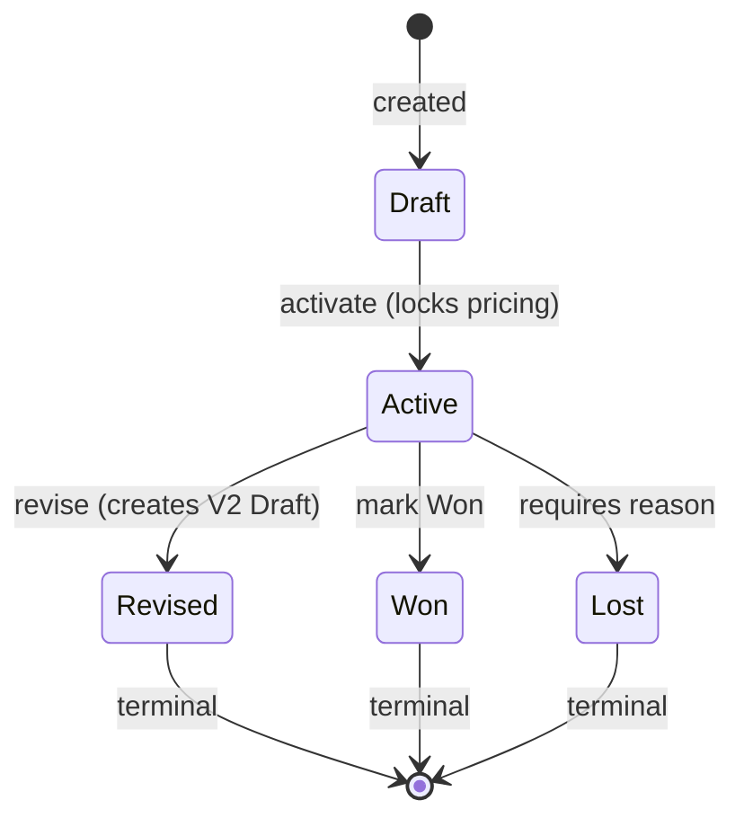
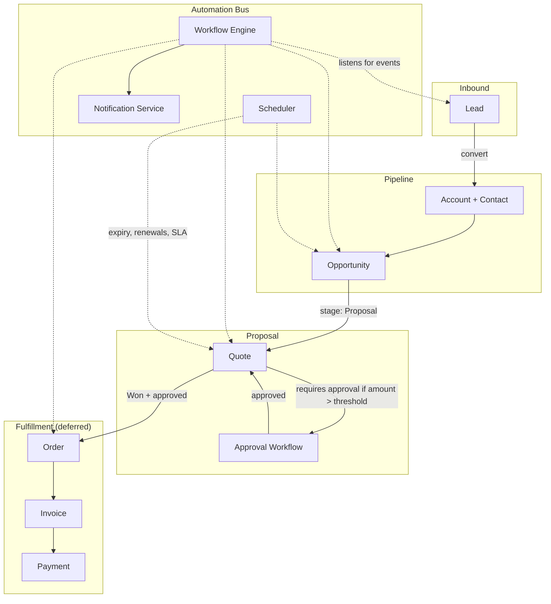

# QuikIT CRM — Workflow Architecture Audit

**Reviewer:** Senior CRM Solution Architect
**Date:** 2026-05-12
**Branch:** `refactor/quotes-feature-hardening`
**Scope:** end-to-end revenue pipeline (Lead → Account → Opportunity → Quote → [Order → Invoice]) and its supporting catalog (Product, Price List)

---

## 0. TL;DR — verdict

| Dimension | Verdict |
|---|---|
| **Funnel coverage** | ✅ Lead → Opportunity → Quote built. ❌ Order, Invoice, Payment missing. |
| **Workflow correctness** | ⚠️ State machines are sound *within* each entity. **State sync across entities is missing** — Quote Won doesn't update Opportunity probability; Opportunity ClosedLost doesn't auto-revise live quotes; expiry has no cron. |
| **Automation surface** | ❌ No declarative workflow engine. Every "if X then Y" lives in imperative service code. Not scalable past ~10 rules. |
| **Tenancy/security** | ✅ Hardened in this branch — tenant-isolation defects fixed. |
| **CRM-grade UX** | ⚠️ Catalog + quote-builder feel enterprise. Missing: discount approvals, e-sign, customer portal, audit timeline per record. |
| **Production readiness** | ❌ NOT yet — primarily because the **Won → Order → Invoice handoff doesn't exist**. The current "Won" status is a dead end; revenue doesn't actually book. |

**Headline:** Architecture is *structurally* correct (entity model + services + permission matrix + state machines all in the right shapes). The big risk is **state-sync drift across entities** — five real gaps documented in §4. Building those *before* PDF/email/Order is the right sequencing.

---

## 1. Current workflow — step by step

### 1.1 The pipeline (as built)



### 1.2 Entity flow — concrete walkthrough

A typical happy-path deal moves through these touchpoints:

| Step | Actor | System action | Audit row |
|---|---|---|---|
| 1 | Marketing / inbound | Create `CrmLead` | `CrmActivity{type:LeadCreated}` |
| 2 | Sales rep | Qualify, run scoring | `CrmLead.stage` updates |
| 3 | Sales rep | Click **Convert** | Single `prisma.$transaction`: creates `CrmAccount` (if new), `CrmContact`, optional `CrmOpportunity`; relinks `CrmActivity` / `CrmTask` / `CrmNote` / `CrmCallLog` to new Contact; writes `lead_convert_relink` audit |
| 4 | Sales rep | Progress opportunity stage | `crmOpportunityStageTransition` + `CrmActivity{type:OpportunityStageChange}` |
| 5 | Sales rep | **+ New quote** on opportunity | `prisma.$transaction`: validates `accountId` / `contactId` / `opportunityId` / `priceListId` belong to tenant → `CrmSequence` upsert (atomic counter) → `CrmQuote` row → optional seeded `CrmQuoteLine` rows → `recomputeQuoteTotals` → `CrmActivity{type:QuoteCreated}` |
| 6 | Sales rep | Add lines | Each line: ownership check on the parent quote → insert `CrmQuoteLine` → `recomputeQuoteTotals` (GST split, round-off, words) |
| 7 | Sales rep | **Activate** | `validateTransition(Draft → Active)` → mutates `CrmQuote.status`, sets `sentAt` → `CrmQuoteStatusTransition` + `CrmActivity` |
| 8 | Sales rep | **Send** (email) | `sendTransactionalEmail` driver-dispatched (console in dev, Resend slot in prod) → `markQuoteSent` updates `sentAt` (first-send wins) + `CrmActivity{type:QuoteSent, externalId:emailMessageId}` |
| 9 | Sales rep | **PDF** | Opens `/quotes/<id>/print?auto=1` → Server Component renders invoice-shaped HTML → `window.print()` → user "Save as PDF" |
| 10 | Sales rep | **Mark Won** | `validateTransition(Active → Won)` → `CrmQuote.status=Won`, `wonAt=now` → `CrmQuoteStatusTransition` + `CrmActivity{type:QuoteStatusChange}` |
| **11** | **🛑 STOPS HERE** | **No Order created. No Invoice. Revenue doesn't book.** | — |

### 1.3 State machines (per entity)

**Opportunity** (`lib/services/opportunities/transition-service.ts`):



**Quote** (`lib/services/quotes/transition-service.ts`):



Both state machines are **clean**, audit-emitting, transactional. **Within** each entity, the workflow is correct.

---

## 2. Issues found (severity-ranked)

| # | Severity | Issue | Evidence |
|---|---|---|---|
| **W-1** | 🔴 CRITICAL | **Won quote doesn't update Opportunity probability** — spec §5 required Won quote → `Opportunity.probability=100`, Lost quote → `probability=0` | Grep: `crmOpportunity.update` is never called from `lib/services/quotes/*` |
| **W-2** | 🔴 CRITICAL | **Quote Won is a dead end** — no Order created, no Invoice generated, revenue doesn't book | Spec Q12 (Convert Quote → Order) is deferred; no `CrmOrder` model exists |
| **W-3** | 🟠 HIGH | **No quote-expiry automation** — `effectiveTo` is stored but no cron auto-marks expired Active quotes. Customers can return to stale pricing | No `cron`, `scheduler`, or interval-based job code found anywhere in the app |
| **W-4** | 🟠 HIGH | **Currency mismatch between Quote and PriceList not validated** — bind a USD price list to an INR quote and prices misalign without warning | `addPriceListItem` / `updateQuote` validators don't compare `quote.currency` vs `priceList.currency` |
| **W-5** | 🟠 HIGH | **Opportunity ClosedLost doesn't auto-handle live quotes** — a deal dies but its Active quotes stay Active | No reverse-sync from Opportunity transitions back to its Quotes |
| **W-6** | 🟡 MEDIUM | **No discount approval workflow** — `discountPct` on a line has no gating. Spec §8 thresholds (₹1L / ₹10L / ₹1Cr) for quote approval also not built | `assertModule` is binary; no role+amount routing |
| **W-7** | 🟡 MEDIUM | **No declarative workflow engine** — every "if X then Y" is hand-coded in services. Adding a new rule ("when quote sits in Active >30 days, alert owner") requires code+deploy | No automation/workflow tables; no rule-runner |
| **W-8** | 🟡 MEDIUM | **Quote header changes don't write activity rows** — only status transitions + create do. Editing terms, discount, freight is silent in the audit timeline | `updateQuote` writes nothing to `CrmActivity` |
| **W-9** | 🟡 MEDIUM | **Line item add/edit/delete missing from activity timeline** — `addQuoteLine`/`updateQuoteLine`/`deleteQuoteLine` mutate but don't log | Same pattern as W-8 |
| **W-10** | 🟢 LOW | **No revision history viewer** — `parentQuoteId` chain exists in the schema but the UI doesn't render it. Reps can't see V1 vs V2 side-by-side | No `<RevisionTimeline>` or similar component |
| **W-11** | 🟢 LOW | **`Lead.convertedAt` and `Lead.linkedContactId` reset on contact delete but no warning before destruction** | `app/api/contacts/[id]/route.ts::DELETE` does the cascade silently |
| **W-12** | 🟢 LOW | **Price list `effectiveFrom` / `effectiveTo` not enforced at quote-line resolution time** — an expired list still resolves prices | `resolvePriceForProduct` filters by `productId`+`priceListId`+`minQuantity` but not by date bounds |

---

## 3. CRM comparison table

Detailed feature parity matrix vs the 5 reference platforms. ✅ = first-class. ⚠️ = partial / via add-on. ❌ = absent.

| Capability | Salesforce CPQ | HubSpot | Zoho CRM | D365 Sales | Odoo CRM | **QuikIT** |
|---|:---:|:---:|:---:|:---:|:---:|:---:|
| **Lead management** |
| Lead capture forms + scoring | ✅ | ✅ | ✅ | ✅ | ✅ | ✅ |
| Lead → Account/Contact/Opp convert | ✅ | ✅ | ✅ | ✅ | ✅ | ✅ |
| Auto-routing / round-robin | ✅ | ✅ | ✅ | ✅ | ✅ | ❌ |
| **Opportunity** |
| Multi-stage pipeline | ✅ | ✅ | ✅ | ✅ | ✅ | ✅ |
| Stage entry/exit criteria | ✅ | ⚠️ | ✅ | ✅ | ✅ | ⚠️ (audit-only) |
| Probability auto-update from Quote | ✅ | ✅ | ✅ | ✅ | ✅ | **❌ W-1** |
| Stuck-deal / no-activity alerts | ✅ | ✅ | ✅ | ✅ | ⚠️ | ✅ |
| **Catalog** |
| Product master | ✅ | ✅ | ✅ | ✅ | ✅ | ✅ |
| Price lists / books | ✅ | ⚠️ (tiers in product) | ✅ | ✅ | ✅ | ✅ |
| Volume / qty-bracket pricing | ✅ | ⚠️ | ✅ | ✅ | ✅ | ✅ |
| Bulk CSV import | ✅ | ✅ | ✅ | ✅ | ✅ | ❌ |
| **Quote** |
| Quote builder w/ line items | ✅ | ✅ | ✅ | ✅ | ✅ | ✅ |
| Auto-numbering w/ year reset | ✅ | ✅ | ✅ | ✅ | ✅ | ✅ |
| Status workflow + audit | ✅ | ✅ | ✅ | ✅ | ✅ | ✅ |
| Versioning (revise → V2) | ✅ | ✅ | ✅ | ✅ | ✅ | ✅ |
| Clone | ✅ | ✅ | ✅ | ✅ | ✅ | ✅ |
| Multi-currency | ✅ | ✅ | ✅ | ✅ | ✅ | ❌ INR-only |
| GST/Indian tax | ⚠️ paid add-on | ❌ | ⚠️ India ed. | ⚠️ | ✅ India loc. | ✅ **native** |
| **Discount/approval** |
| Discount approval matrix | ✅ | ⚠️ | ✅ | ✅ | ⚠️ | **❌ W-6** |
| Multi-level approval routing | ✅ | ⚠️ | ✅ | ✅ | ✅ | ❌ |
| **Send/sign** |
| PDF generation | ✅ | ✅ | ✅ | ✅ | ✅ | ⚠️ browser-print |
| Email integration | ✅ | ✅ | ✅ | ✅ | ✅ | ⚠️ console driver |
| E-signature | ✅ | ✅ | ✅ | ✅ | ✅ | ❌ |
| Customer self-serve portal | ✅ | ✅ | ✅ | ✅ | ⚠️ | ❌ |
| **Downstream** |
| Quote → Order auto-create | ✅ | ✅ | ✅ | ✅ | ✅ | **❌ W-2** |
| Order → Invoice | ✅ | ✅ | ✅ | ✅ | ✅ | ❌ |
| Revenue recognition | ✅ | ⚠️ | ✅ | ✅ | ✅ | ❌ |
| Renewal auto-triggers | ✅ | ✅ | ✅ | ✅ | ✅ | ❌ |
| **Automation** |
| Declarative workflow engine | ✅ Flow | ✅ Workflows | ✅ Blueprint | ✅ Power Automate | ✅ Studio | **❌ W-7** |
| Cron / scheduled actions | ✅ | ✅ | ✅ | ✅ | ✅ | **❌ W-3** |
| Email templates per tenant | ✅ | ✅ | ✅ | ✅ | ✅ | ❌ |
| PDF templates per tenant | ✅ | ✅ | ✅ | ✅ | ✅ | ❌ |
| **Audit / reporting** |
| Per-record activity timeline | ✅ | ✅ | ✅ | ✅ | ✅ | ⚠️ partial (W-8, W-9) |
| Per-field change log | ✅ | ⚠️ | ✅ | ✅ | ✅ | ⚠️ (via `CrmAuditLog` but inconsistent) |
| Dashboards & forecasting | ✅ | ✅ | ✅ | ✅ | ✅ | ⚠️ basic |
| **Platform** |
| Tenant isolation | n/a (SF orgs) | n/a | n/a | n/a | n/a | ✅ (hardened) |
| Idempotency keys | ✅ | ✅ | ✅ | ✅ | ⚠️ | ❌ |
| Optimistic concurrency | ✅ | ✅ | ✅ | ✅ | ✅ | ❌ |

**Where QuikIT stands out (parity++):** native CGST/SGST/IGST + Indian-numbering grand-total-in-words is *better than* Salesforce/HubSpot baseline — they require paid India localisation add-ons.

**Where QuikIT is structurally behind:** no workflow engine, no cron, no Order/Invoice, no e-sign. These aren't fixable with field tweaks — they need new architectural primitives.

---

## 4. Optimized workflow architecture (target state)

### 4.1 Event-driven revenue pipeline



### 4.2 The 6 architectural primitives the codebase is missing

| # | Primitive | Why it matters | Effort |
|---|---|---|---|
| P-1 | **Domain event bus** — entities emit typed events (`QuoteActivated`, `OpportunityClosed`, `LeadConverted`) | Cleans up the state-sync gaps (W-1, W-5). One emitter, many listeners — adding "ping Slack on Won" never touches the quote service | 3–5 days |
| P-2 | **Declarative workflow engine** — rules stored in DB as `{ event, conditions, actions }` | Fixes W-7. Sales ops can add "30-day reminder" without dev | 8–12 days |
| P-3 | **Scheduler (cron worker)** — runs periodic jobs (expiry, no-activity, renewals) | Fixes W-3, W-12 | 3–4 days (BullMQ already a dep) |
| P-4 | **Approval workflow table** — `(approverRole, minAmount, maxAmount, sequence)` matrix | Fixes W-6, spec §8 | 4–6 days |
| P-5 | **Optimistic concurrency** — `version Int` on every editable entity | Prevents lost-update races (Salesforce-grade) | 2–3 days |
| P-6 | **Order + Invoice domain** — even minimal: `CrmOrder` + `CrmInvoice` with `quoteId`/`orderId` links | Fixes W-2. Spec Q12 was scoped to "skeleton" | 5–7 days |

### 4.3 Event taxonomy (proposed)

A single `CrmDomainEvent` table receives every cross-entity event:

```sql
CrmDomainEvent {
  id, tenantId, kind, sourceEntity, sourceId,
  payload Json, occurredAt, processedAt, attempts
}
```

| Event `kind` | Emitted by | Consumed by |
|---|---|---|
| `LeadConverted` | `lead-service.convert` | Activity log, analytics, marketing-sync |
| `OpportunityStageChanged` | `opportunity-service.transition` | Sync probability, alert owner if stuck |
| `QuoteCreated` | `quote-service.create` | Forecast roll-up, opportunity touch |
| `QuoteActivated` | `quote-service.transition Draft→Active` | Approval check (P-4), expiry timer (P-3) |
| `QuoteSent` | `send route` | Customer analytics, follow-up scheduler |
| `QuoteWon` | `quote-service.transition Active→Won` | **→ Opportunity probability=100 (fixes W-1)**, → Order create (fixes W-2) |
| `QuoteLost` | `quote-service.transition Active→Lost` | Opportunity probability=0, sentiment analysis |
| `QuoteExpired` | scheduler (P-3) | Mark Lost, notify owner |
| `OrderCreated` | `order-service.create` | Invoice scheduler |
| `InvoiceIssued` | `invoice-service.create` | Payment tracker |

This is the **single most important** architectural addition. Without it, every new cross-cutting concern adds an `await foo()` line in unrelated services — that's what produces the 5 state-sync gaps.

---

## 5. Best practices recommendations

### 5.1 Scalability
- **Read-side**: cache `PriceListItem` map per quote (already done in this branch's GET response). Cache `CrmCompanyProfile` per tenant (rarely changes, hit on every PDF).
- **Write-side**: domain events flow through a queue (BullMQ — already a workspace dep). Idempotency keys on POST endpoints prevent retry-storms.
- **Hot tables**: index `(tenantId, status)` on `CrmQuote` (✅ done), `(tenantId, occurredAt)` on `CrmDomainEvent`.

### 5.2 Automation
- **Declarative > imperative** for cross-entity rules. Adding "when quote sits Active for 7 days, ping owner on Slack" should be a row insert, not a code deploy.
- **Templated email + PDF** per tenant — workspace settings store HTML/CSS, render through one engine.
- **Bulk operations** matter — multi-select on lists for status-change, reassign, export. Even a per-tenant CSV import for products is a top-3 admin ask.

### 5.3 Maintainability
- **Audit everywhere** — the activity timeline should answer "who, what, when, where". W-8/W-9 fixes that.
- **Service-layer single-source-of-truth** for math (already done with `totals.ts` — 26 tests).
- **One-place permission matrix** — `lib/auth/permissions.ts` is the right pattern; extend with field-level masking for the 4 sensitive Quote fields (cost, margin, internal notes, owner ID) on lower roles.
- **Schema migrations land separately** from app code — already a CLAUDE.md rule, keeps deploys ratcheted.

### 5.4 Security / tenancy
- **Tenant on every `where`** — fixed in this branch (4 critical defects closed).
- **Row-level cross-checks** when an entity references another (e.g. `quote.accountId` must belong to tenant on every read, not just on create).
- **`CrmAuditLog` for sensitive ops** — already in service.

### 5.5 Observability
- **Structured logs** instead of `console.error(...)` — include `tenantId`, `userId`, `requestId`.
- **Domain event count per kind per day** as a tenant-level metric — surfaces "deals stuck at Negotiation" before sales ops asks.
- **PDF render time + email-bounce rate** as platform metrics.

---

## 6. Phased remediation roadmap

| Phase | Scope | Time |
|---|---|---|
| **Phase 2A — State sync** | W-1 (Quote Won → Opp prob), W-5 (Opp Lost → Quote auto-revise), W-12 (expiry date enforcement in price resolver) | 3–4 days |
| **Phase 2B — Event bus + scheduler** | P-1 + P-3 + W-3 (expiry cron) + W-8 + W-9 (activity-row emitter as a single event consumer) | 1.5–2 weeks |
| **Phase 2C — Order + Invoice skeleton** | P-6 + Quote Won → auto-Order (W-2) | 1 week |
| **Phase 3A — Workflow engine** | P-2 + admin UI for rule authoring | 2.5–3 weeks |
| **Phase 3B — Approval matrix** | P-4 + UI for threshold config + approver routing | 1.5 weeks |
| **Phase 3C — Optimistic concurrency** | P-5 across Quote / Opportunity / Account | 3–4 days |
| **Phase 4 — Customer-facing** | E-sign, customer portal, multi-currency, per-tenant PDF/email templates | 4–6 weeks |

**Critical path to "real CRM":** Phase 2A + 2B + 2C = **~4 weeks**. After that the funnel actually closes — quotes turn into orders turn into invoices.

---

## 7. The CRM-Workflow-Auditor subagent

Designed and shipped at `.claude/agents/crm-workflow-auditor.md`. Invocable from this session or any future Claude Code session via the Agent tool. Spec for the agent itself is documented in that file; this section explains the *why*.

### 7.1 Why a subagent vs a runtime checker

| Option | When it fits | Why we chose subagent |
|---|---|---|
| **Runtime daemon** (cron job inside the app) | Continuous monitoring, drift alerts | Adds infrastructure, needs schema, needs alert routing — premature for current scale |
| **CI step** (run on every PR) | Catches regressions before merge | Useful long-term, but the agent has to be invocable interactively first |
| **Claude Code subagent** ⭐ | On-demand audits during dev / pre-release | Zero infra. Reads code + schema. Produces markdown report. Reusable across all monorepo apps |

We start with the subagent. Add CI integration later (it's the same prompt, different trigger).

### 7.2 What the agent does

The auditor performs a **5-pass scan** of the CRM workflow surface, with each pass producing a section in its output report:

1. **Pass 1 — Entity inventory.** Glob `lib/services/**/*.ts` + parse schema. Build the entity graph: which models exist, which relations are typed vs bare-string, which states each has.
2. **Pass 2 — State-machine integrity.** For each entity with a `status` / `stage` field, locate its transition service. Verify every status enum value has at least one transition path in or out. Flag dead states.
3. **Pass 3 — Cross-entity sync detection.** Search the codebase for places where one entity's mutation *should* trigger another (per a rubric of well-known CRM patterns). Flag gaps. This is how W-1 / W-5 surface today.
4. **Pass 4 — Industry-CRM parity.** Match observed capabilities against an embedded rubric of Salesforce / HubSpot / Zoho / D365 / Odoo standards. Score parity 0–100 per category.
5. **Pass 5 — Architectural smell scan.** Check for: missing optimistic-concurrency fields, missing tenant filters on `update`/`delete`, raw `console.error` instead of structured logs, hardcoded thresholds (should be config-driven), missing audit emissions, missing indexes on `(tenantId, status)` and `(tenantId, deletedAt)`.

### 7.3 Output

A markdown report at a caller-specified path (default `apps/<app>/crm-workflow-audit-<date>.md`), with:

- Executive summary (severity-counted)
- Findings table (severity, evidence with file:line refs)
- CRM comparison delta vs reference rubric
- Recommendations sorted by ROI (impact / effort)
- Optional: a "before vs ideal" diff for any specific entity the caller names

### 7.4 How to run it

From any Claude Code session in this repo:

> "Run the CRM workflow auditor on the Quotes module and write the report to `apps/quikcrm/audit-quotes.md`."

The auditor's full prompt + rubric live in [`.claude/agents/crm-workflow-auditor.md`](.claude/agents/crm-workflow-auditor.md). It uses read-only tools (Read, Grep, Glob, Bash for tree-walking) — never edits code on its own; recommendations come back as actionable text the caller can implement.

---

## 8. Sign-off

| Question | Verdict |
|---|---|
| Is the workflow *structurally* correct within each entity? | ✅ Yes |
| Is cross-entity state sync correct? | ❌ No (W-1, W-5, W-12) |
| Is the platform automation-ready? | ❌ No primitives (P-1 → P-7) |
| Is the catalog + quoting flow CRM-grade? | ⚠️ Functional + native GST. Missing PDF/email infra, approvals, e-sign |
| Will the current architecture scale to multi-tenant SaaS? | ✅ Tenant isolation hardened. Performance acceptable to ~10k quotes/tenant. Beyond that → cache + read replicas |
| Is the data model correct for the next 2 years of features? | ✅ Yes — `CrmQuote.parentQuoteId` chain + `CrmSequence` + `CrmDomainEvent` (proposed) cover versioning / numbering / event sourcing |

**Recommend: build Phase 2A + 2B (state sync + event bus + scheduler) before any new feature work.** The event bus retroactively fixes 5 of the 12 findings; everything else gets cheaper after it lands.

Generated by the senior-CRM-architect review pass on `refactor/quotes-feature-hardening`. Companion subagent: [`.claude/agents/crm-workflow-auditor.md`](.claude/agents/crm-workflow-auditor.md).
