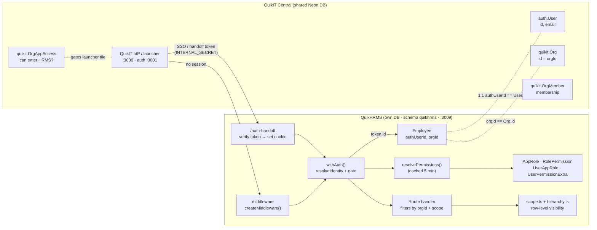
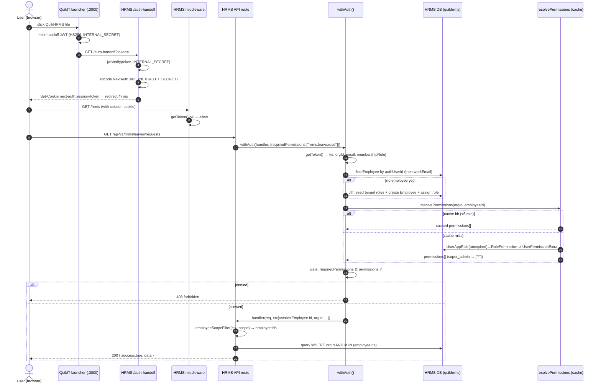
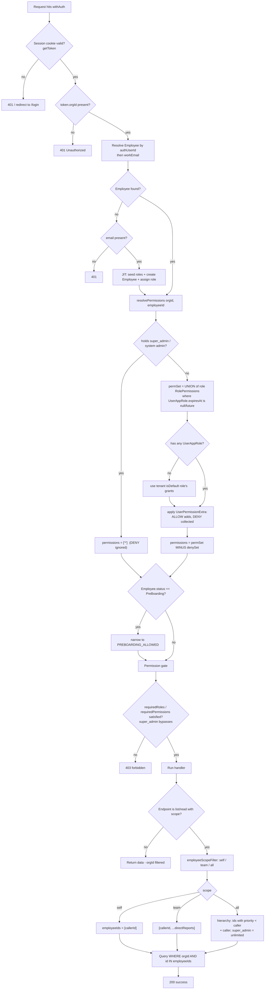
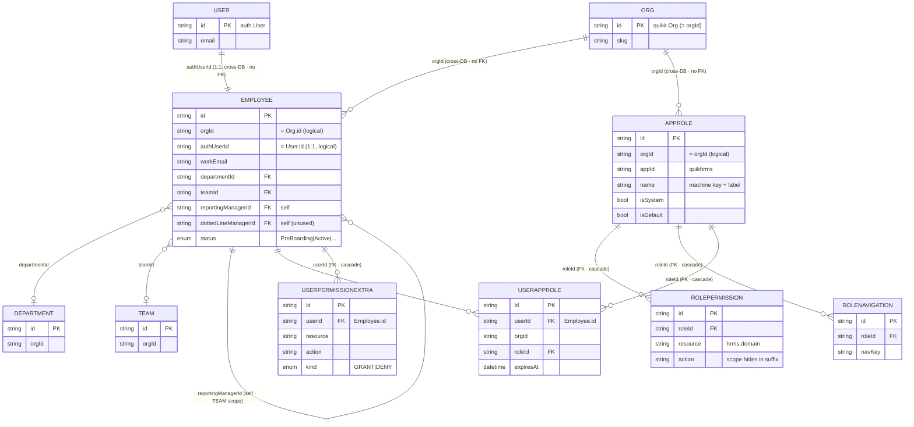
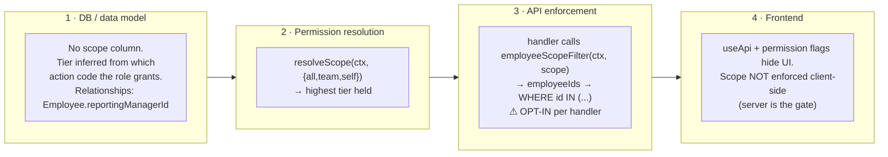
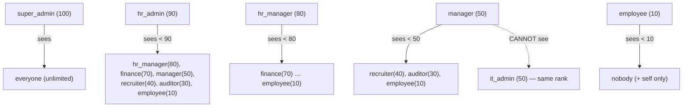
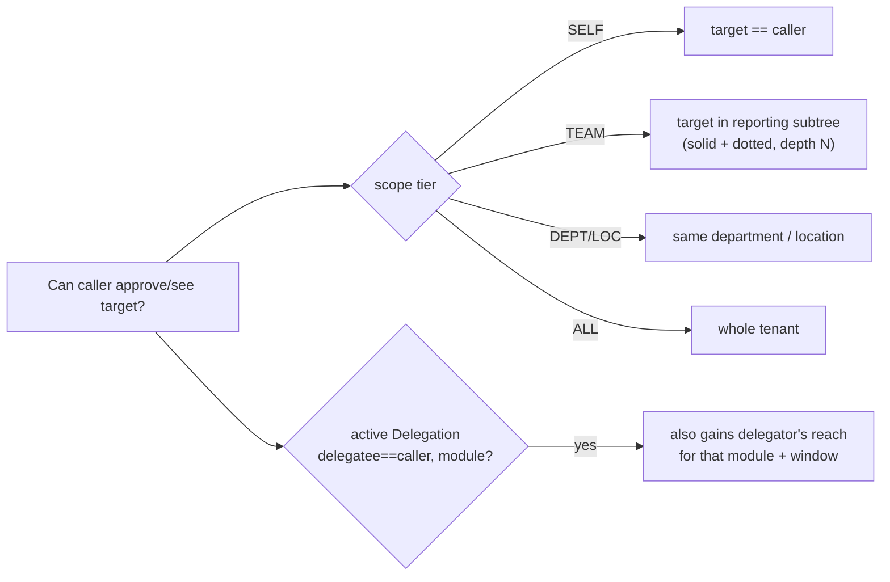
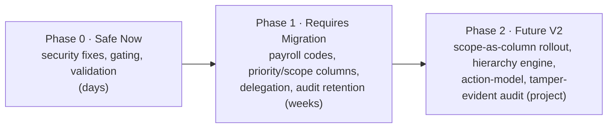

# QuikHRMS — Roles & Permissions Architecture

> **Status:** Living architecture document. Reflects code shipped on branch
> `feature/hrms-central-sso` as of 2026-06-03.
> **Source of truth:** the actual Prisma schema + implementation in
> `apps/quikhrms`. The QuikScale `14-roles-and-permissions.md` and the DB
> screenshots are *reference only* — where they disagree with HRMS code, the
> code wins and the divergence is documented.
> **Audience:** written for both a senior engineer (every claim cites a file)
> and a non-technical stakeholder (each section opens with a plain-English
> summary).

---

## How recommendations are classified

Every recommendation in this document is tagged with exactly one gap class so
you can prioritise by *type of risk*, not just severity:

| Tag | Class | Meaning |
|---|---|---|
| **① DOC** | Documentation Gap | Code is correct; docs/comments are wrong or stale. Lowest risk — fix the words. |
| **② IMPL** | Implementation Gap | Docs/intent are correct; code does the wrong thing. A bug to fix. |
| **③ ARCH** | Architecture Gap | Both work today, but the design will be cleaner/more maintainable changed. |
| **④ SEC** | Security Gap | A possible vulnerability or authorization weakness. |
| **⑤ SCALE** | Scalability Gap | Works now; will degrade at higher tenant/employee/role counts. |

Full classified recommendations live in **§9 Gap Analysis** and **§10 Final
Recommendations**, split into **Safe Now / Requires Migration / Future V2** with
**Low/Med/High** effort estimates. Earlier sections surface findings inline and
tag them, but defer the prioritised plan to §9–§10.

---

## Document sections

1. **Current State Analysis** ← *this section*
2. RBAC Flow
3. Table Analysis
4. Permission Catalog
5. Scope Model
6. Hierarchy Model
7. Payroll Security
8. Audit Design
9. Gap Analysis
10. Final Recommendations

---

# Section 1 — Current State Analysis

## 1.1 Plain-English summary

QuikHRMS does **not** run its own login. A person's identity lives centrally in
QuikIT (`auth.User`), the company they belong to lives in QuikIT (`quikit.Org`),
and *what they can click inside HRMS* lives in HRMS's own database
(`quikhrms` schema). When someone signs in through QuikIT and opens HRMS, HRMS
finds (or auto-creates) their **Employee** record and then answers every "can
this person do X?" by reading that employee's **roles** and **personal
grants** — exactly the QuikScale "Dynamic Roles v2" model, adapted for an HR
system whose central entity is the Employee.

The one structural difference from every other QuikIT app: QuikScale/QuikTrack
have *no* per-app person table — they hang permissions directly off the central
`User.id`. HRMS *must* keep an `Employee` (it holds department, manager, salary,
leave, payroll — data that doesn't exist centrally). So HRMS keys its RBAC on
**`Employee.id`**, with the employee linked 1:1 to the central user via
`Employee.authUserId`.

## 1.2 The three-layer identity model (as built)

```
 CENTRAL (QuikIT, shared Neon DB)                 HRMS (own DB, schema "quikhrms")
 ┌───────────────────────────────┐                ┌──────────────────────────────────┐
 │ auth.User    { id, email }     │                │ Employee { id, orgId,           │
 │ quikit.Org   { id = orgId }    │   SSO + JIT    │           authUserId, workEmail,   │
 │ quikit.OrgMember (membership)  │  ───────────▶  │           ...HR data... }          │
 │ quikit.OrgAppAccess (can enter │                │   linked: authUserId == User.id    │
 │   HRMS?)                       │                │   tenant:  orgId == Org.id      │
 └───────────────────────────────┘                └──────────────────────────────────┘
```

- **Identity** = central `auth.User`. HRMS has no passwords (the entire custom
  auth stack was removed in the SSO migration; see `src/lib/auth.ts`,
  `src/app/auth-handoff/route.ts`).
- **Tenant** = `orgId` on every HRMS row, equal to the central `Org.id`
  (`AppRole.orgId ← orgId`, asserted in
  `src/lib/rbac/registry.ts`). Every query filters by `orgId`.
- **Employee** = the HR profile of a central user, 1:1 via
  `Employee.authUserId` (`src/lib/with-auth.ts → resolveEmployeeByAuthUser`).
  RBAC keys on `Employee.id`, **not** `User.id`.

## 1.3 The RBAC tables (as built, in `quikhrms`)

HRMS mirrors QuikScale's five-table design (`apps/quikhrms/prisma/schema.prisma`):

| Table | Role in HRMS | Notable vs QuikScale reference |
|---|---|---|
| **`AppRole`** | A named role per `(orgId, appId)` — `super_admin`, `hr_admin`, … | `appId` is the constant `"quikhrms"`. **No `priority` column** — priority is a static code map (see §1.6). |
| **`RolePermission`** | A `(resource, action)` grant on a role | **No `scope` column** — scope is encoded in the *action suffix* (`read_self`, `read_team`). |
| **`UserAppRole`** | Assigns an **Employee** to a role | `userId` → **`Employee.id`** (QuikScale: `User.id`). **Has `expiresAt`** — time-boxed role assignments (QuikScale has none). |
| **`UserPermissionExtra`** | Per-user override | **Has `kind` = ALLOW \| DENY** — can *subtract* a grant (QuikScale extras are add-only). |
| **`RoleNavigation`** | Per-role sidebar whitelist | Exists as a table (QuikScale derives nav purely from `view` permissions, no table). |

> **Code-vs-reference note:** the QuikScale doc says "extras can only add, never
> subtract" and "there is no deny row." HRMS **diverges** — `UserPermissionExtra`
> carries a `kind` and the resolver honours `DENY`. This is intentional in HRMS
> and is treated as current state, not a defect.

## 1.4 The permission code format (as built)

- Codes are flat strings of the form **`hrms.<domain>.<action>`**, e.g.
  `hrms.leave.approve`, `hrms.payroll.process`, `hrms.employee.read_self`.
- Stored split into two columns: `resource` = everything before the **last**
  dot, `action` = the last segment (`src/lib/rbac/registry.ts → splitCode` /
  `joinCode`). So `hrms.leave.approve` → `resource:"hrms.leave"`,
  `action:"approve"`.
- The canonical catalog (~85 codes across 18 domains) and the 9 default roles
  live in `src/lib/rbac/permissions.ts` (`PERMISSIONS`, `DEFAULT_ROLES`,
  `COMMON_SELF`). The grantable tree for the admin UI is
  `src/lib/rbac/permissions-tree.ts`.

> **Scope is baked into the action name, not stored.** `read`, `read_self`,
> `read_team` are three *different actions* on the same resource — that's how
> HRMS expresses SELF/TEAM/ALL today. There is no `scope` column. (Detailed in
> §5.) — **③ ARCH** candidate, analysed later.

## 1.5 The permission-resolution algorithm (as built)

The authoritative resolver is `resolvePermissions(orgId, userId)` in
`src/lib/with-auth.ts`. Effective permissions are computed as:

```
            ┌─ roles = UserAppRole rows for (employee, org) WHERE expiresAt IS NULL OR > now
            │         └─ each role's RolePermission rows  ──► permSet (UNION)
EFFECTIVE = │
            ├─ extras = UserPermissionExtra rows for (employee, org)
            │         ├─ kind = ALLOW  ──► add to permSet
            │         └─ kind = DENY   ──► collect into denySet
            │
            ├─ if the user holds super_admin (or a system "admin" role):
            │         ──► return ["*"]   (DENY is ignored — cannot self-lock-out)
            │
            └─ else: permSet MINUS denySet   ──► effective codes
```

Equivalently, in the form you specified:

```
Role Permissions  +  Extra Allow  −  Extra Deny  +  Super-Admin Override  +  Scope Evaluation
```

Additional behaviours layered on top in `withAuth()` itself (not in the pure
resolver):

- **Default-role fallback** — an employee with *zero* `UserAppRole` rows inherits
  the tenant's `isDefault` role's permissions (so a logged-in employee is never
  a blanket 403).
- **PreBoarding narrowing** — if `Employee.status === "PreBoarding"`, the
  effective set is filtered down to a hardcoded onboarding allowlist
  (`PREBOARDING_ALLOWED`).
- **mustChangePassword lockout** — legacy custom-auth field; still gates routes
  to change-password/logout/me when set. (Largely vestigial post-SSO.)
- **5-minute cache** — results are cached per `(orgId, employeeId)` for 300s
  (`cacheKeys.permissions`), invalidated via `invalidatePermissionCache`.

Scope (SELF/TEAM/ALL) is resolved **separately**, at the data layer, by
`src/lib/rbac/scope.ts` + `src/lib/rbac/hierarchy.ts` — not inside
`resolvePermissions`. A route checks the *permission* (e.g. `hrms.leave.read`)
in `withAuth`, then narrows the *rows returned* by scope. (Detailed in §5–§6.)

## 1.6 Role priority & hierarchy (as built)

- `AppRole` has **no `priority` column**. Priority is a static map keyed by role
  name in `src/lib/rbac/registry.ts` (`ROLE_PRIORITY`, sourced from
  `DEFAULT_ROLES[].priority`): `super_admin:100, hr_admin:90, hr_manager:80,
  finance_admin:70, manager:50, it_admin:50, recruiter:40, auditor:30,
  employee:10`.
- `src/lib/rbac/hierarchy.ts` builds the set of employees a caller may see under
  `"all"` scope using **strictly-lower** priority: an employee is visible iff
  their max role priority `< caller's priority` (plus the caller themselves).
  **Same-level peers are invisible** to each other. (Two `manager`s, or two
  `hr_admin`s, cannot see each other's data under `all` scope; `self`/`team`
  follow the reporting line instead.) — flagged for review in §6.

## 1.7 API enforcement (as built)

`withAuth(handler, options)` in `src/lib/with-auth.ts` is the single route
wrapper. Order of operations:

1. **Identity** — `resolveIdentity` reads the NextAuth session cookie
   (`getToken`), maps `token.orgId → orgId` and central `token.id → Employee.id`
   via `authUserId` (JIT-provisioning the employee on first login —
   `src/lib/rbac/provisioning.ts`). Non-prod dev-header fallback
   (`x-tenant-id`/`x-user-id`) is retained for local tooling.
2. **Rate limiting** — a global per-tenant ceiling (300/60s) plus optional
   route-declared limits (`by: user|tenant|ip`).
3. **Permission/role gate** — `requiredRoles` (OR match) and/or
   `requiredPermissions` (AND by default; OR when `anyPermission` or a single
   permission). `super_admin`/`["*"]` bypasses the gate.
4. **Handler** — receives `AuthContext { userId(=Employee.id), orgId, roles,
   permissions, roleCode }`; still expected to filter every query by `orgId`
   (defence in depth) and apply scope via `scope.ts` where row-level visibility
   matters.

Query helpers in `src/lib/rbac/queries.ts` (`whereEmployeeHasAnyRole`, etc.) and
the super-admin floor guard in `src/lib/rbac/guards.ts`
(`ensureSuperAdminRemains`) round out the surface.

## 1.8 What is good (keep unchanged)

- **Single resolver, single wrapper.** One `resolvePermissions` + one
  `withAuth` — no scattered ad-hoc checks. Easy to reason about and test.
- **No admin bypass by special-casing routes.** `super_admin` is powerful
  because it resolves to `["*"]`, not because handlers special-case it. One code
  path for everyone (matches QuikScale's principle).
- **Union semantics + per-user overrides** are correct and match the platform
  model; the **DENY** capability is a genuine improvement over QuikScale's
  add-only extras.
- **Tenant isolation is pervasive** — `orgId` on every model and query;
  `orgId == orgId` keeps it aligned with the central Org.
- **Time-boxed roles (`expiresAt`)** and the **default-role fallback** are
  thoughtful additions that the reference lacks.
- **DB-resolved per request (5-min cache).** Grant edits take effect quickly; no
  JWT invalidation needed.

## 1.9 What is weak / risky (surfaced here, analysed in §9)

Stated as current-state observations; each is fully classified + prioritised in
§9–§10.

- **Scope-in-action-name** (`read`/`read_self`/`read_team`) couples *what* with
  *whose* and triples the action vocabulary. — **③ ARCH**
- **PreBoarding allowlist drift** — `PREBOARDING_ALLOWED` in `with-auth.ts`
  references codes absent from the registry (`hrms.policy.read`,
  `hrms.holiday.read`, `hrms.announcement.read`, `hrms.notification.read_self`),
  so PreBoarding employees silently can't reach those. — **② IMPL**
- **Orphan permissions** — registry/tree/roles ship `hrms.roster.*` etc. that
  may lack matching routes (and vice-versa: routes that don't assert a
  permission). Needs an audit. — **② IMPL** / **④ SEC**
- **`resource`/`action` are open strings** with no DB or compile-time validation
  against the registry; a typo grants nothing and silently 403s. — **④ SEC**
- **Strictly-lower hierarchy** means peer HR admins can't see each other under
  `all` scope — likely surprising; confirm intent. — **③ ARCH**
- **No first-class audit trail for RBAC changes** (who granted/revoked which
  role/permission, when) beyond generic logging. — **④ SEC** / compliance.
- **`getHierarchyAccessibleEmployeeIds` materialises the full tenant
  employee+role set per request** to compute visibility — fine at hundreds,
  costly at tens of thousands. — **⑤ SCALE**

## 1.10 How HRMS differs from the QuikScale reference (summary table)

| Dimension | QuikScale (reference) | QuikHRMS (as built) | Source of truth |
|---|---|---|---|
| Person key for RBAC | central `User.id` | **`Employee.id`** (1:1 to User via `authUserId`) | `schema.prisma`, `with-auth.ts` |
| Scope (self/team/all) | not modelled | encoded in **action suffix** | `permissions.ts`, `scope.ts` |
| Per-user extras | add-only | **ALLOW / DENY** | `UserPermissionExtra.kind`, `with-auth.ts` |
| Time-boxed roles | none | **`UserAppRole.expiresAt`** | `schema.prisma`, `with-auth.ts` |
| Role priority/hierarchy | none | static map + **strictly-lower** visibility | `registry.ts`, `hierarchy.ts` |
| Sidebar nav | derived from `view` perms | dedicated **`RoleNavigation`** table | `schema.prisma` |
| Code format | `Resource:action` (dot-namespaced resource) | `hrms.<domain>.<action>` split into resource+action | `registry.ts` |
| First-login provisioning | invite creates User+OrgMember+role | **JIT** Employee + role on first SSO hit | `provisioning.ts` |

---

*End of Section 1.*

---

# Section 2 — RBAC Flow

## 2.1 Plain-English summary

A request travels through a fixed chain. **Identity** comes from QuikIT (the
NextAuth session cookie). HRMS turns that central identity into an **Employee**
(creating one on first login). It reads the **tenant** from the token, gathers
the employee's **roles**, folds those into an effective **permission** set
(plus per-user allow/deny), checks the route's required permission, and finally
— for list/read endpoints — narrows *which rows* the user sees by **scope**
(self / team / all). If any link fails, the request stops with a specific
status. Two distinct questions are answered in two places: **"may you call this
endpoint?"** (permission gate, in `withAuth`) and **"whose records may you
see?"** (scope, in the handler via `scope.ts`).

## 2.2 The seven stages (as built)

| # | Stage | Where | Outcome / failure |
|---|---|---|---|
| 1 | **Login / session** | `@quikit/auth/middleware` + `/auth-handoff` | No session → bounce to `/login` → `signIn("quikit")` |
| 2 | **Employee resolution** | `resolveIdentity` → `resolveEmployeeByAuthUser` (`with-auth.ts`) | central `User.id` → `Employee.id`; JIT-create if absent; no email → 401 |
| 3 | **Tenant resolution** | `token.orgId → orgId` (`with-auth.ts`) | No `orgId` → 401 |
| 4 | **Role resolution** | `UserAppRole` (unexpired) → roles; fallback to `isDefault` role | empty → default role; none → empty set |
| 5 | **Permission resolution** | `resolvePermissions` (`with-auth.ts`, cached 5 min) | `roles ∪ allow − deny`; `super_admin → ["*"]`; PreBoarding narrowing |
| 6 | **Permission gate** | `withAuth` `requiredRoles` / `requiredPermissions` | not satisfied → 403 |
| 7 | **Scope evaluation** | handler → `scope.ts` / `hierarchy.ts` | restricts returned rows to self / team / hierarchy-visible |

## 2.3 Architecture diagram



## 2.4 End-to-end sequence (login → decision)



## 2.5 The authorization decision (flowchart)

This is the `Role + Allow − Deny + Super-Admin + Scope` formula as executable logic.



## 2.6 Stage detail (with file anchors)

**Stage 1 — Login / session.** HRMS hosts no login. `src/middleware.ts` wraps
`createMiddleware` from `@quikit/auth/middleware`; unauthenticated page requests
redirect to `/login`, whose page auto-fires `signIn("quikit")`. The normal
entry, though, is the launcher **hand-off**: `src/app/auth-handoff/route.ts`
verifies a short-lived HS256 token (signed by the launcher with
`INTERNAL_SECRET`), mints a NextAuth session JWE with the shared
`NEXTAUTH_SECRET`, sets `next-auth.session-token`, and redirects to `/hrms`.
(Local-dev escape hatch: `DEV_BYPASS` skips enforcement when
`NEXT_PUBLIC_QUIKIT_URL` is unset.)

**Stage 2 — Employee resolution.** `resolveIdentity` (`with-auth.ts`) reads the
cookie via `getToken`, then `resolveEmployeeByAuthUser(orgId, authUserId,
email, …)`: (a) fast path — `Employee` where `authUserId == token.id`; (b)
first-login — match by `workEmail`, backfill `authUserId`; (c) JIT — none found
→ `provisionEmployee` (`src/lib/rbac/provisioning.ts`) seeds the tenant's roles
(if absent), creates an `Active` Employee, and assigns a role mapped from the
central membership (`super_admin`→`super_admin`; `org_admin`/`admin`→`hr_admin`;
else default `employee`). Returns the **`Employee.id`** used everywhere
downstream.

**Stage 3 — Tenant resolution.** `orgId = token.orgId`. Asserted equal to the
central `Org.id`; every HRMS query is filtered by it.

**Stage 4 — Role resolution.** Inside `resolvePermissions`: load `UserAppRole`
rows for `(employee, org)` filtered `expiresAt IS NULL OR > now`. If there are
none, fall back to the tenant's `isDefault` role.

**Stage 5 — Permission resolution.** Union each role's `RolePermission` codes
(`joinCode(resource, action)`); fold `UserPermissionExtra` (ALLOW adds, DENY
removes last); `super_admin`/system-admin short-circuits to `["*"]` (ignoring
DENY so an admin can't lock themselves out). Cached 5 min per
`(orgId, employeeId)`.

**Stage 6 — Permission gate.** `withAuth` compares the route's `requiredRoles`
(OR) and `requiredPermissions` (AND, or OR via `anyPermission`/single) against
the resolved set; `["*"]` bypasses. Failure → `403`.

**Stage 7 — Scope evaluation.** Read/list handlers call
`employeeScopeFilter(ctx, scope)` (`scope.ts`): `none`→deny, `self`→`[callerId]`,
`team`→`[callerId, ...directReports]`, `all`→
`getHierarchyAccessibleEmployeeIds` (`hierarchy.ts`) — strictly-lower-priority
employees + caller, or unlimited for `super_admin`. The returned `employeeIds`
constrain the final query.

## 2.7 Failure-mode reference

| Stage | Failure | Status |
|---|---|---|
| 1 | no/invalid session cookie | redirect `/login` (page) · 401 (API) |
| 1 | handoff token bad/expired/missing | redirect `/login?reason=*_handoff` |
| 1 | handoff server missing `INTERNAL_SECRET`/`NEXTAUTH_SECRET` | 500 "Server misconfigured" |
| 2 | central user, no Employee, **no email** | 401 |
| 3 | token has no `orgId` | 401 |
| 6 | required permission/role not held | 403 |
| 7 | scope `none` / not in visible set | empty result (not 403) |
| any | global per-tenant rate ceiling exceeded | 429 |

---

*End of Section 2.*

---

# Section 3 — Table Analysis

All five tables live in the **`quikhrms`** Postgres schema
(`apps/quikhrms/prisma/schema.prisma`, lines ~4122–4209). A schema comment there
claims *"Tables, columns, column-count match quikscale spec exactly"* — that is
now **stale**: HRMS has added `UserAppRole.expiresAt`, `UserPermissionExtra.kind`
+ `createdAt`, and `RoleNavigation`. — **① DOC** (update the comment).

> **Cross-DB reality (applies to every table below).** In QuikScale all RBAC
> tables and `Org`/`App` live in *one* database, so `AppRole` has real foreign
> keys to `Org` and `App`. In HRMS, `Org`/`App`/`User` live in the **central**
> DB while RBAC lives in HRMS's own DB — so **`AppRole.orgId` and `AppRole.appId`
> are unvalidated strings** (no FK can cross databases). `orgId` is trusted to
> equal `orgId`; `appId` is the constant `"quikhrms"`. The only enforced FKs
> are the ones *within* `quikhrms`: child→`AppRole`, and `UserAppRole`/
> `UserPermissionExtra`→`Employee`.

---

## 3.1 `AppRole` — a named role

```prisma
model AppRole {
  id          String   @id @default(cuid())
  orgId       String                          // = orgId (no FK — central DB)
  appId       String                          // = "quikhrms" (no FK — central DB)
  name        String                          // "super_admin", "hr_admin", custom…
  description String?
  isSystem    Boolean  @default(false)         // protects rename/delete only
  isDefault   Boolean  @default(false)         // auto-applied to roleless employees
  createdAt   DateTime @default(now())
  updatedAt   DateTime @updatedAt
  createdBy   String?
  permissions RolePermission[]
  navigations RoleNavigation[]
  members     UserAppRole[]
  @@unique([orgId, appId, name])
  @@index([orgId, appId])
  @@schema("quikhrms")
}
```

| Column | Notes |
|---|---|
| `id` | cuid PK. |
| `orgId` | The tenant. **Unvalidated** (no FK). Must equal `orgId`. |
| `appId` | Always `"quikhrms"`. Redundant in a single-app DB but kept for QuikScale parity. |
| `name` | Display **and** lookup key (the resolver matches `name === "super_admin"`). Unique per `(orgId, appId)`. |
| `description` | Free text. |
| `isSystem` | Protects rename/delete (the `super_admin` seed). **Not** a permission bypass. |
| `isDefault` | The role roleless employees inherit (the `employee` seed). |
| `createdBy` | `userId`/actor; `null` for seeded/JIT rows. |

**Relationships:** 1→∞ `RolePermission`, `RoleNavigation`, `UserAppRole` (all
cascade-delete with the role). No FK to `Org`/`App` (cross-DB).

**Indexes/constraints:** `@@unique([orgId, appId, name])`, `@@index([orgId, appId])`.

**Issues**
- **No `priority` column** — hierarchy priority is a *static code map keyed by
  role name* (`ROLE_PRIORITY` in `registry.ts`). A custom/renamed role gets
  priority `0`, silently bottoming the hierarchy. Coupling authority to a
  hard-coded name list is fragile. — **③ ARCH**
- **`name` doubles as machine key + display label.** Renaming a role (for
  non-system roles) would break both the priority map and the resolver's
  `name === "super_admin"` checks. — **③ ARCH**
- **`orgId`/`appId` unvalidated** — a row with a wrong/stale `orgId` is invisible
  to its tenant and never surfaces an error. — **④ SEC** (write-time validation).

**Recommended final schema** (Requires Migration)
```prisma
model AppRole {
  id          String   @id @default(cuid())
  orgId       String
  appId       String   @default("quikhrms")
  code        String                       // immutable machine key: "super_admin"
  name        String                       // editable display label
  description String?
  isSystem    Boolean  @default(false)
  isDefault   Boolean  @default(false)
  priority    Int      @default(0)          // ③ data-driven hierarchy (replaces ROLE_PRIORITY map)
  createdAt   DateTime @default(now())
  updatedAt   DateTime @updatedAt
  createdBy   String?
  @@unique([orgId, appId, code])
  @@index([orgId, appId])
}
```
*Why:* `priority` as a column makes hierarchy data-driven and lets admins rank
custom roles; a separate immutable `code` lets `name` be renamed safely.

---

## 3.2 `RolePermission` — a single grant

```prisma
model RolePermission {
  id       String  @id @default(cuid())
  roleId   String
  resource String                  // "hrms.leave", "hrms.payroll", …
  action   String                  // "read" | "read_self" | "read_team" | "approve" | …
  role AppRole @relation(fields: [roleId], references: [id], onDelete: Cascade)
  @@unique([roleId, resource, action])
  @@index([roleId])
  @@schema("quikhrms")
}
```

| Column | Notes |
|---|---|
| `id` | cuid PK. |
| `roleId` | FK→`AppRole` (cascade). |
| `resource` | `hrms.<domain>` (everything before the last dot of the code). |
| `action` | The last dot-segment — **and this is where scope hides** (`read_self`, `read_team`). |

**Relationships:** ∞→1 `AppRole` (cascade). **Constraints:** `@@unique([roleId,
resource, action])` (idempotent grant), `@@index([roleId])`.

**Issues**
- **Scope is encoded in `action`** (`read` vs `read_self` vs `read_team`). One
  logical capability ("read leave") becomes three actions, multiplying the
  catalog and making "grant read at TEAM scope" a string convention rather than
  a field. — **③ ARCH**
- **`resource`/`action` are open strings** with no DB enum, FK, or write-time
  validation against the code registry. A typo (`hrms.leeave.read`) is a silent
  no-op grant. — **④ SEC**
- **No `scope`/`conditions` columns** → cannot express attribute-based rules
  (e.g. "approve leave only for own department", "edit only while status=Draft")
  without inventing more action strings. — **③ ARCH** / Future V2.

**Recommended final schema** (Requires Migration → Future V2)
```prisma
enum PermissionScope { NONE  SELF  TEAM  DEPARTMENT  LOCATION  ALL }   // see §5

model RolePermission {
  id        String          @id @default(cuid())
  roleId    String
  resource  String                                   // "hrms.leave"
  action    String                                   // "read" | "approve" | … (no _self/_team)
  scope     PermissionScope @default(ALL)             // ③ scope becomes a column
  conditions Json?                                    // future ABAC predicates
  role AppRole @relation(fields: [roleId], references: [id], onDelete: Cascade)
  @@unique([roleId, resource, action, scope])
  @@index([roleId])
}
```
*Migration note:* split existing `read_self`/`read_team` actions into
`action:"read"` + `scope:SELF|TEAM`. This is a **V2** change (touches the
resolver, registry, and every grant row) — see §5 + §9.

---

## 3.3 `RoleNavigation` — per-role sidebar whitelist

```prisma
model RoleNavigation {
  id     String @id @default(cuid())
  roleId String
  navKey String
  role AppRole @relation(fields: [roleId], references: [id], onDelete: Cascade)
  @@unique([roleId, navKey])
  @@index([roleId])
  @@schema("quikhrms")
}
```

| Column | Notes |
|---|---|
| `roleId` | FK→`AppRole` (cascade). |
| `navKey` | Sidebar item key (e.g. `"leaves"`, `"payroll"`). |

**Issues**
- **Divergence from the reference.** QuikScale has **no** navigation table —
  "a sidebar item is visible **iff** the user has `view` on its mapped
  resource." HRMS stores nav separately, which can **drift** from permissions:
  a role may have `hrms.payroll.read` but no `payroll` `navKey` row (hidden menu
  for a permitted page) or vice-versa (visible menu that 403s). — **③ ARCH**
- **Maintenance cost.** Two sources of truth (permissions + nav) must be kept in
  sync per role. — **③ ARCH**

**Recommendation.** Prefer **deriving** nav from `view`/`read` permissions via a
code-side `NAV_RESOURCE` map (QuikScale's approach) and **deprecate
`RoleNavigation`** — *or*, if intentional menu curation is a product requirement,
keep the table but treat it as **cosmetic only** (never an authorization
boundary; the API permission is always the real gate). Decide in §10. — **③ ARCH**
(Safe Now: document it as cosmetic; Requires Migration: drop the table.)

---

## 3.4 `UserAppRole` — assigns an Employee to a role

```prisma
model UserAppRole {
  id         String    @id @default(cuid())
  userId     String                          // = Employee.id (FK below)
  orgId      String                          // = orgId
  roleId     String
  assignedAt DateTime  @default(now())
  assignedBy String?
  expiresAt  DateTime?                        // HRMS addition — time-boxed roles
  role     AppRole  @relation(fields: [roleId], references: [id], onDelete: Cascade)
  employee Employee @relation(fields: [userId], references: [id], onDelete: Cascade)
  @@unique([userId, orgId, roleId])
  @@index([roleId])
  @@index([userId, orgId])
  @@index([expiresAt])
  @@schema("quikhrms")
}
```

| Column | Notes |
|---|---|
| `userId` | **`Employee.id`** (FK, cascade) — *not* central `User.id`. |
| `orgId` | Tenant scope (redundant with `Employee.orgId` but kept for query symmetry). |
| `roleId` | FK→`AppRole` (cascade). |
| `assignedAt` / `assignedBy` | Audit of the assignment. |
| `expiresAt` | `null` = permanent; else the role is ignored once past (resolver filters `expiresAt IS NULL OR > now`). |

**Relationships:** ∞→1 `AppRole`; ∞→1 `Employee`. Both cascade.
**Constraints/indexes:** `@@unique([userId, orgId, roleId])` (can't double-assign),
`@@index([roleId])` ("who holds this role"), `@@index([userId, orgId])` (hot path),
`@@index([expiresAt])`.

### Single vs multiple role assignment
- **The schema supports MULTIPLE roles per employee** (unique is on the triple
  `userId+orgId+roleId`, so many `roleId`s per user are allowed), and the
  **resolver unions all of them** — this is the correct, intended model and
  matches QuikScale.
- **Recommendation: keep multi-role.** It composes cleanly (a "Manager" + a
  "Payroll Reviewer" role = the union), avoids combinatorial custom roles, and
  the union resolver already handles it. If an admin UI ever needs "primary
  role" for display, derive it (earliest `assignedAt`) rather than constraining
  to one row. — **③ ARCH** (no change; document the intent).

**Trade-offs**
| Approach | Pros | Cons |
|---|---|---|
| **Multiple (current)** | composable, fewer bespoke roles, matches union semantics | "what's my role?" needs a display rule; DENY needed to carve exceptions |
| Single | trivial "the role" display | role explosion (every combo = a new role); rigid |

**Issues**
- **Expired rows are never purged** — the resolver filters them out, so they're
  harmless functionally, but they accumulate. — **⑤ SCALE** (low) — a periodic
  sweep or partial index suffices.
- **Soft-delete leaves dangling assignments.** `Employee` uses *soft* delete
  (`deletedAt`), but `onDelete: Cascade` only fires on a **hard** delete — so a
  soft-deleted (or re-hired) employee's `UserAppRole` rows persist. Not a leak
  (the resolver filters `deletedAt: null`), but stale grants accumulate and a
  re-hire could resurface old roles. Same applies to `UserPermissionExtra`. —
  **⑤ SCALE / ②IMPL** (cleanup on soft-delete, cross-ref `employee-cascade.ts`).
- **`orgId` not checked against `Employee.orgId`** — no FK/constraint; the
  resolver trusts `orgId == orgId`. A mismatched row is silently invisible.
  — **④ SEC** (write-time check; same class as `AppRole.orgId`).

---

## 3.5 `UserPermissionExtra` — per-user override (GRANT / DENY)

```prisma
enum PermissionGrantKind { GRANT  DENY }

model UserPermissionExtra {
  id        String              @id @default(cuid())
  orgId     String
  userId    String                                   // = Employee.id (FK below)
  resource  String
  action    String
  kind      PermissionGrantKind @default(GRANT)        // GRANT = your "ALLOW"
  grantedBy String?
  createdAt DateTime            @default(now())
  employee Employee @relation(fields: [userId], references: [id], onDelete: Cascade)
  @@unique([orgId, userId, resource, action])
  @@index([userId, orgId])
  @@schema("quikhrms")
}
```

| Column | Notes |
|---|---|
| `kind` | `GRANT` adds the pair; `DENY` removes it after the union. Default `GRANT`. |
| `@@unique([orgId,userId,resource,action])` | **Excludes `kind`** — so a given `(user,resource,action)` can be **either** GRANT **or** DENY, never both. No intra-pair conflict is possible by construction. ✓ |

### Conflict resolution & precedence (as built)
```
1. permSet  = UNION(role grants)  +  UNION(extra GRANTs)
2. denySet  = { extra DENY pairs }
3. effective = permSet − denySet            (DENY wins over any GRANT/role)
4. EXCEPT super_admin / system-admin → ["*"]  (DENY ignored — can't self-lock-out)
```
- **DENY always wins** over a role grant or an extra GRANT (it's subtracted
  last). This is the meaningful upgrade over QuikScale (whose extras are
  add-only and the reference doc explicitly says "no deny row").
- A **DENY on a pair the user never had is a no-op** (nothing to subtract).
- `super_admin` is the **only** bypass — by design, so an admin can't lock
  themselves out.

**Issues**
- **No `expiresAt`** on extras, although roles have one — temporary personal
  grants can't auto-expire. — **③ ARCH**
- **DENY precedence is implicit** (lives only in resolver code, not enforced or
  documented at the table). Worth an explicit doc/test so it isn't "fixed"
  later by someone who assumes add-only. — **① DOC** + test.
- **Open-string `resource`/`action`** — same validation gap as RolePermission.
  A DENY typo silently protects nothing. — **④ SEC**

**Recommended addition** (Safe Now / Requires Migration)
```prisma
model UserPermissionExtra {
  // … existing …
  expiresAt DateTime?     // ③ optional auto-expiry, mirrors UserAppRole
  reason    String?       // ④ audit: why this exception exists
}
```

---

## 3.6 The `Employee` link (RBAC-relevant fields)

`UserAppRole.userId` and `UserPermissionExtra.userId` both FK to **`Employee.id`**
— so the Employee is the RBAC subject. The RBAC-relevant columns:

| Field | Role in RBAC |
|---|---|
| `id` | The subject key for all grants/assignments. |
| `authUserId` | **The bridge** to central `auth.User.id` (added in the SSO migration; `@@index([orgId, authUserId])`). 1:1 link. |
| `orgId` | Must equal `AppRole.orgId`/`UserAppRole.orgId`. |
| `workEmail` | First-login link key (backfills `authUserId`); `@@index([orgId, workEmail])`. |
| `status` | `PreBoarding` triggers the permission allowlist narrowing; `Active` is the normal gate. |
| `reportingManagerId` / `dottedLineManagerId` | Drive **TEAM scope** + hierarchy (§6). |

**Issue:** `authUserId` is **nullable and not unique**. Two employees in the same
tenant could in principle be linked to the same central user (e.g. a bad
backfill), and the linking query (`findFirst`) would pick one arbitrarily. —
**④ SEC** (recommend a partial unique index `@@unique([orgId, authUserId])
WHERE authUserId IS NOT NULL`).

---

## 3.7 Cross-cutting findings

| # | Finding | Class |
|---|---|---|
| 1 | `AppRole.orgId`/`appId` have no FK (cross-DB) → unvalidated tenant refs | **④ SEC** / **③ ARCH** |
| 2 | `resource`/`action` open strings everywhere, no registry validation at write or DB level | **④ SEC** |
| 3 | Scope encoded in `action` instead of a column | **③ ARCH** |
| 4 | Priority is a name-keyed code map, not an `AppRole` column | **③ ARCH** |
| 5 | `RoleNavigation` can drift from permissions; reference derives nav instead | **③ ARCH** |
| 6 | `UserPermissionExtra` lacks `expiresAt` (roles have it) | **③ ARCH** |
| 7 | `Employee.authUserId` nullable, not unique → possible double-link | **④ SEC** |
| 8 | Expired `UserAppRole` rows never purged | **⑤ SCALE** (low) |
| 9 | Schema comment "matches quikscale exactly" is stale | **① DOC** |
| 10 | Soft-deleted/re-hired employees leave dangling `UserAppRole`/`UserPermissionExtra` rows (cascade is hard-delete only) | **⑤ SCALE / ②IMPL** |
| 11 | `UserAppRole.orgId` not constrained to `Employee.orgId` | **④ SEC** (minor) |

> *Review note (post-§9):* findings #10–#11 were added in a Section-3 review pass
> and extend the §9 register — #10 rolls into the purge/hygiene item (cf. **G31**),
> #11 into the unvalidated-`orgId` item (cf. **G10**). No new severity above Low.

**Indexing verdict:** the current indexes cover the hot paths well —
`UserAppRole(userId, orgId)` and `RolePermission(roleId)` are exactly what the
resolver joins on, and `expiresAt` is indexed. No missing index is *required*
today; the only index recommendation is the **partial unique on
`Employee(orgId, authUserId)`** (#7).

---

## 3.8 Entity-Relationship diagram

Relationships labelled **"cross-DB · no FK"** are *logical only* — they span the
central QuikIT DB and HRMS's own DB, so no foreign key enforces them (§3 intro).
Relationships labelled **"FK · cascade"** are real, enforced foreign keys inside
the `quikhrms` schema.



**Reading the diagram (the authorization spine):**
- A central **USER** maps 1:1 to one **EMPLOYEE** per tenant (via `authUserId`);
  the **ORG** is the tenant (`orgId`). Both links cross the DB boundary and
  are unenforced.
- **EMPLOYEE** is the RBAC *subject*: it holds many **USERAPPROLE** (→ **APPROLE**)
  and many **USERPERMISSIONEXTRA** (GRANT/DENY) — all FK-enforced + cascade.
- **APPROLE** owns its **ROLEPERMISSION** grants and **ROLENAVIGATION** entries.
- **EMPLOYEE → DEPARTMENT/TEAM** + the self-referential **reportingManagerId**
  power scope/hierarchy (§5–§6); `dottedLineManagerId` exists but is unused.
- Effective permission = `(∪ ROLEPERMISSION of the employee's unexpired roles)`
  `∪ (GRANT extras)` `− (DENY extras)`, with `super_admin → ["*"]` (§1.5).

---

*End of Section 3.*

---

# Section 4 — Permission Catalog

## 4.1 Plain-English summary

The set of things a role *can* be granted is a flat list of **permission codes**
of the form `hrms.<domain>.<action>`, defined in code at
`src/lib/rbac/permissions.ts` (the single source of truth). Today there are
**~86 codes across 18 categories**. This section lists them exactly as they
exist, then reconciles them against the full enterprise module set you asked
about — which surfaces several modules that ship features and API routes **but
no permission codes of their own** (most importantly **Payroll**).

## 4.2 The catalog as built (source of truth: `permissions.ts`)

Scope variants are shown as `read{,_self,_team}` (three separate actions — see §1.4/§5).

| # | Category | Resource (`hrms.…`) | Actions (codes) |
|---|---|---|---|
| 1 | Employee | `employee` | `read`, `read_self`, `read_team`, `write`, `delete` |
| 2 | Org | `org` | `read`, `write` |
| 3 | Leave | `leave` | `read`, `read_self`, `read_team`, `apply`, `approve`, `manage` |
| 4 | Leave | `leave_policy` | `read`, `write`, `approve` |
| 5 | Attendance | `attendance` | `read`, `read_self`, `read_team`, `punch`, `approve`, `manage` |
| 6 | Roster | `roster` | `read`, `read_self`, `read_team`, `manage` |
| 7 | Expense | `expense` | `read`, `read_self`, `read_team`, `submit`, `approve`, `manage` |
| 8 | Recruit | `recruit` | `read`, `write`, `offer`, `interview` |
| 9 | Performance | `performance` | `read`, `read_self`, `read_team`, `write`, `appraise`, `pip` |
| 10 | Asset | `asset` | `read`, `read_self`, `read_team`, `write` |
| 11 | Document | `document` | `read`, `read_self`, `read_team`, `write`, `write_self`, `acknowledge` |
| 12 | Boarding | `onboarding` | `read`, `write` |
| 13 | Boarding | `offboarding` | `read`, `write` |
| 14 | Engagement | `engage` | `read`, `post`, `announce`, `survey.manage`, `approve` |
| 15 | Engagement | `feedback` | `approve` |
| 16 | Workflow | `workflow` | `read`, `manage` |
| 17 | Audit | `audit` | `read` |
| 18 | Reports | `reports` | `read`, `manage` |
| 19 | Ticket | `ticket` | `read`, `read_self`, `read_assigned`, `raise`, `write`, `manage`, `delete` |
| 20 | Settings | `settings` | `read`, `write` |
| 21 | Settings | `rbac` | `manage` |
| 22 | Settings | `user` | `invite` |
| 23 | Dashboard | `dashboard` | `admin`, `hr`, `manager`, `employee`, `recruiter`, `finance`, `it`, `audit` |

> Note on §22: the code is literally `hrms.user.invite` → `resource:"hrms.user"`,
> `action:"invite"` (per `splitCode`). The `survey.manage` code (§14) splits to
> `resource:"hrms.engage.survey"`, `action:"manage"`.

## 4.3 Action vocabulary — not a clean CRUD-V model

Unlike QuikScale's strict `view/create/update/delete` (+ implied), HRMS uses a
**domain-specific verb per capability**: `read`, `read_self`, `read_team`,
`write`, `write_self`, `delete`, `apply`, `punch`, `submit`, `approve`,
`manage`, `appraise`, `pip`, `offer`, `interview`, `post`, `announce`, `raise`,
`acknowledge`, `invite`, plus the **eight dashboard actions** that are really
*flags*, not CRUD.

- **Pro:** verbs read naturally (`leave.approve`, `attendance.punch`).
- **Con:** no uniform CRUD axis → the UI can't render a generic
  resource×action matrix; every leaf needs bespoke action lists; "who can edit
  X" isn't a single action across modules. — **③ ARCH**
- `dashboard.*` actions encode *which dashboard* as the action — a category
  smell (these are view-flags, not actions on a `dashboard` resource). — **③ ARCH**

## 4.4 Coverage vs the enterprise module set (reconciliation)

You asked the catalog to cover: Employees, Departments, Teams, Attendance,
Leave, Payroll, Recruitment, Performance, KRA, KPI, Documents, Assets, Helpdesk,
Tasks, Workflows, Reports, Analytics, Settings, Audit, AI. Mapping that to what
**actually has codes**:

| Enterprise module | Dedicated codes? | How it's handled today |
|---|---|---|
| Employees | ✅ `employee.*` | full |
| Departments / Teams | ⚠️ folded | `org.read` / `org.write` (no per-entity granularity) |
| Attendance | ✅ `attendance.*` | full (+ `roster.*`) |
| Leave | ✅ `leave.*` + `leave_policy.*` | full |
| **Payroll** | ❌ **none** | **gated by `settings.write`; 14 routes ungated** — **④ SEC (critical)** |
| Recruitment | ✅ `recruit.*` | full |
| Performance | ✅ `performance.*` | full |
| **KRA / KPI** | ❌ folded | under `performance.*` (no scorecard-specific gating) — **③ ARCH** |
| Documents | ✅ `document.*` | full |
| Assets | ✅ `asset.*` | full |
| Helpdesk | ✅ `ticket.*` | full |
| **Tasks** | ❌ **none** | Task/TaskList routes — no `task.*` codes — **④ SEC** |
| Workflows | ✅ `workflow.*` | full |
| Reports | ✅ `reports.*` | full |
| **Analytics** | ❌ **none** | conflated into `dashboard.*` / `reports.*` — **③ ARCH** |
| Settings | ✅ `settings.*` + `rbac.manage` + `user.invite` | full (but over-loaded, see Payroll) |
| Audit | ✅ `audit.read` | view-only |
| **AI** | ❌ **none** | `ai/chat`, `ai/document-chat`, ATS scoring routes — no `ai.*` codes — **④ SEC** |
| **Time / Timesheet / Overtime / WFH** | ❌ **none** | many routes (`timesheets`, `time-logs`, `overtime`, `wfh`) — no codes — **④ SEC** |
| **Delegation / E-Sign / Holidays / Notifications / Legal entities** | ❌ **none** | routes exist, no codes | **④ SEC** / **② IMPL** |

## 4.5 Critical catalog gaps (classified)

1. **Payroll has no permission model.** ~72 payroll routes gate on
   `hrms.settings.write` (71 as the sole gate) and **14 payroll routes assert no
   permission at all** (identity-only). Consequences: (a) "process payroll" == "edit tenant
   settings" — over-broad and wrong; (b) `finance_admin` (which has *no*
   `settings.write`) **cannot** access payroll, so the intended "Finance
   processes payroll" is unmet; (c) 14 routes are reachable by any authenticated
   employee in the tenant. — **④ SEC (Critical)**. Full matrix in §7.
2. **Ungated routes exist beyond payroll** — Tasks, AI, Time/WFH/Overtime,
   Delegation, ESign, Holidays likely run on identity-only or borrowed codes.
   A repo-wide **route-guard audit** is required (see §9). — **④ SEC**.
3. **KRA/KPI folded into `performance`** — scorecard assignment/templates can't
   be gated separately from goals/appraisals. — **③ ARCH**.
4. **Analytics has no resource** — analytics endpoints lean on `dashboard.*`
   flags or `reports.read`; no clean "view analytics" capability. — **③ ARCH**.
5. **Departments vs Teams granularity** — both under `org.*`; can't grant "manage
   teams" without "manage departments/designations/grades". — **③ ARCH**.
6. **No write-time validation** that a granted `(resource, action)` exists in
   `PERMISSIONS` — typos are silent. — **④ SEC** (cross-ref §3.7 #2).

## 4.6 Recommended catalog (target — Requires Migration, see §9/§10)

Add first-class domains (codes follow the existing `hrms.<domain>.<action>`
convention; scope handled by a `scope` column per §3.2/§5, not suffixes):

| New domain | Proposed codes |
|---|---|
| **Payroll** (split run vs config vs view) | `payroll.read`, `payroll.read_self` (own payslip), `payroll.process` (run/compute), `payroll.approve` (release/approve run), `payroll.configure` (salary structures, statutory), `payroll.tds.manage` |
| **Tasks** | `task.read`, `task.read_self`, `task.write`, `task.manage` |
| **Time** | `timesheet.read{,_self,_team}`, `timesheet.submit`, `timesheet.approve`, `overtime.{read,submit,approve}`, `wfh.{read,apply,approve}` |
| **Analytics** | `analytics.read` (+ optional sub-areas) |
| **KRA/KPI** | `performance.kra.manage`, `performance.kra.assign` |
| **AI** | `ai.use`, `ai.admin` |
| **Org granularity** (optional) | split `org` → `department.*`, `team.*`, `designation.*`, `grade.*` |
| **Delegation / E-Sign / Holidays** | `delegation.manage`, `esign.{read,manage}`, `holiday.{read,manage}` |

> These are **proposals**, prioritised in §9–§10. The single highest-priority
> item is **Payroll** (④ SEC, Critical) — it is the subject of §7.

---

*End of Section 4.*

---

# Section 5 — Scope Model

## 5.1 Plain-English summary

A permission answers *"may you read leave records?"*. **Scope** answers the next
question: *"whose?"* — your own, your team's, or everyone's. Today HRMS expresses
scope by giving you a **different action** for each tier
(`leave.read_self` / `leave.read_team` / `leave.read`) and then, in the handler,
narrowing the rows to the matching set of employees. It supports **three
effective tiers** — SELF, TEAM, ALL — *not* the six (SELF/TEAM/DEPARTMENT/
BUSINESS_UNIT/LOCATION/ALL) you asked about. And crucially, scope narrowing is
**opt-in per route** (the handler must call the filter), and "ALL" is silently
**capped by role-priority hierarchy** rather than meaning literally everyone.

## 5.2 The scope model as built

**Levels:** `type ScopeLevel = "none" | "self" | "team" | "all"`
(`src/lib/rbac/scope.ts`). There is **no DEPARTMENT, LOCATION, or BUSINESS_UNIT
tier.**

**How a tier is chosen — `resolveScope(ctx, { all, team, self })`:** the route
passes the three permission codes that represent each tier; the resolver returns
the **highest** tier the caller holds (and `["*"]`/super-admin → `all`):

```ts
// e.g. a leave list route:
const scope = resolveScope(ctx, {
  all:  "hrms.leave.read",        // holds this → ALL
  team: "hrms.leave.read_team",   // else holds this → TEAM
  self: "hrms.leave.read_self",   // else holds this → SELF
});                               // else → NONE (403)
```

So **scope lives in the action suffix**: `read` = ALL tier, `read_team` = TEAM,
`read_self` = SELF. The DB stores no scope; the catalog encodes it (cross-ref
§4.2 — many resources ship the `read/read_self/read_team` trio).

**How rows are narrowed — `employeeScopeFilter(ctx, scope)`:**

| Scope | Employee-id filter returned | Source |
|---|---|---|
| `none` | `{ allow: false }` → handler returns 403 | — |
| `self` | `[callerId]` | `getCallerEmployeeId` |
| `team` | `[callerId, ...directReports]` | `getCallerReporteeIds` (`reportingManagerId == caller`) |
| `all` | hierarchy set (or unlimited for super-admin) | `getHierarchyAccessibleEmployeeIds` |

The handler then applies `WHERE orgId AND id IN (employeeIds)`.

## 5.3 The four enforcement layers (today)



1. **DB / data model.** No `scope` column. Tier is implied by *which* action
   code the role carries; relationships come from `Employee.reportingManagerId`
   (TEAM) and the role-priority map (ALL).
2. **Permission resolution.** `resolveScope` maps the caller's held codes to the
   highest tier. `["*"]` → `all`.
3. **API enforcement.** The handler **must** call `employeeScopeFilter` and apply
   the returned `employeeIds`. This is **not centralized** — a route that checks
   only the permission gate but forgets the filter returns **all tenant rows**
   to a self-only user. (`withAuth` does *not* auto-apply scope.)
4. **Frontend.** `useApi`/permission flags hide buttons & menu items; scope
   (which rows) is enforced **server-side only** — the client never decides
   visibility of records.

## 5.4 Findings (classified)

1. **Only three tiers (SELF/TEAM/ALL).** No DEPARTMENT, LOCATION, or
   BUSINESS_UNIT — despite `Employee.departmentId`, `officeLocationId`, `teamId`
   existing. An "HR Manager sees their *department*" rule can't be expressed. —
   **③ ARCH**
2. **Scope enforcement is opt-in per handler.** Forgetting `employeeScopeFilter`
   silently leaks all-tenant rows to a narrow-scope user. There is no
   compiler/wrapper guarantee. — **④ SEC**
3. **"ALL" is hierarchy-capped.** Holding the `read` (ALL) code does *not* show
   everyone — `getHierarchyAccessibleEmployeeIds` restricts to **strictly-lower
   role-priority** employees (+ self). "Scope=ALL" and "rank-based visibility"
   are conflated into one path. — **③ ARCH** (and surprising; see §6).
4. **TEAM = direct reports only, and not hierarchy-capped.** `getCallerReporteeIds`
   returns only `reportingManagerId == caller` (one level) — no skip-level, and
   `dottedLineManagerId` is ignored. Inconsistent with ALL (which *is* capped). —
   **③ ARCH** / **② IMPL** (dotted-line omission).
5. **TEAM ≠ the `Team` entity.** "Team" scope means *reporting line*, not
   membership of `Employee.teamId`'s `Team`. Naming can mislead. — **① DOC**.
6. **`canAccessEmployee` / `intersectEmployeeIds` exist but aren't uniformly
   used** — single-record endpoints must remember to call them. — **④ SEC**.

## 5.5 Recommended enterprise scope model (target)

Make scope a **first-class, declarative** attribute and support all six tiers.

**(a) Store scope on the grant** (per §3.2):
```prisma
enum PermissionScope { NONE  SELF  TEAM  DEPARTMENT  LOCATION  BUSINESS_UNIT  ALL }
// RolePermission { resource, action, scope }  — replaces _self/_team action suffixes
```

**(b) One resolver, one filter — centralized.** A single helper derives the
employee-id set for any tier, so handlers can't forget:

```ts
// scopeFilterFor(ctx, "hrms.leave", "read") → { allow, employeeIds? }
//   SELF          → [callerId]
//   TEAM          → reporting subtree (configurable depth; + dotted-line)
//   DEPARTMENT    → employees WHERE departmentId = caller.departmentId
//   LOCATION      → employees WHERE officeLocationId = caller.officeLocationId
//   BUSINESS_UNIT → (when modelled) employees in caller's BU
//   ALL           → no employee filter (tenant-only)
```

**(c) Tier → relationship mapping** (all already on `Employee`):

| Tier | Visible employees | Column |
|---|---|---|
| SELF | the caller | `id` |
| TEAM | reporting subtree (direct, optionally transitive) + dotted-line | `reportingManagerId`, `dottedLineManagerId` |
| DEPARTMENT | same department | `departmentId` |
| LOCATION | same office location | `officeLocationId` |
| BUSINESS_UNIT | same BU | *(new — needs a BU model)* |
| ALL | whole tenant | `orgId` |

**(d) Decouple scope from hierarchy.** Keep role-priority hierarchy (§6) as an
**optional, separate** guard a route can opt into — *not* silently baked into
"ALL". "ALL" should mean the whole tenant; rank-masking should be explicit.

**(e) Worked examples (target):**

| Role | Grant | Effective visibility |
|---|---|---|
| Employee | `leave:read @ SELF` | own leave only |
| Manager | `leave:read @ TEAM` + `leave:approve @ TEAM` | own + reporting subtree |
| HR Manager | `leave:read @ DEPARTMENT` | everyone in their department |
| HR Admin | `leave:read @ ALL` | whole tenant |
| Regional Lead | `attendance:read @ LOCATION` | everyone at their office |

## 5.6 Enforcement design (target, by layer)

- **DB:** `scope` column on `RolePermission` (+ `conditions Json?` for future
  ABAC). Relationship columns already exist on `Employee`.
- **Permission resolution:** the resolver returns, per `(resource, action)`, the
  **highest scope** the user holds across their roles + extras.
- **API:** wrap scope into the route guard so it's **automatic** — e.g.
  `withAuth(handler, { scopedResource: "hrms.leave", action: "read" })` injects
  `ctx.scopeFilter` (the employee-id set) that the handler applies; a lint/test
  asserts scoped resources always apply their filter. Removes the opt-in foot-gun
  (#2 above).
- **Frontend:** unchanged in principle — UI hides affordances by permission;
  **records are always scoped server-side**. Optionally expose the caller's tier
  so the client can label "Showing: your team" vs "your department".

> Migrating `read_self`/`read_team` → `read @ {SELF,TEAM}` is the same V2 change
> flagged in §3.2/§4.6 and is sequenced in §9–§10. **Centralizing enforcement
> (#2/§5.6 API)** is the highest-value scope fix and can land **before** the
> column migration (Safe Now): add the wrapper, keep the action-suffix mapping
> behind it.

---

*End of Section 5.*

---

# Section 6 — Hierarchy Model

## 6.1 Plain-English summary

HRMS has **two unrelated notions of "hierarchy"**, and it's vital to keep them
apart:

1. **Reporting line** — who reports to whom (`Employee.reportingManagerId`,
   `dottedLineManagerId`). Drives **TEAM scope**.
2. **Role rank** — a numeric priority per role name (`super_admin:100` …
   `employee:10`). Drives the **ALL-scope visibility cap**: you only see people
   ranked *strictly below* you.

These two are **not** connected: your manager-of relationship doesn't change your
rank, and your rank doesn't follow your reporting tree. Today TEAM is reporting-
based and one level deep; ALL is rank-based and tenant-wide-minus-peers. The
dotted-line column, skip-level traversal, and the whole **Delegation** feature
are present in the schema but **not wired into authorization**.

## 6.2 Building blocks (as built)

| Mechanism | Where | Used for |
|---|---|---|
| `Employee.reportingManagerId` | `schema.prisma` | TEAM scope (direct reports) |
| `Employee.dottedLineManagerId` | `schema.prisma` | **declared but unused** in scope/hierarchy |
| `ROLE_PRIORITY` (name→int map) | `src/lib/rbac/registry.ts` | ALL-scope rank cap |
| `getHierarchyAccessibleEmployeeIds` | `src/lib/rbac/hierarchy.ts` | computes ALL-scope visible set |
| `canAccessEmployee(ctx, id)` | `hierarchy.ts` | single-record visibility check |
| `Delegation` model + `getActiveDelegations` | `schema.prisma`, `gap-fill.ts` | **CRUD only — not consulted by approvals** |

**The priority ladder (from `DEFAULT_ROLES[].priority`):**

```
100  super_admin   ── unlimited (bypass)
 90  hr_admin
 80  hr_manager
 70  finance_admin
 50  manager · it_admin        ← same rank → mutually invisible under ALL
 40  recruiter
 30  auditor
 10  employee
  0  (custom/renamed roles, or no role)  ← sees only self under ALL
```

## 6.3 Manager / rank visibility (the strictly-lower rule)

`getHierarchyAccessibleEmployeeIds(ctx)` (`hierarchy.ts`):

```
if caller has "*"            → unlimited
callerPriority = MAX(priority of caller's roles)   // multi-role → max
visible = { every employee whose MAX role priority  <  callerPriority }  +  caller
```



**Consequences of "strictly lower":**
- **Same-rank peers are mutually invisible** under ALL scope — two `manager`s,
  `manager` vs `it_admin` (both 50), or two `hr_admin`s cannot see each other's
  records. — confirm this is intended; it commonly surprises. **③ ARCH**
- **Custom/renamed roles default to priority 0** (not in `ROLE_PRIORITY`) → a
  user holding only a custom role sees **only themselves** under ALL, regardless
  of how the admin intended that role to rank. — **③ ARCH** (cross-ref §3.1).
- **Roleless employees → priority 0** → self only.

## 6.4 Hierarchy traversal — what exists vs what doesn't

| Capability | Status |
|---|---|
| **Direct reports** (TEAM scope) | ✅ `getCallerReporteeIds` — `reportingManagerId == caller`, **one level** |
| **Skip-level / transitive reports** | ❌ no recursion/CTE — a skip-level manager does **not** see reports-of-reports via TEAM | 
| **Dotted-line reports** | ❌ `dottedLineManagerId` is never queried in scope/hierarchy | 
| **Rank-based (ALL)** | ✅ priority compare, tenant-wide | 
| **Matrix org (multi-manager)** | ❌ only the single solid-line `reportingManagerId` participates |

So there is **no transitive reporting-tree traversal anywhere** — TEAM is
strictly one hop, and ALL ignores the tree entirely (it's rank-based). A
director three levels up has no scope that returns their whole sub-org by
reporting line. — **③ ARCH** / **② IMPL** (dotted-line).

## 6.5 Skip-level & matrix organisations

- **Skip-level:** unsupported by scope. A skip-level manager would need ALL
  scope (rank) or per-record access — there's no "my entire reporting subtree"
  tier.
- **Matrix / dotted-line:** the data model supports a second manager
  (`dottedLineManagerId`) but **no code path reads it** for visibility or
  approvals. A dotted-line manager sees nothing extra. — **② IMPL**

## 6.6 Delegations & temporary approvers (as built)

```prisma
model Delegation {
  delegatorId String           // who hands authority over
  delegateeId String           // who receives it
  type        DelegationType   // Temporary | Permanent
  modules     Json             // e.g. ["leave","expense"]
  fromDate    DateTime         // active window
  toDate      DateTime?
  notifyMode  DelegationNotifyMode
  isActive    Boolean
  deletedAt   DateTime?
}
```

- `getActiveDelegations(orgId, delegatorId, module)` (`gap-fill.ts`) correctly
  computes active delegations for a window + module.
- **But it is only referenced by the Delegation CRUD routes + employee-cascade
  cleanup** — **no approval flow (leave / expense / payroll / regularization)
  consults it.** Creating a delegation today does **not** actually let the
  delegatee approve on the delegator's behalf, nor reroute pending approvals. —
  **② IMPL (significant):** the feature is a managed record with no runtime
  effect on authority.

## 6.7 The two-hierarchy inconsistency

| Axis | Basis | Scope tier it powers | Capped? |
|---|---|---|---|
| Reporting line | `reportingManagerId` | TEAM | **not** rank-capped (a manager sees same-rank direct reports) |
| Role rank | `ROLE_PRIORITY` | ALL | **strictly-lower** rank cap |

Because TEAM is uncapped but ALL is rank-capped, the *same person* can see a
peer as a **direct report** (TEAM) yet **not** as part of "everyone" (ALL).
Coherent once understood, but the asymmetry is a frequent source of "why can X
see Y here but not there?" — **③ ARCH** (document or unify).

## 6.8 Findings (classified)

1. Strictly-lower rule hides same-rank peers under ALL. — **③ ARCH** (confirm intent)
2. Priority is a name-keyed code map; custom roles = 0. — **③ ARCH** (cross-ref §3.1)
3. No transitive/skip-level reporting traversal. — **③ ARCH**
4. `dottedLineManagerId` declared but unused for visibility/approvals. — **② IMPL**
5. **Delegation has no runtime effect on approvals** despite full schema + CRUD. — **② IMPL (significant)**
6. `getHierarchyAccessibleEmployeeIds` loads **all** tenant `UserAppRole` rows + all employees **per request** to compute the visible set (then filters in memory). Fine at hundreds; O(tenant size) per call at scale. — **⑤ SCALE** (cross-ref §1.9)
7. Reporting-line vs rank asymmetry is undocumented. — **① DOC**

## 6.9 Recommended hierarchy model (target)

- **Data-driven priority** — move rank to an `AppRole.priority` column (§3.1) so
  custom roles rank correctly and renames don't break the map. — Requires Migration.
- **Transitive TEAM scope** — compute the reporting subtree with a recursive CTE
  (or maintain a closure/`ManagerPath` table for O(1) reads at scale), with a
  configurable depth (`direct` vs `subtree`). Include `dottedLineManagerId` as an
  optional second edge. — Requires Migration (closure table) or Safe-ish (CTE).
- **Wire Delegation into authorization** — in approval resolution and TEAM-scope
  computation, treat an active `Delegation(delegatee = caller, module)` as if the
  caller also holds the **delegator's** approval reach for that module/window.
  This is the missing link that makes the feature real. — **② IMPL fix.**
- **Separate "rank masking" from "scope."** Make ALL mean the whole tenant
  (§5.5d); offer rank-based masking as an explicit, opt-in route concern rather
  than baking it into ALL.
- **Scale** — cache the per-tenant priority map and/or precompute the reporting
  closure; avoid the full-tenant scan on every scoped request.



---

*End of Section 6.*

---

# Section 7 — Payroll Security

> **Severity:** this section contains the highest-risk findings in the document,
> including a confirmed **IDOR** on payslip PDFs. Payroll is the most sensitive
> data in HRMS (salaries, bank details, statutory IDs), yet it has **no
> permission model of its own**.

## 7.1 Plain-English summary

Payroll *should* be governed by a small set of clear capabilities — *see my own
payslip*, *see everyone's pay*, *run payroll*, *approve a run*, *configure
salary/statutory*. Instead, HRMS has **zero payroll permission codes**. Payroll
routes are guarded by a borrowed, unrelated permission (`hrms.settings.write`)
or, for 14 routes, **nothing at all**. The practical results are backwards:
**Finance cannot touch payroll**, only HR/super admins can, and **any logged-in
employee can download any colleague's payslip**.

## 7.2 Current state (as built)

- **No `hrms.payroll.*` codes exist** (§4.5).
- **71 payroll routes** gate on `requiredPermissions: ["hrms.settings.write"]`
  (a handful also/instead use `hrms.settings.read` or `hrms.reports.read`).
- **14 payroll routes** declare **no `requiredPermissions`/`requiredRoles`** —
  identity-only (any authenticated employee in the tenant).

Which roles actually hold `settings.write` (= payroll access today):

| Role | `settings.write`? | Can use the 71 payroll routes? |
|---|---|---|
| `super_admin` | ✅ (`*`) | ✅ |
| `hr_admin` | ✅ | ✅ |
| `hr_manager` | ❌ (`settings.read` only) | ❌ |
| **`finance_admin`** | ❌ (no `settings.*` at all) | ❌ **locked out** |
| `manager`, `employee`, `recruiter`, `it_admin`, `auditor` | ❌ | ❌ |

## 7.3 The actual access matrix (today — what the code enforces)

| Capability (route group) | Gate today | Who can actually do it |
|---|---|---|
| Run/compute payroll, salary structures, statutory config, TDS, challans, etc. (71 routes) | `settings.write` | **super_admin, hr_admin only** |
| Own payslip / own salary / own claims (`my-*`) | **none** (identity) | any authenticated employee (relies on internal self-filter) |
| **Payslip PDF by id** (`payslips/[id]/pdf`) | **none** | **any authenticated employee — for ANY employee's payslip** 🔴 |
| Reimbursement / POI approvals (`approvals/*`) | **none** | any authenticated employee 🔴 |
| Gratuity, Form12BB, giving, run release-preflight, setup/statutory status | **none** | any authenticated employee |

**Headline problems:**
- **`finance_admin` and `hr_manager` are locked out of payroll entirely** — the
  one role named for finance cannot run, view, or approve payroll. The intent
  "Finance processes payroll" is **not met**. — **④ SEC / ② IMPL**
- **"Manage tenant settings" == "run payroll."** Anyone you trust to edit
  settings can process and release pay; you cannot grant payroll without granting
  all settings, or vice-versa. — **④ SEC**

## 7.4 The 14 ungated routes (classified)

| Route | Risk | Class |
|---|---|---|
| `payroll/payslips/[id]/pdf` | **CONFIRMED IDOR** — `findFirst({ id, orgId })`, no owner/permission check → any employee downloads any payslip PDF | **④ SEC — Critical** |
| `payroll/approvals/reimbursements` · `approvals/poi` | approval endpoints with no gate — possible unauthorized approve/list | **④ SEC — High** |
| `payroll/my-payslips` · `my-salary` · `my-salary/history` · `my-claims(/components)` · `form12bb` · `giving` | self-service; *probably* internally scoped to caller, but **no permission + no defence-in-depth** — each must be verified to filter by `caller == employeeId` | **④ SEC — Med** (verify) |
| `payroll/gratuity` | sensitive figures, no gate | **④ SEC — High** |
| `payroll/runs/[id]/release-preflight` · `setup/status` · `statutory/status` | status/preflight leakage | **④ SEC — Low/Med** |

> **Confirmed:** `payslips/[id]/pdf` (`GET = withAuth(... { orgId }, { id })`)
> loads `prisma.payslip.findFirst({ where: { id, orgId } })` and returns the
> PDF — **it never checks the payslip's `employeeId` against the caller, and has
> no `requiredPermissions`.** Any authenticated tenant user with a payslip `id`
> gets the document. This is a reportable data-exposure bug.

## 7.5 Intent vs reality (your stated examples)

| Intended rule | Reality today |
|---|---|
| Employee can view **own** payslip | ✅ works, but via an **ungated** self route (no `read_self` permission, no defence-in-depth) |
| Manager **cannot** view salary | ✅ true (managers lack `settings.write`) — but only as a side-effect of the conflation, not a deliberate rule |
| **Finance can process** payroll | ❌ `finance_admin` is **locked out** |
| **Finance Admin can approve** payroll | ❌ `finance_admin` cannot even reach the run routes |
| Auditor can **view but not edit** payroll | ❌ `auditor` has no payroll view (no `settings.read` on the 71 routes); can't see pay at all |

So **4 of 5 intended rules are not actually enforced** the way intended.

## 7.6 Recommended payroll permission model + matrix (target)

**Codes** (from §4.6), with **maker-checker separation of duties**:

| Code | Capability |
|---|---|
| `hrms.payroll.read_self` | view **own** payslip / salary / claims |
| `hrms.payroll.read` | view **all** payroll (read-only) |
| `hrms.payroll.process` | create/compute/edit a pay run, adjustments |
| `hrms.payroll.approve` | approve / **release** a run (the "checker") |
| `hrms.payroll.configure` | salary structures, statutory, schedules |
| `hrms.payroll.claims.approve` | reimbursement / POI / Form12BB approvals |
| `hrms.payroll.tds.manage` | TDS overrides, challans, 24Q/Form16 |

**Target per-role matrix:**

| Role | read_self | read (all) | process | approve | configure | claims.approve | tds.manage |
|---|:--:|:--:|:--:|:--:|:--:|:--:|:--:|
| Employee | ✅ | — | — | — | — | — | — |
| Manager | ✅ (own only) | — | — | — | — | — | — |
| HR Manager | ✅ | ✅ | — | — | — | ✅ | — |
| HR Admin | ✅ | ✅ | ✅ | — | ✅ | ✅ | ✅ |
| **Finance Admin** | ✅ | ✅ | ✅ | ✅ | ✅ | ✅ | ✅ |
| Auditor | ✅ | ✅ (view-only) | — | — | — | — | — |
| Super Admin | ✅ | ✅ | ✅ | ✅ | ✅ | ✅ | ✅ |

**Separation of duties (④ SEC best practice):** `process` and `approve` should be
**held by different people for the same run** (maker ≠ checker). Enforce at the
release step ("the user who computed/last-edited a run may not approve it"), not
just by role — analogous to the existing `ensureSuperAdminRemains` guard.

> Note: managers get **own payslip only** — explicitly *no* team salary
> visibility — satisfying "Manager cannot view salary." Auditor is read-only
> across all payroll. Finance Admin is the payroll owner (process + approve +
> configure).

## 7.7 Remediation priority (ordered — full plan in §9/§10)

1. **Fix the IDOR now** — add an owner/permission check to `payslips/[id]/pdf`
   (`payslip.employeeId == caller` OR `hrms.payroll.read`). **④ SEC Critical · Safe Now · Low effort.**
2. **Gate the other 13 ungated routes** — approvals & sensitive reads must
   require a permission; self routes must filter by `caller == employeeId`.
   **④ SEC · Safe Now · Low–Med.**
3. **Introduce `hrms.payroll.*` codes** and assign per §7.6; **stop using
   `settings.write` as the payroll gate**; grant `finance_admin` the payroll
   capabilities. **④ SEC / ③ ARCH · Requires Migration · Med.**
4. **Add maker-checker** at run release. **④ SEC · Requires Migration · Med.**
5. **Audit-log every payroll authority action** (process/approve/config change)
   — feeds §8. **Requires Migration · Med.**

---

*End of Section 7.*

---

# Section 8 — Audit Design

> **Correction to an earlier provisional note.** §1.9 tentatively flagged "no
> first-class audit trail for RBAC changes." That is **wrong** — verified
> against code, RBAC changes **are** audited. The accurate picture follows
> (source of truth wins).

## 8.1 Plain-English summary

HRMS keeps a **single, unified audit trail** (`AuditLog`) written through one
helper (`createAuditLog`). Coverage is broad: **166 API routes** record audit
events, including **role/permission changes** and **62 payroll routes**. The
design is solid; the gaps are about *completeness at the edges* (login/session
events now live in the central system, not HRMS), *granularity* (RBAC actions
are recorded as generic `Create/Update`), and *governance* (no retention policy,
GDPR handling, or tamper-evidence yet).

## 8.2 The model + helper (as built)

```prisma
enum AuditAction { Create Update Delete Login Logout Export Import Approve Reject StatusChange }

model AuditLog {
  id         String      @id @default(cuid())
  orgId   String
  userId     String                 // actor = Employee.id
  action     AuditAction
  entityType String                 // "AppRole", "UserAppRole", "PayRun", "LeaveRequest", …
  entityId   String?
  changes    Json?                  // before/after diff (helper computes it)
  metadata   Json?
  ipAddress  String?
  userAgent  String?
  createdAt  DateTime    @default(now())
  @@index([orgId])
  @@index([orgId, entityType])
  @@index([orgId, userId])
  @@index([orgId, createdAt])
  @@index([orgId, entityType, entityId])
  @@schema("quikhrms")
}
```

**Helper — `createAuditLog(params)`** (`src/lib/utils/audit.ts`):
- Auto-extracts **IP** (`x-forwarded-for`/`cf-connecting-ip`/`x-real-ip`) and
  **User-Agent** from the request.
- Computes a **field-level `before/after` diff** into `changes`.
- **Best-effort:** wrapped in try/catch — a failed audit write is logged to
  console and **does not block** the underlying action.

**Indexing:** excellent for the read/filter patterns (by tenant, entity type,
actor, time, and specific entity) — the audit-log viewer + entity timeline are
well-served.

## 8.3 What IS audited (verified)

- **166 routes** call `createAuditLog`.
- **RBAC is audited:** `settings/roles` (create/update/delete), `roles/[id]/permissions`
  (matrix changes), `roles/[id]/clone`, `roles/[id]/navigation`,
  `employees/[id]/role`, `employees/[id]/permissions`, `employees/bulk-role` —
  all record audit events.
- **Payroll is audited:** **62 payroll routes** call `createAuditLog`
  (pay-run actions, adjustments, releases, salary/statutory config, claims).
- Plus assets, documents, delegations, onboarding/offboarding, data
  import/export, candidate portal, dashboards, etc.

So the **"who changed which role / ran which pay run, when"** trail exists today.

## 8.4 What is NOT captured / is weak (classified)

1. **Login / session events live in the CENTRAL system, not HRMS.** Post-SSO,
   HRMS no longer authenticates, so `Login`/`Logout` are effectively never
   emitted by HRMS — those events are in the central `auth`/`quikit` audit. An
   **HRMS-only audit view cannot answer "who logged into HRMS and when"**; you
   need to correlate with the central audit. — **③ ARCH** / compliance.
2. **Generic action vocabulary for RBAC.** A role grant change is recorded as
   `action: Update, entityType: "AppRole"` — not a specific
   `RoleGranted`/`PermissionRevoked`/`RoleAssigned`. The `changes` diff carries
   the detail, but querying "all permission grants in the last 30 days" means
   parsing `changes`, not filtering on action. — **③ ARCH**.
3. **Best-effort writes can silently drop entries.** A DB hiccup → the action
   still succeeds, the audit row is lost (only a console line). Acceptable for
   availability, **not** for compliance-grade "every privileged action is
   recorded." — **④ SEC** / compliance.
4. **No retention / archival policy.** `AuditLog` grows unbounded; no
   partitioning, no purge, no cold-storage. At scale this is both a cost and a
   query-performance issue. — **⑤ SCALE** + compliance.
5. **PII inside `changes`/`metadata`.** Diffs of employee/payroll rows store
   salary, bank, statutory IDs, personal contact data in `changes` (JSON). That
   widens the PII surface and complicates GDPR erasure. — **④ SEC** / GDPR.
6. **No tamper-evidence.** `AuditLog` is a normal table — anyone with DB access
   can alter/delete rows; there's no append-only enforcement or hash-chain. —
   **③ ARCH** (compliance-dependent).
7. **No read-gate verification on the audit viewer beyond `hrms.audit.read`** —
   ensure the audit API + export are gated (it is for `audit-logs`, but confirm
   the export route — §7-style audit needed). — **④ SEC** (verify).

## 8.5 RoleAudit / PermissionAudit / ApprovalAudit — keep unified, don't split

Your prompt asks to "design `AuditLog` + `RoleAudit` + `PermissionAudit` +
`ApprovalAudit`." **Recommendation: do NOT create separate tables.** HRMS already
has a **unified `AuditLog`** discriminated by `entityType` + `action`, which is
the industry-standard approach and avoids:
- four write paths and four read UIs to maintain,
- cross-table correlation when one business action spans entities,
- schema churn every time a new auditable entity appears.

Instead, make the **single log richer** (a "logical view" replaces a physical
table):

| Logical audit | How to get it from the unified log |
|---|---|
| RoleAudit | `WHERE entityType IN ('AppRole','RolePermission','UserAppRole','RoleNavigation')` |
| PermissionAudit | `WHERE entityType IN ('RolePermission','UserPermissionExtra')` |
| ApprovalAudit | `WHERE action IN ('Approve','Reject')` (+ `entityType` for the domain) |

To make those queries first-class, **extend the action enum** with
RBAC/approval-specific verbs (recorded *alongside* the generic ones):
`RoleAssigned`, `RoleRevoked`, `PermissionGranted`, `PermissionRevoked`,
`PermissionDenied`, `RunReleased`, `RunApproved`. — **③ ARCH** (Requires Migration: enum add).

## 8.6 Retention strategy (recommended)

- **Tiered retention by entity sensitivity.** Payroll/statutory audit in India
  is commonly retained **7+ years**; general operational audit 1–2 years.
- **Partition `AuditLog` by `createdAt`** (monthly range partitions) so old
  partitions can be detached/archived to cold storage and purged cheaply.
- **Scheduled purge/archive job** (BullMQ — HRMS already runs workers) that
  moves rows past the retention window to an archive table / object storage.
- Keep the existing `(orgId, createdAt)` index for the purge scans.

## 8.7 GDPR / compliance considerations

- **Right-to-erasure vs audit immutability.** Don't delete audit rows on a
  subject-erasure request — instead **pseudonymise** the actor/subject
  (`userId` → a tombstone id) and **redact PII inside `changes`**, preserving the
  fact of the event. Document this in the retention policy.
- **Minimise PII in `changes`.** For sensitive entities (payroll, bank, IDs),
  store *that a field changed* and a non-PII summary rather than full before/after
  values — or encrypt the `changes` payload at rest. — **④ SEC**.
- **Access control + export.** `hrms.audit.read` gates the viewer; ensure the
  **export** path is equally gated and itself audited (`Export` action) — exports
  of an audit log are themselves a sensitive event.
- **Tamper-evidence (optional, compliance-driven).** Add a per-row hash chained
  to the previous row (`prevHash`) so any later edit/deletion is detectable;
  or stream a copy to append-only external storage.
- **Lawful basis / data map.** `AuditLog` is "legitimate interest /
  legal obligation" data; include it in the org's data-processing record with
  its retention window.

## 8.8 Findings & recommendations (classified)

| # | Item | Class | Tier |
|---|---|---|---|
| 1 | Login/session events not in HRMS audit (central-only) | **③ ARCH** | document + cross-link to central; or mirror key events |
| 2 | RBAC/approval actions recorded as generic `Create/Update` | **③ ARCH** | Requires Migration (enum add) |
| 3 | Best-effort audit can silently drop privileged-action records | **④ SEC** | Safe Now (alert on failure) → V2 (transactional for privileged actions) |
| 4 | No retention/archival → unbounded growth | **⑤ SCALE** + compliance | Requires Migration (partitioning + purge job) |
| 5 | PII in `changes` widens exposure + complicates erasure | **④ SEC** / GDPR | Safe Now (minimise/redact sensitive diffs) |
| 6 | No tamper-evidence | **③ ARCH** | Future V2 (hash-chain) |
| 7 | Verify audit export is gated + self-audited | **④ SEC** | Safe Now (verify) |

> **Net:** the audit *foundation* is strong (unified model, broad coverage incl.
> RBAC + payroll, good indexes, auto IP/UA + diffs). The work is **governance**
> (retention, GDPR, tamper-evidence), **granularity** (RBAC/approval action
> verbs), and **completeness** (login/session correlation with central) — not a
> rebuild.

---

*End of Section 8.*

---

# Section 9 — Gap Analysis

## 9.1 Method

Every finding from §1–§8 is consolidated below with: a stable **ID**, the source
section, its **class** (①DOC ②IMPL ③ARCH ④SEC ⑤SCALE), **severity**
(Critical/High/Medium/Low — *risk if left as-is*), the remediation **bucket**
(**Safe Now** = no schema/breaking change · **Requires Migration** = schema/data
change · **Future V2** = larger redesign), and **effort** (Low/Med/High). §10
sequences these into a roadmap.

## 9.2 Master gap register

### 🔴 Critical
| ID | Finding | § | Class | Bucket | Effort |
|---|---|---|---|---|---|
| **G1** | **Payslip PDF IDOR** — `payslips/[id]/pdf` returns any employee's payslip (no owner/permission check) | §7.4 | ④SEC | **Safe Now** | Low |
| **G2** | **Payroll has no permission model** — 71 routes gated by `settings.write`, **14 ungated**; `finance_admin`/`hr_manager` locked out of payroll | §4.5/§7 | ④SEC / ②IMPL | Safe Now *(gate routes)* + **Requires Migration** *(payroll.\* codes)* | Med |

### 🟠 High
| ID | Finding | § | Class | Bucket | Effort |
|---|---|---|---|---|---|
| **G3** | 13 ungated payroll routes (approvals, gratuity, self-reads) — add gates + self-scoping | §7.4 | ④SEC | Safe Now | Low–Med |
| **G4** | **Route-guard audit needed app-wide** — Tasks/AI/Time/WFH/Overtime/Delegation/ESign/Holidays have no permission codes & may be identity-only | §4.4/§4.5 | ④SEC | Safe Now *(audit + gate)* | Med |
| **G5** | **Scope enforcement is opt-in per handler** — forgetting `employeeScopeFilter` leaks all-tenant rows; not centralized | §5.4 | ④SEC | Safe Now *(wrapper)* | Med |
| **G6** | `Employee.authUserId` nullable & **not unique** → possible double-link to one central user | §3.6 | ④SEC | Requires Migration *(partial unique idx)* | Low |
| **G7** | **Delegation has no runtime effect** — schema+CRUD exist but no approval flow consults it | §6.6 | ②IMPL | Requires Migration *(wire into approvals)* | Med |
| **G8** | `authUserId` column applied via raw SQL, **not in `_prisma_migrations`** → drift / fresh-env risk | §DB | ②IMPL | Safe Now *(reconcile history)* | Low |

### 🟡 Medium
| ID | Finding | § | Class | Bucket | Effort |
|---|---|---|---|---|---|
| **G9** | `resource`/`action` are open strings — no registry validation at write/DB → silent no-op grants/denies | §3.7/§4.5 | ④SEC | Safe Now *(validate on write)* | Low–Med |
| **G10** | `AppRole.orgId`/`appId` unvalidated (cross-DB, no FK) — stale tenant ref invisible | §3.1 | ④SEC/③ARCH | Safe Now *(write-time check)* | Low |
| **G11** | PreBoarding allowlist references 4 non-existent codes → those reads silently blocked | §1.9 | ②IMPL | Safe Now | Low |
| **G12** | Scope has only SELF/TEAM/ALL — no DEPARTMENT/LOCATION/BUSINESS_UNIT (columns exist) | §5.4 | ③ARCH | Requires Migration → V2 | High |
| **G13** | Scope encoded in **action suffix** (`read_self/_team`) instead of a `scope` column | §3.2/§5 | ③ARCH | Requires Migration → V2 | High |
| **G14** | `AppRole` has **no `priority` column** — name-keyed map; custom/renamed roles rank 0 | §3.1/§6.3 | ③ARCH | Requires Migration | Med |
| **G15** | **"ALL" scope silently hierarchy-capped** — scope & rank conflated | §5.4/§6.7 | ③ARCH | Requires Migration | Med |
| **G16** | No transitive/skip-level reporting traversal (TEAM = direct only) | §6.4 | ③ARCH | Requires Migration | Med–High |
| **G17** | `getHierarchyAccessibleEmployeeIds` scans **all** tenant roles+employees per request | §6.8 | ⑤SCALE | Future V2 *(closure/cache)* | Med |
| **G18** | `AuditLog` has **no retention/archival** → unbounded growth | §8.4 | ⑤SCALE | Requires Migration *(partition+purge)* | Med |
| **G19** | Best-effort audit can **silently drop** privileged-action records | §8.4 | ④SEC | Safe Now *(alert)* → V2 *(txn)* | Low–Med |
| **G20** | **PII in audit `changes`** (salary/bank/IDs) widens exposure + complicates erasure | §8.7 | ④SEC/GDPR | Safe Now *(minimise/redact)* | Med |
| **G21** | Orphan permissions (`roster.*` etc.) vs unmatched routes — reconcile catalog↔routes | §1.9/§4 | ②IMPL | Safe Now | Low–Med |

### 🟢 Low
| ID | Finding | § | Class | Bucket | Effort |
|---|---|---|---|---|---|
| **G22** | `RoleNavigation` can drift from permissions (reference derives nav) | §3.3 | ③ARCH | Safe Now *(doc cosmetic)* / Migration *(drop)* | Low |
| **G23** | `UserPermissionExtra` lacks `expiresAt` (roles have it) | §3.5 | ③ARCH | Requires Migration | Low |
| **G24** | `AppRole.name` doubles as machine key + display label | §3.1 | ③ARCH | Requires Migration *(add `code`)* | Low–Med |
| **G25** | `dottedLineManagerId` declared but unused for visibility/approvals | §6.4 | ②IMPL | Requires Migration | Med |
| **G26** | KRA/KPI folded into `performance`; Analytics has no resource; Dept/Team under `org` | §4.5 | ③ARCH | Requires Migration | Med |
| **G27** | Action vocab not CRUD-uniform; `dashboard.*` actions are view-flags | §4.3 | ③ARCH | Requires Migration → V2 | Med |
| **G28** | Audit RBAC/approval recorded as generic `Create/Update` (no specific verbs) | §8.4 | ③ARCH | Requires Migration *(enum add)* | Low |
| **G29** | No audit tamper-evidence (hash-chain/append-only) | §8.4 | ③ARCH | Future V2 | High |
| **G30** | Login/session events live in central, not HRMS audit | §8.4 | ③ARCH | Safe Now *(doc/cross-link)* | Low |
| **G31** | Expired `UserAppRole` rows never purged | §3.4 | ⑤SCALE | Safe Now *(sweep)* | Low |
| **G32** | Doc drift: stale "matches quikscale" comment, DENY-precedence undocumented, "TEAM"≠`Team` entity | §3/§5 | ①DOC | Safe Now | Low |

## 9.3 Severity & class rollup

| | Critical | High | Medium | Low | **Total** |
|---|:--:|:--:|:--:|:--:|:--:|
| **Count** | 2 | 6 | 13 | 11 | **32** |

| Class | Count | Notes |
|---|:--:|---|
| ④ Security | 11 | dominated by payroll (G1–G3) + scope/validation gaps |
| ③ Architecture | 13 | scope-in-action, priority, hierarchy, catalog shape |
| ②2 Implementation | 5 | delegation, PreBoarding drift, migration history, dotted-line, orphan perms |
| ⑤ Scalability | 3 | hierarchy scan, audit retention, expired-role purge |
| ① Documentation | 1 | doc-drift cluster |

## 9.4 Bucket summary (what §10 will sequence)

**Safe Now** (no schema/breaking change — do first):
G1, G2(gate-routes), G3, G4, G5, G8, G9, G10, G11, G19(alert), G20(redact), G21, G22(doc), G30, G31, G32.

**Requires Migration** (schema/data change):
G2(codes), G6, G7, G12, G13, G14, G15, G16, G18, G23, G24, G25, G26, G28.

**Future V2** (larger redesign):
G13/G12 (scope-as-column rollout end-state), G17 (hierarchy closure/cache), G27 (action-model overhaul), G29 (tamper-evident audit).

> **Headline:** the only **Critical** items are payroll (**G1 IDOR**, **G2**).
> Everything that makes the system *insecure today* (G1, G3, G5, G11, parts of
> G2) is **Safe Now / Low-effort**. The **Architecture** cluster (scope-as-column,
> priority column, hierarchy) is the bulk of the long-term work and is best done
> as one coordinated **V2** rather than piecemeal.

---

*End of Section 9.*

---

# Section 10 — Final Recommendations

## 10.1 Roadmap at a glance

Three phases mapped to the §9 buckets. **Security-first:** the only things that
make HRMS insecure *today* are all in Phase 0 (no schema change, low effort).



## 10.2 Phase 0 — Safe Now (do immediately; no migration)

| Order | Item (G#) | Concrete change | Effort |
|---|---|---|---|
| 1 | **G1 — payslip IDOR** | In `payroll/payslips/[id]/pdf/route.ts`: require `payslip.employeeId === callerEmployeeId` **OR** `hrms.payroll.read`. | Low |
| 2 | **G3 + G2(gate)** | Add `requiredPermissions` to the 14 ungated payroll routes; make `my-*` routes filter by `caller == employeeId`; gate `approvals/*` behind an approval permission (interim: `hrms.settings.write` until payroll codes land). | Low–Med |
| 3 | **G4 — route-guard audit** | Script-enumerate every `route.ts` lacking `requiredPermissions`/`requiredRoles`; gate each (closest existing code, or a temporary admin gate). Add a CI check that new routes must declare a gate. | Med |
| 4 | **G5 — scope-by-default** | Add a `scopedResource`/`action` option to `withAuth` that injects `ctx.scopeFilter` (keeping the current action-suffix mapping behind it); add a test asserting scoped reads apply it. | Med |
| 5 | **G9 / G10 — write-time validation** | In role-permission + extras + role-create endpoints, reject `(resource, action)` not in `PERMISSIONS`, and reject `orgId !== orgId`. | Low–Med |
| 6 | **G11 — PreBoarding allowlist** | Replace the 4 non-existent codes (`hrms.policy.read`, `hrms.holiday.read`, `hrms.announcement.read`, `hrms.notification.read_self`) with real ones (`hrms.engage.read`, `hrms.org.read`, …) or add those codes. | Low |
| 7 | **G21 — catalog↔route reconcile** | Remove/Build orphan `roster.*` (and other) codes to match actual routes; document the canonical list. | Low–Med |
| 8 | **G19 / G20 — audit hardening** | Alert (not just `console.error`) on audit-write failure for privileged actions; redact/summarise PII in `changes` for payroll/bank/ID entities. | Low–Med |
| 9 | **G8 — migration history** | Reconcile the manually-applied `authUserId` column into `_prisma_migrations` (mark the migration resolved) so fresh/other envs and `prisma migrate` stay consistent. | Low |
| 10 | **G22 / G30 / G31 / G32 — doc & hygiene** | Document `RoleNavigation` as cosmetic-only; cross-link login/session audit to central; add an expired-`UserAppRole` sweep; fix the stale schema comment + document DENY precedence + "TEAM = reporting line". | Low |

## 10.3 Phase 1 — Requires Migration (schema/data changes)

| Item (G#) | Change |
|---|---|
| **G2 — payroll permission model** | Add `hrms.payroll.{read_self,read,process,approve,configure,claims.approve,tds.manage}`; assign per §7.6 (give **`finance_admin`** the payroll caps); migrate the 71 routes off `settings.write` onto the new codes. |
| **G6 — identity integrity** | Partial unique index `Employee(orgId, authUserId) WHERE authUserId IS NOT NULL`. |
| **G7 — delegation** | Wire `getActiveDelegations` into approval resolution + TEAM scope: an active `Delegation(delegatee=caller, module, window)` grants the delegator's approval reach. |
| **G14 + G24 — AppRole** | Add `priority Int @default(0)` (data-driven hierarchy, replaces `ROLE_PRIORITY` map) and immutable `code` (so `name` is freely renamable). |
| **G15 / G16 / G25 — hierarchy** | Decouple "ALL" from rank (ALL = whole tenant); add transitive TEAM (recursive CTE) incl. `dottedLineManagerId`; expose configurable depth. |
| **G18 — audit retention** | Range-partition `AuditLog` by `createdAt`; add a BullMQ purge/archive job with tiered windows (payroll 7y+, ops 1–2y). |
| **G28 — audit verbs** | Extend `AuditAction` with `RoleAssigned/RoleRevoked/PermissionGranted/PermissionRevoked/RunReleased/RunApproved`. |
| **G23 — extras expiry** | Add `expiresAt`, `reason` to `UserPermissionExtra`. |
| **G26 — catalog domains** | Add `task.*`, `timesheet.*`/`overtime.*`/`wfh.*`, `analytics.*`, `ai.*`, `performance.kra.*`; optionally split `org.*` → `department/team/designation/grade`. |
| **G13 (introduce)** | Add `scope` enum column to `RolePermission` (dual-write/read with action suffixes during transition). |

## 10.4 Phase 2 — Future V2 (coordinated redesign)

- **Scope-as-column rollout (G12/G13 end-state).** Support all six tiers
  (SELF/TEAM/DEPARTMENT/LOCATION/BUSINESS_UNIT/ALL); drop the `_self`/`_team`
  action suffixes; migrate grants to `action + scope`; centralized resolver
  returns the highest scope per `(resource, action)`.
- **Hierarchy engine (G17).** Closure/`ManagerPath` table (or cached recursive
  CTE) for O(1) subtree reads; cached per-tenant priority map — removes the
  full-tenant scan per request.
- **Action-model overhaul (G27).** Move to a uniform CRUD-V axis + capability
  verbs; take `dashboard.*` out of the action axis (model dashboards as a
  separate visibility concern).
- **Tamper-evident audit (G29)** *(if compliance requires)*: per-row hash chain
  / append-only mirror.

## 10.5 Keep unchanged (the strengths — do **not** rebuild)

- **Single resolver (`resolvePermissions`) + single wrapper (`withAuth`)** — one
  code path, easy to test. Build *on* it (e.g. scope-by-default), don't replace it.
- **No admin bypass by special-casing** — `super_admin → ["*"]` is the only
  bypass; keep it.
- **Union semantics + DENY extras** — the GRANT/DENY model is a genuine
  improvement over the reference; keep it (and keep the `[orgId,userId,resource,action]`
  unique that prevents intra-pair conflict).
- **Pervasive `orgId` filtering + `orgId == orgId`** — keep as the
  isolation backbone.
- **`UserAppRole.expiresAt`, default-role fallback, JIT provisioning** — keep.
- **Unified `AuditLog` + `createAuditLog` helper with broad coverage** — keep;
  enrich rather than split into Role/Permission/Approval tables.

## 10.6 Cross-cutting best practices to adopt

1. **Deny-by-default routing.** No route ships without an explicit gate; enforce
   in CI (G4). A missing gate is a build failure, not a silent identity-only route.
2. **Validate against the registry** at every write (G9) — codes are open
   strings; treat the registry as the schema.
3. **Scope-by-default** (G5) — scope filtering belongs in the wrapper, not the
   handler's memory.
4. **Maker-checker for money** (§7.6) — payroll `process` ≠ `approve` for the
   same run; enforce like `ensureSuperAdminRemains`.
5. **Least privilege per role** — re-derive default-role grants from the target
   matrices (§7.6) once payroll codes exist; audit each role against "what does
   this persona actually need."
6. **Test matrix per gated route** — 401 (no session), tenant-isolation
   (cross-tenant rejected), happy-path, **and a scope test** (self-user can't see
   others). Permission helpers get an admin/peer/self/DENY matrix.
7. **One source of truth** — keep permission codes, scope, priority, and
   nav-visibility derivable from data + the registry, not from hard-coded name
   lists.

## 10.7 Open decisions for the owner (settle these to finalize)

| # | Decision | Why it matters |
|---|---|---|
| D1 | **JIT sync model**: one-time vs **re-sync each login** vs webhook push | Determines whether central role/access changes propagate to HRMS after first login (today: one-time only). |
| D2 | **App-admin mapping**: central `org_admin` → HRMS `hr_admin` or `super_admin`? Read per-app `UserAppAccess.role`? | Controls who can administer HRMS after invite. |
| D3 | **Hierarchy "strictly-lower"** intent — should same-rank peers (e.g. two HR admins) see each other under ALL? | Surprising default; affects every ALL-scope read. |
| D4 | **Which scope tiers** does the org actually need (DEPARTMENT? LOCATION? BU)? | Scopes the Phase-1/V2 scope work. |
| D5 | **`RoleNavigation`**: keep as curated cosmetic, or drop and derive nav from `view`? | Removes a drift source if dropped. |
| D6 | **Audit retention windows** + tamper-evidence requirement | Drives Phase-1 retention + whether G29 is in scope. |

## 10.8 Suggested first PR (smallest high-value slice)

Phase 0 items **G1 + G3 + G11**, with regression tests:
- Fix the payslip IDOR (G1).
- Gate the 14 ungated payroll routes + self-scope `my-*` (G3).
- Repair the PreBoarding allowlist (G11).

This closes the only live data-exposure bug and the worst ungated surface in one
small, migration-free, well-tested change — then proceed down §10.2.

---

*End of document — all 10 sections complete. Source of truth: `apps/quikhrms`
code/schema as of 2026-06-03 (branch `feature/hrms-central-sso`).*
