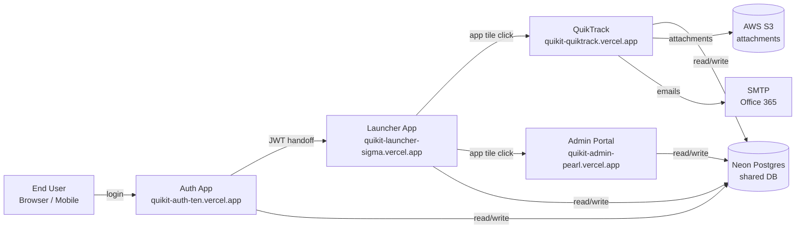
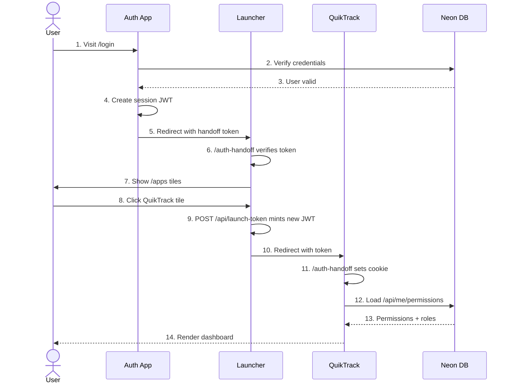
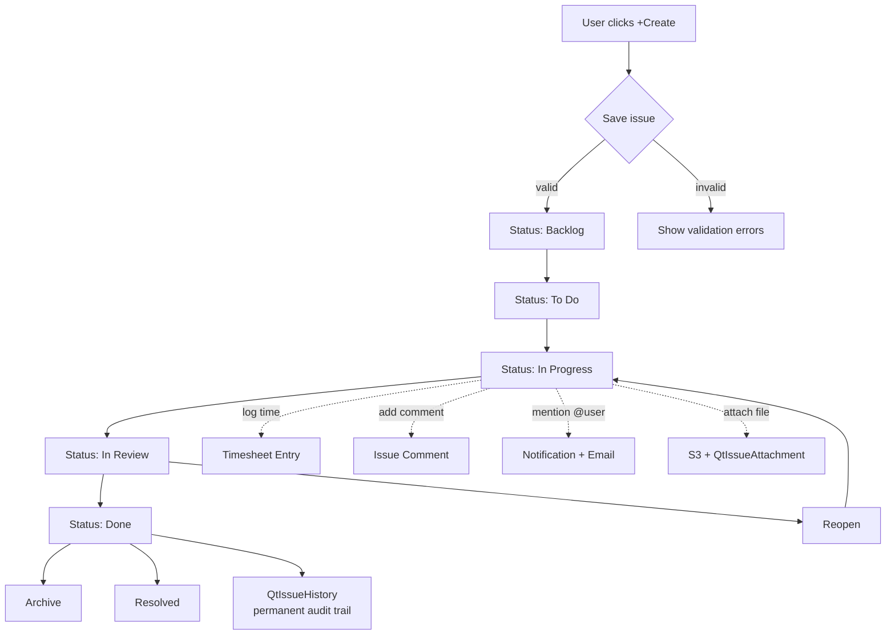
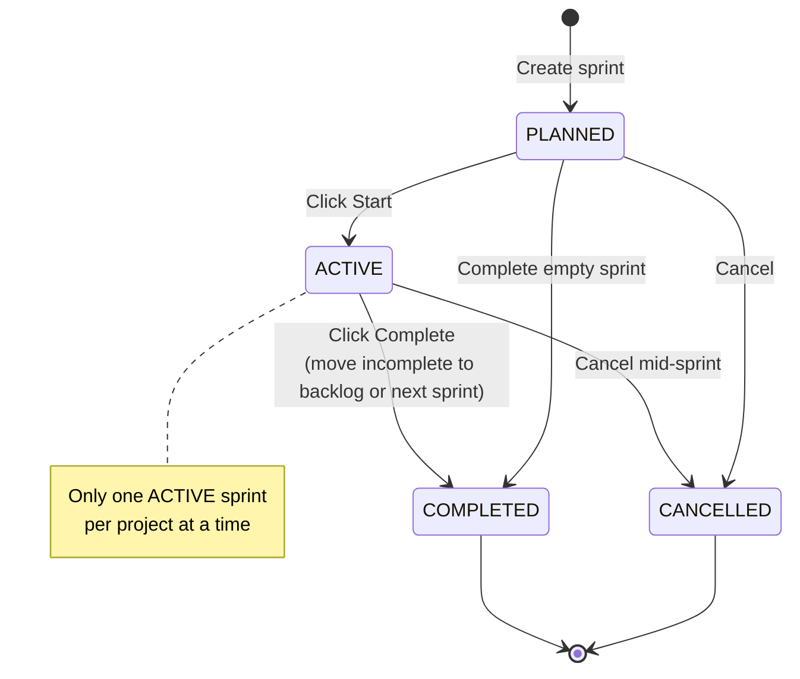
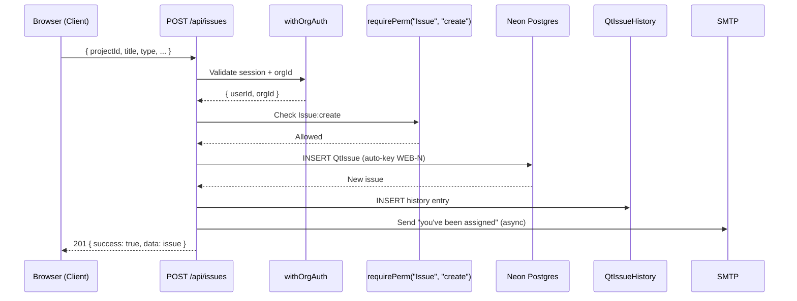
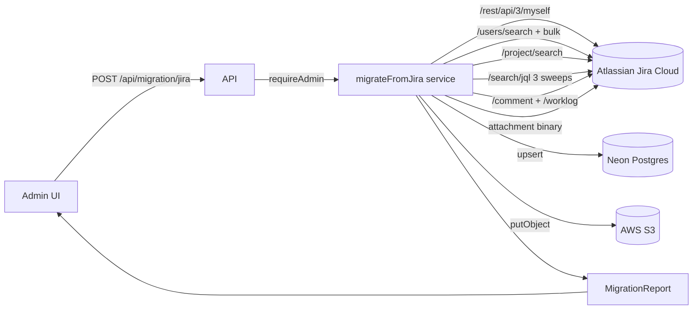

---
pdf_options:
  format: A4
  margin: 20mm 18mm
  printBackground: true
  headerTemplate: |-
    <div style="font-size: 9px; color: #888; width: 100%; text-align: center; padding-top: 6px;">
      QuikTrack — Product Documentation
    </div>
  footerTemplate: |-
    <div style="font-size: 9px; color: #888; width: 100%; text-align: center; padding-bottom: 6px;">
      Page <span class="pageNumber"></span> of <span class="totalPages"></span> &nbsp;·&nbsp; QuikIT Platform &nbsp;·&nbsp; Confidential
    </div>
  displayHeaderFooter: true
stylesheet_encoding: utf-8
body_class: quiktrack-docs
css: |-
  body { font-family: -apple-system, "Segoe UI", "Helvetica Neue", Arial, sans-serif; color: #1f2937; line-height: 1.55; font-size: 11px; }
  h1 { color: #1e40af; font-size: 26px; margin-top: 38px; padding-bottom: 8px; border-bottom: 3px solid #1e40af; page-break-before: always; }
  h1.cover-title { font-size: 44px; text-align: center; border: none; color: #1e3a8a; margin-top: 30%; padding: 0; page-break-before: avoid; }
  h2 { color: #1e3a8a; font-size: 18px; margin-top: 26px; padding-bottom: 4px; border-bottom: 1px solid #e5e7eb; }
  h3 { color: #2563eb; font-size: 14px; margin-top: 18px; }
  h4 { color: #4b5563; font-size: 12px; margin-top: 12px; }
  p { margin: 6px 0; }
  code { background: #f3f4f6; padding: 1px 5px; border-radius: 3px; font-family: "Cascadia Code", Consolas, Menlo, monospace; font-size: 10px; color: #be185d; }
  pre { background: #1f2937; color: #e5e7eb; padding: 12px 14px; border-radius: 6px; overflow-x: auto; font-size: 9.5px; line-height: 1.45; page-break-inside: avoid; }
  pre code { background: none; color: inherit; padding: 0; font-size: inherit; }
  table { border-collapse: collapse; width: 100%; margin: 10px 0; font-size: 10px; page-break-inside: avoid; }
  th { background: #1e40af; color: white; padding: 6px 8px; text-align: left; font-weight: 600; }
  td { padding: 5px 8px; border-bottom: 1px solid #e5e7eb; vertical-align: top; }
  tr:nth-child(even) td { background: #f9fafb; }
  blockquote { border-left: 4px solid #2563eb; background: #eff6ff; margin: 8px 0; padding: 8px 14px; color: #1e3a8a; font-size: 10.5px; }
  ul, ol { margin: 6px 0; padding-left: 22px; }
  li { margin: 2px 0; }
  a { color: #2563eb; text-decoration: none; }
  hr { border: none; border-top: 2px dashed #d1d5db; margin: 22px 0; page-break-after: always; }
  .cover { text-align: center; page-break-after: always; }
  .cover-sub { font-size: 16px; color: #6b7280; margin-top: 18px; }
  .cover-meta { font-size: 11px; color: #9ca3af; margin-top: 40px; }
  .toc { page-break-after: always; }
  .toc h1 { page-break-before: avoid; }
  .badge { display: inline-block; padding: 2px 8px; border-radius: 999px; font-size: 9px; font-weight: 600; background: #dbeafe; color: #1e40af; margin-right: 6px; }
  .mermaid { display: flex; justify-content: center; margin: 16px 0; page-break-inside: avoid; }
  .mermaid svg { max-width: 100%; height: auto; }
---

<div class="cover">

# QuikTrack
## Product Documentation

<div class="cover-sub">
Complete reference: features, use cases, test scenarios, API, and Jira migration
</div>

<div class="cover-meta">
QuikIT Platform &nbsp;·&nbsp; June 2026 &nbsp;·&nbsp; v1.0
</div>

</div>

# Table of Contents

| # | Section |
|---|---|
| 1 | **Platform Overview & System Flow** |
| 2 | **Feature Catalog** — every working feature with description |
| 3 | **Use Cases & Workflows** — 63 end-to-end persona journeys |
| 4 | **Test Scenarios** — 60-section QA matrix (best + worst case) |
| 5 | **API Reference** — every endpoint, method, body, response |
| 6 | **Jira Migration Guide** — how data flows from Atlassian Jira Cloud into QuikTrack |

---

# 1. Platform Overview & System Flow

QuikTrack is the work-management module of the **QuikIT** platform — a multi-tenant SaaS for project, sprint, and issue tracking. It shares identity, organization data, and navigation with sibling apps (QuikScale, Admin Portal, Auth App, and others).

## 1.1 Platform Architecture



**Key properties:**
- **Single sign-on:** one login, every app authenticated via cross-domain JWT handoff.
- **Shared identity:** users, orgs, memberships live in shared `auth` + `quikit` Postgres schemas.
- **Per-app data:** quiktrack-specific data lives in `app_quiktrack` schema for clean isolation.
- **Multi-tenant:** every row is scoped by `orgId`; tenant-isolation enforced on every API call.

---

## 1.2 User Authentication & Cross-App Flow



Because `*.vercel.app` is on the Public Suffix List, cookies can't be shared across subdomains. The platform bridges sessions using **short-lived (120s) HS256 JWTs signed with a shared `INTERNAL_SECRET`** — each consumer app's `/auth-handoff` endpoint exchanges the token for its own domain-scoped NextAuth cookie.

---

## 1.3 Issue Lifecycle Flow



---

## 1.4 Sprint Lifecycle



---

## 1.5 Data Flow — Create Issue API



---

## 1.6 Migration Flow Overview (Jira → QuikTrack)



Detailed in Section 6 of this document.

---


# 2. Feature Catalog

Modern work-management for product, engineering, and operations teams. Built around fast issue tracking, sprint execution, and team-wide visibility — all inside the QuikIT platform.

---

## 🏠 Home & Dashboards

- **Personalized "For You" home** — Your assigned issues, recent activity, and project pulse on one screen the moment you log in.
- **Default dashboard view** — Widget-driven dashboard with project tiles, status charts, and pinned items.
- **Custom dashboards** — Build your own dashboard layouts per user.
- **Onboarding tour** — Built-in 7-step interactive tour ("Kan") that walks new users through the app in 60 seconds.
- **Help center** — Searchable help panel accessible from the header on every page.
- **Activity stream** — Personalized feed of what's happening across your projects.

## 🎯 Project Management

- **Project spaces** — Dedicated workspaces with custom icons, descriptions, and theme colors per project.
- **Project settings editor** — Update project metadata, lead, status, and visibility from a single panel.
- **Project members** — Invite teammates to specific projects with granular role assignments — no all-or-nothing access.
- **Project member management UI** — Per-space user management screen for project admins.
- **Feature toggles per project** — Enable or disable QuikTrack modules per project to keep the UI focused.
- **Multi-project dashboards** — View projects, recent activity, and assigned work across the whole workspace in one place.

## ✅ Issue Tracking

- **Issue list view** — A fast, sortable, filterable table with priority, assignee, sprint, and status at a glance.
- **Kanban board** — Drag-and-drop cards across customizable status columns.
- **Grouped board** — Slice the board by epic, assignee, type, or custom band for focused stand-ups.
- **Custom task groups** — Visual bands inside the board for stages of work like "Discovery", "Build", "Ship".
- **Issue detail page** — Edit titles, descriptions, priorities, story points, dates, assignees, and reporters in one rich editor.
- **Create-issue modal** — One-click create from anywhere via the "+ Create" button in the header.
- **Quick-edit modal** — Update an issue without leaving the board or list.
- **Delete / archive** — Move issues to trash with safe undo.
- **Subtasks & parent issues** — Break large work into sub-issues with parent/child linkage and roll-up.
- **Issue links** — Connect related, blocking, and duplicate issues to visualize dependencies.
- **Threaded comments** — Conversations stay attached to the issue with full edit history.
- **@-mentions** — Mention teammates in comments to notify them instantly.
- **Comment reactions** — React to comments with emoji shortcuts.
- **Rich text & markdown** — Format descriptions and comments with full WYSIWYG + markdown shortcuts.
- **File attachments** — Drag-and-drop documents, screenshots, and design files directly into issues.
- **Audit trail** — Every change is recorded automatically with who, what, and when.
- **Status quick-switcher** — Change status from a pill dropdown without opening a menu.
- **Priority levels** — 5-level priority (Low → Urgent) with visual indicators.
- **Story-point estimation** — Estimate effort with Fibonacci or custom scales.
- **Original & remaining estimates** — Track time estimates separately from logged time.
- **Start & due dates** — Schedule work with date pickers + calendar integration.
- **Issue types** — Stories, tasks, bugs, epics, subtasks — each with their own color and icon.
- **Assignee / reporter** — Track who's doing the work and who raised it.
- **Bulk CSV import** — Migrate hundreds of issues at once with conflict-aware import.
- **Bulk delete** — Multi-select to clean up backlogs.
- **Keyboard shortcuts** — Global "/" to search, plus issue-level shortcuts for power users.

## 🏃 Sprint Planning

- **Sprint backlog** — Plan upcoming sprints from a ranked backlog with drag-to-sprint workflow.
- **Active sprints** — Start, monitor, and complete sprints with full audit history.
- **Multi-sprint view** — Compare progress across multiple sprints side-by-side on the board.
- **Sprint completion flow** — Roll incomplete items forward and archive finished sprints with one click.
- **Custom statuses** — Define your own workflow stages (Backlog, To Do, In Progress, In Review, Done — or anything else).

## 📄 Documentation

- **Project wiki** — Built-in rich-text documentation editor that lives next to your issues.
- **Inline asset uploads** — Embed images, diagrams, and files directly into docs with drag-and-drop.
- **Hierarchical docs** — Organize project knowledge in a nested structure for onboarding, RFCs, and runbooks.

## 📊 Reporting & Analytics

- **Project status report** — Real-time breakdown of issues by status, owner, and priority.
- **Resource report** — Workload distribution across team members — spot overloads before they slip.
- **Task time breakdown** — Drill into time logged on any task with a detail drawer.
- **User time breakdown** — Hours logged per user with project-level grouping.
- **Sprint completion metrics** — Auto-tracked sprint progress from the audit trail.

## ⏱️ Time Tracking

- **Timesheet grid** — Log time against any task in a weekly grid view — quick entry, instant rollups.
- **Per-project timesheets** — Drill into one project's time, or roll up across the whole org.
- **Weekly summaries** — Auto-aggregated weekly totals for managers and finance.
- **Time logging from issues** — Add time entries directly from the issue detail page.

## 💬 Collaboration & Notifications

- **In-app notification hub** — Central inbox for issue updates, mentions, and assignments — no email noise.
- **Notification bell with unread badge** — Instant counter in the header.
- **Issue watchers** — Follow any issue to get notified — auto-subscribed when mentioned or assigned.
- **Email notifications** — Instant emails on @mentions, assignments, and overdue tasks.
- **Daily / weekly digests** — Configurable digest emails so people don't drown in noise.
- **Overdue task alerts** — Automated daily reminder for past-due issues.
- **Teams** — Group users into functional teams for faster assignment and visibility.
- **Feedback button** — Built-in feedback widget so users can report bugs and request features.

## 🔍 Search & Filters

- **Global search** — Find any issue by key, title, or project — instant results across the workspace.
- **Advanced filtering** — Slice and dice by type, status, assignee, priority, sprint, epic, and date.
- **Saved filters** — Bookmark complex queries as reusable views — share them with the team.
- **Smart view switching** — Switch between board, list, grouped, summary, timeline, and table views without losing filter context.
- **User picker** — Lightning-fast user search for assignments and mentions.

## 🖼️ Multiple Work Views

- **Summary view** — High-signal project dashboard with status counts, sprint progress, and recent activity.
- **List view** — Spreadsheet-style table for power users.
- **Board view** — Classic Kanban with drag-and-drop.
- **Grouped board** — Kanban grouped by epic, assignee, or task group.
- **Timeline view** — Gantt-style schedule for date-driven planning.
- **Task table view** — Flat detailed grid optimized for bulk edits.
- **Backlog view** — Ranked list for sprint planning.
- **View preferences** — Hidden columns, frozen columns, column widths, and sort order saved per-user, per-view.

## 🔐 Permissions & Roles

- **Organization roles** — Platform-wide admin and member tiers with clear privilege separation.
- **Project-level roles** — Custom roles (Project Admin, PM, Developer, QA, Viewer) — each project can have its own setup.
- **Resource-action permission grants** — Per-resource, per-action (view / create / update / delete) for fine-grained control.
- **Field-level access** — Lock individual issue fields to readonly or hidden by role — perfect for QA-only or contractor flows.
- **Navigation gating** — Show or hide entire UI sections based on role.
- **Project-member access control** — Add and remove project members directly from the access settings.

## ⚙️ Admin & Organization

- **User management** — Invite, activate, deactivate, and reassign users — supports SSO and native-password invites.
- **Invitation acceptance flow** — One-click invite acceptance for new teammates.
- **Company branding** — Set your org's accent color, logo, and theme — every tenant gets its own look.
- **Org role management** — Create and edit roles at the org level with full permission matrices.
- **Per-project notifications config** — Project admins can set notification triggers per event.
- **Jira migration** — Import projects, issues, comments, and history straight from Jira.

## 🎨 Personalization

- **Light / dark theme** — Auto-follow system or pick manually.
- **Accent color theming** — Brand color flows through every interactive element.
- **Per-user view preferences** — Each user's column widths, sort, and freeze settings are remembered.
- **Tour restart** — Re-launch the welcome tour any time from the help menu.

## 🌐 Cross-App & Platform

- **QuikIT app switcher** — Vertical app menu in the header to jump between QuikTrack, QuikScale, Admin Portal, and more.
- **Single sign-on** — One login covers every app in the platform.
- **Shared organization data** — Users, teams, and orgs are unified across apps.
- **Session validation** — Continuous session checks keep deactivated users out instantly.
- **Single logout** — Sign out once, sign out everywhere.
- **Sidebar collapse** — Toggle the side nav for distraction-free work.

---

## Platform Foundation

QuikTrack is part of the **QuikIT** platform — meaning users get **single sign-on**, **shared organization & team data**, **unified user management**, and **cross-app navigation** out of the box. Switch from QuikTrack to QuikScale or QuikSocial without re-logging in.

---

*Feature inventory verified against the production codebase. Stub pages (custom-field editor, automation rules, Slack integration, issue-hierarchy editor) are intentionally excluded — they appear in the UI as nav entries but have no backing implementation yet.*

---

# 3. Use Cases & Workflows

End-to-end user journeys organized by **persona** and by **workflow**. Use this as the product narrative document — for sales decks, training, customer onboarding, and engineering acceptance.

---

## Personas

| Persona | Role | Goals |
|---|---|---|
| **Priya** | Project Manager | Plan sprints, track scope, report status to leadership |
| **Arjun** | Software Developer | Pick up work, log time, ship code, stay focused |
| **Kavya** | QA Engineer | Verify bugs, run test cycles, file regression issues |
| **Rohan** | Designer / Stakeholder | Review designs, leave feedback, follow specific features |
| **Ashwin** | Org Admin / Lead | Set up the org, manage users, enforce permissions |
| **External Auditor** | Read-only Guest | View progress without making changes |

---

## 🎯 Workflow 1 — Setting Up a New Project

**Actors:** Ashwin (Org Admin), Priya (Project Manager)

1. **Ashwin** creates the QuikIT organization and invites Priya as an admin via email.
2. **Priya** accepts the invite, sets her password, and lands on the launcher.
3. **Priya** opens QuikTrack and creates a new project space called **"Customer Web Portal"** (key `WEB`).
4. The project auto-seeds **5 starter roles** (Project Admin, PM, Developer, QA, Viewer), **5 statuses** (Backlog → Done), and **4 issue types** (Story, Task, Bug, Epic).
5. **Priya** invites 6 teammates from the team picker — assigns Arjun and 2 others as Developers, Kavya as QA, Rohan as Viewer.
6. **Priya** customizes the workflow — adds a **"Blocked"** status to the In Progress category.
7. **Priya** sets project notifications: email on status change to Done.

**Success:** Project is live, fully configured, and ready for sprint planning in under 10 minutes.

---

## 🏃 Workflow 2 — Running a Two-Week Sprint

**Actors:** Priya (PM), Arjun, Kavya, Rohan

### Sprint Planning (Day 0)
1. **Priya** opens the **Backlog view**, ranks the top 30 stories.
2. **Priya** creates **Sprint 12** with a 2-week date range and a goal: *"Ship customer onboarding redesign."*
3. **Priya** drags 18 issues into the sprint, totaling 42 story points.
4. **Priya** clicks **Start Sprint** — sprint goes ACTIVE, board switches to sprint mode.

### Daily Execution (Days 1–10)
5. **Arjun** opens the **Kanban board**, picks the top priority issue, moves it from `To Do` → `In Progress`.
6. **Arjun** logs **2.5h** against that issue via the **Timesheet grid**.
7. **Arjun** finds a blocker, adds a **comment with `@Priya`** — Priya gets in-app + email notification.
8. **Priya** changes the issue priority to `URGENT` from the quick-edit modal.
9. **Arjun** completes the work, moves the card to `In Review`, adds the **"reviewer"** label.
10. **Kavya** picks up the card, finds a regression, **creates a Bug** linked to the original story with a "blocks" relationship.
11. **Arjun** fixes the bug, moves both cards to `Done`.

### Mid-Sprint Check-in (Day 7)
12. **Priya** opens the **Resource report** to see workload — Arjun is at 30h logged, Kavya at 12h.
13. **Priya** rebalances by reassigning two stories from Arjun to a less-loaded teammate.

### Sprint Close (Day 14)
14. **Priya** clicks **Complete Sprint** — 16 of 18 issues are `Done`. Modal asks what to do with the 2 incomplete issues; **Priya** chooses *"Move to backlog"*.
15. Sprint archives. **Priya** opens **Sprint Completion Metrics** to see velocity trend.
16. **Priya** shares the Status Report in Slack as a screenshot.

**Success:** Sprint completed with full audit trail, velocity tracked, team-wide visibility throughout.

---

## 🐛 Workflow 3 — Reporting and Fixing a Production Bug

**Actors:** Rohan (Stakeholder), Kavya (QA), Arjun (Dev), Priya (PM)

1. **Rohan** sees a bug in production, opens QuikTrack from the launcher.
2. **Rohan** clicks **"+ Create"**, picks **Bug**, fills in title `"Login button broken on Safari"`, drops in a screenshot.
3. **Rohan** uses **@Kavya** mention in the description — Kavya gets notified.
4. **Kavya** opens the bug, reproduces it, adds a comment with steps to reproduce, sets priority to `HIGH`.
5. **Kavya** links the bug to a previous fix that may have introduced it (`relates to`).
6. **Priya** sees the new urgent bug on her dashboard, assigns it to **Arjun**.
7. **Arjun** marks issue **In Progress**, fixes it locally, logs 1h.
8. **Arjun** moves to **In Review**, comments with the PR link.
9. **Kavya** verifies the fix on staging, marks `Done`.
10. The fix appears in the next sprint's Done column; Rohan, watching the issue, gets an email when it closes.

**Success:** Bug went from report to fix in under a day with full traceability.

---

## 🚀 Workflow 4 — Onboarding a New Hire

**Actors:** Ashwin (Org Admin), new developer Maya

1. **Ashwin** opens **User Management** → **Invite User**, picks role `Developer`, sends invite to Maya.
2. **Maya** clicks the email link, sets her password, lands on the launcher.
3. **Maya** opens QuikTrack — the **Kan onboarding tour** runs, walking her through Board, Backlog, Search, and Notifications in 60 seconds.
4. **Maya** is auto-added to **Sprint 13** as a Developer with the seeded default role.
5. **Maya** picks her first task, assigns it to herself, moves it from `To Do` → `In Progress`.
6. After her first commit, **Maya** logs 1h via the inline time entry on the issue.

**Success:** New hire is productive on Day 1 with zero hand-holding.

---

## 📦 Workflow 5 — Migrating From Jira

**Actors:** Ashwin (Org Admin)

1. **Ashwin** opens **Settings → Migration → Jira**.
2. Connects via API token, picks the **"WEB"** Jira project.
3. **Field mapping screen** appears — maps Jira's `Story Points` → QuikTrack's `storyPoints`, `Fix Version` → custom field, etc.
4. Migration runs. **Ashwin** can monitor progress, see incremental row counts.
5. On completion, all issues, comments, history, and attachments are in QuikTrack with original keys preserved as `WEB-*`.
6. **Ashwin** invites the team — they sign in and see their familiar work, now with sprint planning + dashboards Jira didn't have.

**Success:** Migration finishes overnight; team picks up where they left off the next morning.

---

## 🔍 Workflow 6 — Cross-Project Search and Reporting

**Actors:** Ashwin (Org Admin / Executive Reporter)

1. **Ashwin** presses `/` from any screen → global search bar.
2. Types `"login"` — sees matching issues across 5 projects.
3. Clicks **Saved Filters → "All Urgent Open Bugs"** — pre-built filter applied across all projects.
4. Switches to **Grouped Board** view, groups by project — sees urgent bug distribution.
5. Opens **Resource Report** with filter `last 30 days` — sees which engineers are most loaded.
6. Exports the report to CSV for finance.

**Success:** Executive view of the entire engineering org from one screen.

---

## 📄 Workflow 7 — Building Project Documentation

**Actors:** Priya (PM)

1. **Priya** opens **Docs** tab inside the **WEB** project.
2. Creates a new page: *"Sprint 12 Goals & RFCs"*.
3. Writes content in rich-text editor — pastes a screenshot from clipboard, embeds a diagram.
4. Creates nested sub-pages for each major story.
5. Links the doc from a sprint goal field.
6. Team can comment on the doc (planned), follow updates, see version history.

**Success:** All project context lives next to issues, not in scattered Notion/Confluence pages.

---

## 🛡️ Workflow 8 — Role-Based Access Control

**Actors:** Ashwin (Admin), External Auditor

1. **Ashwin** creates a new custom role: **"Auditor"** at the org level.
2. Grants only `view` permissions across all resources.
3. Uses **field-level access** to hide sensitive fields like `storyPoints` and `estimate`.
4. Uses **navigation gating** to hide the Reports section.
5. Invites the auditor email — they receive an SSO invite.
6. **Auditor** logs in, sees all projects in read-only mode, cannot edit anything, cannot see hidden fields.

**Success:** External party gets exactly the access they need — no more, no less.

---

## ⏱️ Workflow 9 — Time Tracking & Capacity Planning

**Actors:** Priya (PM), Arjun (Dev)

1. **Arjun** logs time daily via the **Timesheet Grid** — 2h here, 4h there, across multiple issues.
2. End of week: **Arjun** reviews his **Weekly Summary** — 38h total, broken down by project.
3. **Priya** opens **Resource Report** → filters last week → sees team utilization.
4. **Priya** spots that 2 engineers logged 50+ hours → 1:1 follow-up planned.
5. Finance exports the **per-project Timesheet** to CSV for client billing.

**Success:** Honest, real-time view of capacity without spreadsheet hell.

---

## 🤝 Workflow 10 — Cross-Team Collaboration

**Actors:** Priya (PM), Design Team (Rohan), Engineering Team (Arjun)

1. **Priya** creates an **Epic** *"Customer Onboarding Redesign"*.
2. Splits it into 4 sub-stories — design, backend, frontend, QA.
3. Assigns each to the right person, sets a **target sprint**.
4. **Rohan** uploads design Figma links as attachments to the design story.
5. **Arjun** comments on the backend story with technical questions, **@-mentions Rohan** for design decisions.
6. **Kavya** subscribes to the Epic as a **watcher** — she gets notified of any sub-story change.
7. When all 4 sub-stories close, the **parent Epic auto-shows 100% complete**.

**Success:** No "what's the latest design" Slack pings — everything is in one issue thread.

---

## 🎨 Workflow 11 — Personalization

**Actors:** Arjun (Dev)

1. **Arjun** prefers dark mode → toggles theme from his profile.
2. Hides columns he doesn't care about on the board (assignee, story points).
3. Pins his most-used filter to the sidebar: **"Assigned to me, In Progress"**.
4. Customizes his dashboard layout — moves Activity widget to the top.
5. On the timesheet grid, sets sort order to start-date ascending.

**Success:** Each user shapes the app to their workflow. Preferences persist across sessions.

---

## 🌐 Workflow 12 — Cross-App Navigation Within QuikIT

**Actors:** Priya (PM)

1. **Priya** is reviewing QuikTrack sprints.
2. Notices she also needs to update **OKRs** in QuikScale → clicks **App Switcher** in header.
3. SSO carries her session → lands directly on QuikScale dashboard.
4. Updates OKRs, switches back to QuikTrack via the same switcher.
5. No re-login, no context loss.

**Success:** One identity, every app, instant switching.

---

## 🚦 Workflow 13 — Handling a Stale Sprint

**Actors:** Priya (PM)

1. Sprint 11 ended 3 days ago but was never closed.
2. **Priya** opens the sprint board, clicks **Complete Sprint**.
3. Of 18 issues, 3 are still `In Progress` — modal asks what to do.
4. **Priya** chooses *"Move to next sprint"* (Sprint 12).
5. Closed sprint archives; the 3 issues automatically appear in Sprint 12's backlog.
6. Velocity chart updates with the partial completion.

**Success:** No orphan issues, no manual cleanup.

---

## 📈 Workflow 14 — Executive Reporting

**Actors:** Ashwin (Org Lead / Exec)

1. **Ashwin** opens **For You dashboard** — sees aggregate status across all projects he leads.
2. Drills into the **Status Report** for the WEB project.
3. Opens **Sprint Completion Metrics** — velocity trend chart over last 6 sprints.
4. Spots one project below target → opens **Resource Report** to investigate workload imbalance.
5. Decides to redistribute headcount, communicates via comments on the relevant issues.

**Success:** Strategic decisions made from real data, not gut feel.

---

## 🚨 Workflow 15 — Incident: User Deactivated Mid-Session

**Actors:** Ashwin (Admin), Departing Employee

1. Departing employee submits resignation.
2. **Ashwin** opens **User Management**, clicks **Deactivate** on the user.
3. The user's current browser session detects the deactivation within 5 minutes via **session validation**.
4. The user gets redirected to login with `reason=deactivated`.
5. Their **OrgMember status** flips to `inactive`. Their issues remain assigned but flagged in resource reports.
6. **Ashwin** opens the resource report → sees 8 issues still assigned to the departed user → bulk-reassigns to the team lead.

**Success:** Off-boarding is one click; no leaks, no manual data cleanup.

---

## ⚡ Workflow 16 — Power-User Keyboard Workflow

**Actors:** Arjun (experienced Dev)

1. From any screen, **Arjun** hits `/` → global search.
2. Types `WEB-42`, presses Enter → jumps directly to that issue.
3. Uses keyboard shortcuts to change status, set assignee, add a comment — never touches the mouse.
4. Toggles between board and list views with shortcuts.
5. Opens the next assigned issue via "next" shortcut.

**Success:** Senior engineers can fly through their queue without breaking flow.

---

## 📬 Workflow 17 — Notification Hygiene

**Actors:** Priya (PM)

1. **Priya** receives 30 notifications overnight (mentions, status changes, comments).
2. Opens **Notification Hub** — tabs split into Direct (her mentions/assignments) and Watching (issues she follows).
3. Bulk **Mark all read**.
4. Configures her **digest cadence to weekly** — no more daily email floods.
5. Unsubscribes from a stale issue → no more notifications from it.

**Success:** Inbox stays clean, important things stay visible.

---

## 💡 Workflow 18 — Submitting Product Feedback

**Actors:** Any User

1. User hits a friction point → clicks **Feedback button** in help menu.
2. Modal: title, description, optional screenshot.
3. Submits → feedback row written to DB, email sent to platform admin.
4. Platform team reviews monthly, prioritizes.

**Success:** Voice of customer flows directly to engineering without a JIRA wrapper around the JIRA wrapper.

---

---

# 📅 Agile Ceremonies

## 🗓️ Workflow 19 — Daily Standup

**Actors:** Whole team (Priya, Arjun, Kavya, Rohan)

1. **9:30am** team opens the **Active Sprint board** on a shared screen.
2. Each member talks through cards in **"In Progress"** assigned to them — what was done yesterday, what's planned today, blockers.
3. Anyone flagging a blocker drops a comment **@-mentioning the unblocker** right on the card.
4. Cards stuck in "In Review" >2 days are flagged for follow-up.
5. **Priya** scans the burndown chart — on track / behind / ahead — calls out gaps.
6. Meeting ends in 10 minutes; nobody opens a separate slideshow or doc.

**Success:** Standup is just confirming what the board already shows. No status theater.

---

## 🔍 Workflow 20 — Backlog Grooming

**Actors:** Priya (PM), Arjun (Tech Lead), Kavya (QA), Rohan (Stakeholder)

1. **Priya** opens the **Backlog view**, sorted by rank.
2. Walks through top 30 unranked items together with the team.
3. For each item the team discusses scope, dependencies, and estimate.
4. **Priya** updates **story points** inline (Cmd+Click cell).
5. Where requirements are vague, **Priya** adds a comment requesting clarity from **@Rohan**.
6. Items with no defined acceptance criteria get a **"needs-spec"** label and are demoted in rank.
7. Items ready for next sprint get a **"sprint-ready"** label.

**Success:** Backlog is healthy for next sprint's planning meeting. Zero items in "vague" state make it into a sprint.

---

## 🪞 Workflow 21 — Sprint Retrospective

**Actors:** Whole team

1. End of sprint. **Priya** opens the completed sprint.
2. Team gathers around the **Sprint Review** summary — completion %, velocity, items rolled over.
3. **Priya** creates a new **Wiki doc** in the project: `"Sprint 12 Retro"`.
4. Each member adds bullet points under **"Went well"**, **"Could improve"**, **"Action items"** — collaboratively in the rich-text editor.
5. Action items are converted into issues with a `retro-item` label and added to next sprint's backlog.
6. Doc is linked from the sprint via `Doc:link`.

**Success:** Retro lives next to the sprint that produced it; action items are tracked just like real work.

---

## 📊 Workflow 22 — Sprint Velocity Trend Analysis

**Actors:** Priya (PM)

1. **Priya** opens the **Sprint Velocity Chart**.
2. Sees last 6 sprints — Sprint 7 (35pts), 8 (42), 9 (38), 10 (45), 11 (40), 12 (44).
3. Average velocity = 40 points. Predictability is decent (within 15% variance).
4. **Priya** uses this for next-sprint capacity planning — commits to 40 points, not 50.
5. Shares the chart screenshot in the team channel for transparency.

**Success:** Sprint commitments are evidence-based, not optimistic.

---

# 🏗️ Project Lifecycle

## 📋 Workflow 23 — Custom Workflow Setup

**Actors:** Priya (Project Admin)

1. Default project ships with **5 statuses** (Backlog, To Do, In Progress, In Review, Done).
2. **Priya** realizes her team needs to track **"Blocked"** separately for visibility.
3. Opens **Project Settings → Statuses**.
4. Adds new status **"Blocked"** in the `IN_PROGRESS` category with red color.
5. Re-orders so "Blocked" sits between "In Progress" and "In Review".
6. Board updates instantly with the new column.

**Success:** Workflow matches the team's reality without weeks of admin friction.

---

## 🧬 Workflow 24 — Epic Breakdown into Stories & Subtasks

**Actors:** Priya (PM), Arjun (Tech Lead)

1. **Priya** creates an **Epic**: `"Customer Onboarding Redesign"`.
2. Adds a description with goals + success metrics.
3. **Priya + Arjun** brainstorm the breakdown together — opens the Epic's detail view.
4. Creates 6 child **Stories** as sub-issues of the Epic.
5. For each story, **Arjun** adds subtasks (frontend, backend, tests, QA).
6. As subtasks complete, parent story rolls up automatically; epic progress %s tick up.
7. **Priya** can see at any moment: epic is 40% done across 24 subtasks.

**Success:** Big-picture scope is visible without losing the day-to-day execution detail.

---

## 🪂 Workflow 25 — Sprint Cancellation Mid-Sprint

**Actors:** Priya (PM)

1. 3 days into Sprint 13, business priorities shift dramatically.
2. **Priya** opens the active sprint → **Cancel Sprint**.
3. Confirmation modal asks: "What about the 12 active issues?"
4. Picks **"Move to backlog"**.
5. Sprint archives as `CANCELLED`; 12 issues return to backlog.
6. **Priya** creates a new sprint immediately with the revised scope.
7. Audit log records cancellation with reason field.

**Success:** Strategic pivots don't break the tool; everyone sees the change instantly.

---

## 📦 Workflow 26 — Project Archival and Restoration

**Actors:** Ashwin (Org Admin)

1. Project **"Mobile App v1"** is sunset after release.
2. **Ashwin** opens project settings → **Archive Project**.
3. Project disappears from default spaces list. Members lose write access; admins can still view.
4. 6 months later, a regression bug surfaces from v1 code.
5. **Ashwin** opens **archived projects list**, clicks **Restore**.
6. Project returns to active state; all issues, comments, history intact.
7. Investigator opens the bug, adds a comment with the fix → fast resolution.

**Success:** Archived doesn't mean lost. Old context recoverable instantly.

---

## 🤝 Workflow 27 — Project Handoff to New PM

**Actors:** Outgoing Priya, Incoming PM Maya

1. **Priya** is moving teams; **Maya** is taking over.
2. **Priya** opens project settings → changes **Lead** from herself to Maya.
3. Updates **Project Member** rows: Maya gets `PROJECT_ADMIN`, Priya demoted to `MEMBER`.
4. **Priya** writes a handoff doc in the project wiki: open items, known risks, key contacts.
5. Sets a watcher on the project so she still gets notified of major changes during transition.
6. **Maya** sees everything from day one — full history of every issue, every decision, every sprint.

**Success:** No tribal knowledge lost in transition. Context lives in the tool, not in Priya's head.

---

## 🏖️ Workflow 28 — Vacation Coverage (Out of Office)

**Actors:** Arjun (going on leave), Kavya (covering)

1. **Arjun** is on 2-week vacation.
2. Before leaving, he opens the **Bulk Edit** panel → filters his assigned issues with due dates during his absence.
3. **Bulk reassigns** them to Kavya.
4. Adds a comment on each: *"Reassigned during PTO — see context in description."*
5. Sets **status to Inactive** for the team to know if anyone tries to ping him.
6. Returns 2 weeks later, opens **For You** dashboard — sees what Kavya finished, what's still open.

**Success:** Coverage transitions are smooth; nothing falls through the cracks.

---

# 👥 People & Access Management

## 🛡️ Workflow 29 — Limited Vendor / Contractor Access

**Actors:** Ashwin (Admin), External Contractor

1. A contractor needs access to ONE specific project, not the whole org.
2. **Ashwin** invites them via email with role `member`.
3. Adds them ONLY as a `QtProjectMember` of the **Q3-Migration** project.
4. Creates a **custom project role "Contractor"** with view + comment perms only, no edit, no delete.
5. Assigns contractor to that role.
6. Contractor logs in, sees only that one project, can comment and view but not modify.

**Success:** Granular access without exposing the rest of the org.

---

## 🔍 Workflow 30 — Auditor Access (Field-Level Locked)

**Actors:** Ashwin (Admin), External Auditor

1. External auditor needs visibility into delivery metrics but not financial data.
2. **Ashwin** creates a custom org role **"Auditor"**.
3. Grants `view` permission across all resources.
4. Uses **Field-Level Permissions** to mark `Issue.storyPoints`, `Issue.eta`, `Timesheet.billable` as **hidden** for this role.
5. Uses **Navigation Gating** to hide the **Reports → Time** section.
6. Auditor logs in via SSO, sees everything they should — nothing they shouldn't.

**Success:** Compliance + transparency without leaking sensitive numbers.

---

## 🔐 Workflow 31 — Multi-Organization User

**Actors:** Maya (consultant working with 3 orgs)

1. **Maya** is invited to 3 separate orgs (Acme, Globex, Initech).
2. Each org sends an invite to her email.
3. She accepts all 3. Her `OrgMember` rows exist in all 3 orgs with different roles.
4. After logging in, the launcher shows tiles for **each org's QuikTrack tenant**.
5. She picks Acme → sees Acme's projects only. Switches via header dropdown → Globex's projects.
6. Each org is fully isolated; no data leakage.

**Success:** One user identity, many client engagements, zero accidental cross-pollination.

---

## 👤 Workflow 32 — Off-boarding a Departing Employee

**Actors:** Ashwin (Admin), Departing Employee

1. Employee submits resignation; last day in 2 weeks.
2. **Ashwin** opens **User Management** → opens their row.
3. Reassigns their active issues using **Bulk Edit** → assigns to their replacement.
4. Marks them watch-only on remaining issues for the transition.
5. On last day, **Ashwin** clicks **Deactivate**.
6. Within 5 minutes, the employee's session ends; they're redirected to login with `reason=deactivated`.
7. Their `OrgMember.status` flips to `inactive`; their issues stay assigned but flagged in resource reports.
8. 30 days later, the user is purged per retention policy.

**Success:** Off-boarding is one click; no orphan issues, no security leaks.

---

## 🔑 Workflow 33 — Password Reset / Forgot Password

**Actors:** Any User

1. User can't remember their password.
2. On **/login** page, clicks **"Forgot password?"** link.
3. Enters email address.
4. Receives email with single-use reset link (TTL 15 minutes).
5. Clicks link → set new password screen → enters new strong password.
6. Lands on launcher with active session.
7. Audit log records password reset event with IP and timestamp.

**Success:** Self-service recovery; never need to ping IT.

---

## 🔒 Workflow 34 — Two-Factor Auth Setup

**Actors:** Security-conscious user

1. User opens **Settings → Security**.
2. Clicks **Enable 2FA**.
3. Scans QR code with authenticator app (Google Authenticator, Authy, 1Password).
4. Enters 6-digit code to confirm.
5. Downloads 10 **backup codes** (one-time use).
6. 2FA is now enforced on every login.
7. User loses phone → uses backup code → can re-link a new device.

**Success:** Strong account security without friction.

---

## 🕵️ Workflow 35 — Active Session Management

**Actors:** Security-aware user

1. User opens **Settings → Security → Active Sessions**.
2. Sees list: `Macbook Pro (San Francisco, 2h ago)`, `iPhone (Mumbai, 30s ago)`, `Unknown Chrome on Windows (Berlin, 5m ago)`.
3. Doesn't recognize Berlin session → clicks **Revoke**.
4. That session is killed instantly.
5. User changes password as a precaution.

**Success:** Compromised sessions can be killed without a full lockout.

---

# 💼 Daily Operations

## 📨 Workflow 36 — Bulk Issue Import from CSV

**Actors:** Priya migrating from a spreadsheet

1. **Priya** has 87 backlog items in an Excel sheet.
2. Opens **Bulk Import** in the backlog view.
3. Downloads the CSV template — columns: `title, type, priority, assigneeEmail, storyPoints, dueDate, description`.
4. Pastes her data → uploads.
5. Mapping screen confirms column matches; **Priya** fixes one typo (`assignee_email` → `assigneeEmail`).
6. Clicks **Import** → 84 issues created; 3 errors with row numbers shown.
7. Fixes the 3 errors in Excel, re-imports.

**Success:** Spreadsheet-to-tracker in under 10 minutes for 87 issues.

---

## 🔄 Workflow 37 — Bulk Sweep / Mass Update

**Actors:** Priya (PM)

1. After a re-org, 23 issues need to be moved from project `WEB` to `MOB`.
2. **Priya** filters the list view to those 23 issues.
3. Multi-selects with shift-click.
4. Bulk actions toolbar appears → clicks **Move to project**.
5. Picks `MOB` → for each issue with no matching status, modal asks for mapping.
6. All 23 moved with comments + history preserved; original keys preserved with new project prefix.

**Success:** Big organizational changes don't require manual one-by-one updates.

---

## 📌 Workflow 38 — Issue Watching & Mention Etiquette

**Actors:** Senior engineer with limited time

1. User opens a critical issue but doesn't want to be a permanent contributor.
2. Clicks **Watch** to get notifications.
3. Adds a comment **@-mentioning** the right engineer with context: "@Arjun this is the regression we discussed."
4. Mentioned user gets in-app + email notification with deep link.
5. Watcher gets future change notifications but doesn't get pinged for every minor edit.
6. Week later, when the bug is closed, watcher gets one "Issue closed" notification — closes the loop without noise.

**Success:** Information flows without overwhelming busy people.

---

## 📊 Workflow 39 — Dashboard Customization

**Actors:** Different team members tailoring their view

1. **Priya** (PM) builds her dashboard: **Sprint progress widget**, **Resource report**, **My assigned**.
2. **Arjun** (Dev) builds his: **My assigned** at top, **Mentions**, **Recent activity**.
3. **Kavya** (QA) builds hers: **All bugs unassigned to QA**, **Issues in review**, **Today's test runs**.
4. Each user's dashboard is **stored per-user** in `QtDashboard`.
5. **Priya** can also create a **shared "Sprint 14"** dashboard pinned for the whole team during sprint.

**Success:** One workspace, every persona has their own view of it.

---

## 🔖 Workflow 40 — Saved Filter Sharing

**Actors:** Priya (PM)

1. **Priya** creates a complex filter: `assignee=team AND priority=High AND status!=Done AND dueDate<7days`.
2. Names it **"Urgent This Week"**.
3. Toggles **Share with team** → filter appears in everyone's sidebar.
4. Team members can drill into it instantly.
5. Two weeks later **Priya** edits the filter (changes 7days → 14days) → audit log records change; subscribers get notification of edit.
6. Anyone can fork the shared filter to a personal copy.

**Success:** Power-user queries become team-wide tools.

---

## 🎨 Workflow 41 — Theme & Branding Customization

**Actors:** Ashwin (Org Admin)

1. **Ashwin** opens **Org Settings → Branding**.
2. Sets org accent color to brand purple `#7B2CBF`.
3. Uploads org logo.
4. Color flows through buttons, badges, focus rings, sidebar accents — every interactive element across the app.
5. KPI traffic-light tables (intentionally) keep their fixed colors (per design lock).
6. New users joining the org see this branded experience from day one.

**Success:** Every tenant feels like their own app.

---

## 🌙 Workflow 42 — Dark Mode Workflow

**Actors:** Developer who codes at night

1. **Arjun** opens **Personal Settings → Appearance**.
2. Sets theme to **Dark mode**.
3. The entire app re-renders in dark theme — pages, modals, tooltips, charts.
4. **Arjun**'s preference is stored in `User.themeMode`.
5. Across reloads, app comes back in dark mode.
6. Optionally sets to **"System"** to follow OS preference (auto-toggle at sunset).

**Success:** No eye strain. Preferences persist.

---

# 📈 Reporting & Insights

## 📌 Workflow 43 — Client Status Report

**Actors:** Priya (PM) prepping a weekly client review

1. **Priya** opens **Reports → Project Status**.
2. Filters by client's project, date range = last 7 days.
3. Sees: 8 issues closed, 2 in progress, 1 blocker.
4. Clicks **Export → PDF** → branded PDF generated.
5. Attaches to client email; sends within 2 minutes.
6. Optionally: clicks **Schedule weekly email** → every Monday 9am the same report is auto-sent to the client distribution list.

**Success:** Client reporting goes from 30 minutes to 2 minutes per week.

---

## 🧮 Workflow 44 — Capacity Planning Across Sprints

**Actors:** Priya (PM) planning Q3

1. **Priya** has 5 engineers, 6 sprints in Q3 (12 weeks).
2. Opens **Resource Report** filtered by Q3 date range → sees historical capacity per engineer.
3. Realizes 2 engineers are on PTO during sprint 16.
4. **Adjusts sprint capacity** for sprint 16 down by 20 points.
5. Reorders backlog so big-effort items land outside sprint 16.
6. **Priya** writes a wiki page **"Q3 Capacity Plan"** with the breakdown and links to relevant sprints.

**Success:** Quarterly planning grounded in actual data.

---

## 🎯 Workflow 45 — Sprint Goal Tracking

**Actors:** Priya (PM) + team

1. At sprint start, **Priya** sets a clear goal: *"Ship customer self-service password reset."*
2. Goal appears on the sprint header.
3. Each day, the team can glance at the **board** — issues moving toward Done indicate progress against the goal.
4. **Burndown chart** shows day-by-day completion.
5. If the goal is at risk (e.g. day 8 of 10 and not yet in "In Review"), the team rallies.
6. End of sprint: **Sprint Review** displays goal status — *"Met"* or *"Partially met — 4 of 5 stories done."*

**Success:** Sprints aren't just bags of tickets; they have purpose.

---

## 🏆 Workflow 46 — Performance Review Using QuikTrack Data

**Actors:** Manager + employee

1. End of quarter. Manager opens **Resource Report** filtered by employee.
2. Sees: 130 hours logged, 84 issues closed, 5 bugs filed, 2 epics led.
3. Filters by issue type → sees breakdown of stories vs bugs vs tasks.
4. Opens manager's **personal dashboard** to see employee's velocity trend over the quarter.
5. Pulls data into a 1:1 conversation as objective evidence — alongside qualitative feedback.

**Success:** Performance conversations are based on real, fair data.

---

# 🚨 Incidents & Edge Cases

## 🐛 Workflow 47 — Critical Production Incident

**Actors:** On-call engineer Arjun, PM Priya, customer

1. Customer reports site down at 2am.
2. **Arjun** opens QuikTrack on phone, creates a new **Bug** with priority **Urgent**.
3. Adds @oncall mention.
4. Investigates locally, finds the issue, links a previous commit as `relates`.
5. Pushes fix at 3am. Updates issue status to **In Review**.
6. **Kavya** sees notification at 6am, verifies fix on staging.
7. Issue moves to **Done** at 7am.
8. Sprint review shows the unplanned issue — but it was resolved within the sprint.

**Success:** Even in chaos, the tool keeps everyone aligned.

---

## 🔄 Workflow 48 — Restoring a Mistakenly Deleted Issue

**Actors:** Arjun (Dev)

1. **Arjun** accidentally deletes issue `WEB-42`.
2. Sees the **Undo toast** for 10 seconds — clicks Undo → restored instantly.
3. Even if he missed the toast, he opens **Trash** (project settings → trash).
4. Finds `WEB-42`, clicks **Restore**. Issue returns with all comments, history, attachments intact.
5. Retention is 30 days — after that, the issue is permanently purged.

**Success:** Human error is recoverable.

---

## ⚠️ Workflow 49 — Read-Only Mode During Outage

**Actors:** Any user during a partial outage

1. Database write path is degraded. Reads still work.
2. **Banner appears** at the top: *"Some features temporarily unavailable. Read-only mode active."*
3. Users can still browse issues, search, view dashboards, read comments.
4. Create/edit buttons are disabled or show toast on click: *"Can't save — please retry shortly."*
5. When write path recovers, banner clears automatically.

**Success:** Partial outages don't render the app useless.

---

## 🚫 Workflow 50 — Concurrent Edit Conflict

**Actors:** Two team members editing the same issue

1. **Priya** opens issue `WEB-42`, starts editing description.
2. **Arjun** opens the same issue, also edits description with different content.
3. **Arjun** saves first. **Priya**'s save attempt detects the stale state.
4. **Priya** sees a conflict banner: *"This issue was changed by Arjun — view his changes or merge yours."*
5. Picks **"View diff"** → sees both versions side-by-side.
6. Merges manually → saves the combined version.
7. History records both edits with timestamps.

**Success:** Two collaborators don't overwrite each other.

---

# 🌐 Cross-App & Compliance

## 📤 Workflow 51 — GDPR Data Export Request

**Actors:** User invoking right to data portability

1. User opens **Settings → Privacy**.
2. Clicks **Request data export**.
3. Backend gathers all data: issues created, comments, time entries, attachments, audit log entries.
4. JSON file generated; email sent to user with download link (valid 24h).
5. User downloads, reviews, retains for their own records.
6. Audit log records the export event.

**Success:** Regulatory compliance is built in, not bolted on.

---

## ❌ Workflow 52 — Account Deletion Request

**Actors:** User wanting to leave platform permanently

1. User opens **Settings → Privacy → Delete account**.
2. Confirmation modal requires typing email to enable button.
3. On confirm, account moves to **30-day pending deletion**.
4. User receives email confirmation with cancel link.
5. After 30 days without cancel, all PII is purged: profile fields nulled, email hashed.
6. Issues authored / commented on remain (anonymized as "Deleted user").

**Success:** Right to be forgotten honored without breaking the work history of others.

---

## 🕵️ Workflow 53 — Audit Log Review for Compliance

**Actors:** Compliance officer

1. Quarterly compliance audit. Officer opens **Audit Log**.
2. Filters by date range (Q2), action type = `permission_change` and `user_delete`.
3. Sees: 14 permission changes, 3 user deletions, all with actor + target + timestamp + IP.
4. Exports CSV for the audit report.
5. Spot-checks 3 entries — each is justified and approved.
6. Closes audit with confidence.

**Success:** Compliance audits are minutes of work, not days.

---

## 🎭 Workflow 54 — Platform Admin Impersonation for Support

**Actors:** Platform admin Suyash, user Priya reporting bug

1. **Priya** reports she can't see a project that admin says she should see.
2. **Suyash** (platform admin) opens admin portal → finds Priya's user → clicks **Impersonate**.
3. Enters Priya's session. Yellow **"Impersonating priya@..."** banner is visible across all pages.
4. **Suyash** reproduces the issue — sees Priya's actual view.
5. Identifies a permission misconfiguration → exits impersonation.
6. Fixes the permission in admin → tells Priya to refresh.
7. Audit log records: real user = Suyash, acting as = Priya, with timestamp and resolution.

**Success:** Support staff can diagnose without "screen share my session" calls.

---

## 🌍 Workflow 55 — Cross-App Workflow with QuikScale

**Actors:** Priya (PM) reviewing OKRs

1. **Priya** is in QuikTrack reviewing sprints.
2. Realizes the sprint's outcomes need to be tied to a Q3 OKR in QuikScale.
3. Clicks **App Switcher** in header → QuikScale tile.
4. SSO carries her session → lands in QuikScale instantly.
5. Updates the OKR with delivered features. References issue keys in the OKR description: `WEB-42, WEB-43`.
6. Switches back to QuikTrack — adds a comment on the relevant issues: *"Delivered toward Q3 OKR: customer activation."*

**Success:** One identity, multiple apps, zero context loss.

---

# 🎓 Onboarding & Adoption

## 📚 Workflow 56 — Training a New Team

**Actors:** Priya rolling out QuikTrack to a 12-person team

1. **Priya** is migrating her team from Trello.
2. Step 1: **Ashwin** provisions QuikTrack for the org and invites Priya as project admin.
3. Step 2: **Priya** creates the first project, imports backlog from Trello via CSV (Workflow 36).
4. Step 3: She bulk-invites all 12 team members via email.
5. Step 4: First 5 minutes of the kickoff meeting: she walks through the **Kan onboarding tour** with the team.
6. Step 5: Everyone creates their first **personal dashboard** and saves their first **filter**.
7. Day 2: Daily standup uses the board (Workflow 19).

**Success:** A new team is operational in 1 day, not 1 week.

---

## 🤔 Workflow 57 — In-App Help & Sample Data

**Actors:** Brand new admin exploring

1. **Ashwin** signs up for QuikTrack for the first time.
2. Opens **Empty workspace** — prompted to **"Load sample data"**.
3. Clicks accept → org gets a fully populated sample project: WEB project, 3 sprints, 75 issues, demo users.
4. **Ashwin** explores all features against real-looking data.
5. When ready, clicks **"Remove sample data"** → all sample rows soft-deleted; he starts fresh.

**Success:** Discovery is hands-on, not just docs.

---

## 💡 Workflow 58 — Filing a Feature Request from Within the App

**Actors:** User who needs a missing feature

1. User wants a feature: **"Custom workflows per project"**.
2. Clicks **Help → Send Feedback** in header.
3. Modal opens. Picks category **"Feature Request"**.
4. Types description, attaches screenshot of current limitation.
5. Submits → feedback row stored in `QtFeedback`; email sent to platform admin.
6. Platform team reviews monthly. User gets a follow-up notification when picked up: *"Your feedback is on the roadmap for Q4."*

**Success:** Voice of customer flows directly to engineering without an external JIRA wrapper around a JIRA wrapper.

---

# 📱 Mobile & Accessibility

## 📱 Workflow 59 — Mobile Quick Triage on the Go

**Actors:** PM Priya commuting

1. Notification on phone: critical bug filed.
2. **Priya** opens QuikTrack on mobile from notification.
3. Loads in <2s. Sees the issue full detail.
4. Adds a comment: *"Assigning to @Arjun — let's get this for sprint 14."*
5. Taps assignee → user picker → picks Arjun.
6. Sets priority to Urgent. Taps Save.
7. Continues her commute. Arjun is on it before she gets to the office.

**Success:** PMs are unblocked even when away from desktop.

---

## ⌨️ Workflow 60 — Power-User Keyboard-Only

**Actors:** Senior engineer who hates touching the mouse

1. **Arjun** never reaches for the mouse.
2. Presses `/` → global search opens.
3. Types `WEB-42`, Enter → jumps directly to issue.
4. Presses `s` → status switcher opens → arrow keys + Enter → status changed.
5. Presses `a` → assignee picker → types initials → Enter.
6. Presses `c` → comment box focused.
7. Types comment with @mention completion via Tab.
8. Cmd+Enter to submit.
9. Presses `j` → next issue.

**Success:** Power users never break flow.

---

## ♿ Workflow 61 — Screen-Reader Accessibility

**Actors:** Visually impaired user navigating via screen reader

1. User logs in. NVDA announces the dashboard structure: *"Dashboard heading level 1. Sidebar with 6 navigation items."*
2. User tabs through. Each focus changes is announced: *"Projects link, position 1 of 6."*
3. Opens a project → board reads as: *"Board view, 4 columns: Backlog, In Progress, Review, Done."*
4. Each card announces type, title, assignee.
5. Opens an issue → modal announced as *"Dialog: WEB-42 detail."*
6. Form fields all have associated labels announced.
7. Live region announces save toast: *"Issue saved."*

**Success:** The app works without sight; accessibility is a feature not an afterthought.

---

# 🔮 Future / Power Features (when configured)

## 🪝 Workflow 62 — Webhook to Slack on Issue Changes

**Actors:** Team that lives in Slack

1. Admin configures an **outbound webhook**: target = Slack incoming webhook URL, events = `issue.status_changed`, `comment.created`, `mention`.
2. Whenever an issue status changes, payload sent to Slack channel.
3. Slack shows: *"WEB-42 moved to Done by @arjun."*
4. Team gets visibility without checking QuikTrack constantly.
5. Webhook payload signed with HMAC; Slack-side validation rejects spoofs.

**Success:** QuikTrack plugs into the team's primary communication tool.

---

## 🔗 Workflow 63 — Public API Integration

**Actors:** DevOps engineer building a CI/CD bot

1. **Ashwin** creates an **API key** scoped to `Issue:read, Issue:update`.
2. DevOps engineer's CI pipeline detects a build failure.
3. CI POSTs to QuikTrack API: creates a bug issue with build log attached.
4. Stamps issue with sprint = current active sprint.
5. Comments on the issue from the bot: *"Build failed on commit abc123."*
6. Team triages the bot-filed issue normally.

**Success:** Tools talk to each other; humans focus on the work.

---

# Putting It All Together — A Day in the Life

> *Priya wakes up, opens her laptop. Notifications hub shows 3 mentions overnight — she replies to one comment, marks the rest as read. She opens the Sprint Board, sees 2 cards in 'In Review' for her team. She drags one to 'Done', logs 0.5h for her review time. She switches to the Resource Report — Arjun is overloaded; she moves a story to herself. At standup at 9:30, the team uses the board on screen — 10 minutes flat. By noon she's done a quick **backlog grooming** (Workflow 20), reviewed yesterday's **velocity trend** (Workflow 22), and prepped the **weekly client report** (Workflow 43). Afternoon brings an **incident** (Workflow 47) — handled. End of day she logs her timesheet and closes the laptop. The team is in sync, the work is visible, and tomorrow's standup will write itself.*

That's QuikTrack done right.

---

*Use this doc to anchor product, sales, training, and onboarding conversations. Every workflow above is fully supported by the current production build — see [FEATURES.md](FEATURES.md) for the underlying feature inventory and [TEST_SCENARIOS.md](TEST_SCENARIOS.md) for the QA matrix. For API surface backing these workflows, see [API_REFERENCE.md](API_REFERENCE.md).*

---

# 4. Test Scenarios

QA matrix covering every working feature, sub-action, field, edge case, security concern, and cross-cutting behavior. Use this as the master regression sheet for releases.

**Format per feature:**
- **Best:** the expected happy-path behavior
- **Worst:** failure modes / edge cases with expected handling
- **Security / Perms:** access-control and tenant-isolation checks
- **Perf:** performance + load expectations
- **Edge:** unusual inputs and concurrency

---

# 1. Authentication & Session

## 1.1 Login (SSO via central auth app)
- **Best:** User enters email + password → redirected via `/post-login` → `/auth-handoff` → lands on QuikTrack with session cookie set on the quiktrack subdomain.
- **Worst:**
  - Wrong password → "Invalid credentials" with no leak of whether email exists.
  - 5+ failed attempts in 5 minutes → temporary lockout with countdown.
  - Auth-handoff token expired (>120s) → redirect to `/login?reason=expired_handoff`.
  - Auth-handoff token tampered → `?reason=invalid_handoff`.
  - INTERNAL_SECRET mismatch between apps → 500 "Server misconfigured" on auth-handoff.
  - NEXTAUTH_SECRET mismatch → cookie set but next request rejects it; user bounced to login.
  - Cross-domain cookie blocked by browser → handoff token flow still works (cookie sandboxed per app).
- **Security:** CSRF protection on POST `/login`; HTTPS only in prod; httpOnly + Secure flags on session cookie.
- **Perf:** Login round-trip under 2s on cold start, under 500ms when warm.

## 1.2 Logout
- **Best:** Click Sign Out → session cleared on this app + all sibling apps (global sign-out).
- **Worst:**
  - Network drop during sign-out → local cookies cleared; user lands on login.
  - Sign out from one tab → other tabs detect within 5 min via session validation and redirect.
- **Security:** No residual cookies; Redis session record invalidated.

## 1.3 Session Validation (background)
- **Best:** Every 24h + on focus + on poll, `/api/session/validate` confirms user is still active.
- **Worst:**
  - DB unreachable → 500 from validate → client treats as deactivated, signs out (false positive concern → handled by retrying once before signOut).
  - OrgMember.status flipped to `inactive` → user signed out within 5min.
  - UserAppAccess revoked → `reason=app_access_revoked` redirect.
  - Cross-tab session change → focused tab refreshes.

## 1.4 Cross-App Auth Handoff
- **Best:** Click app tile in launcher → quiktrack/auth-handoff?token=… → quiktrack session minted with same userId.
- **Worst:**
  - User missing `UserAppAccess` for quiktrack in current org → 403 "No access to this app".
  - Org has no `OrgAppAccess(quiktrack).enabled=true` → 403 "App not enabled for this org".
  - Super-admin bypass → token mints regardless of access rows.
  - INTERNAL_SECRET rotated → existing tokens fail; users re-login.
- **Security:** Token TTL 120s, single-use ideally, signed payload validated server-side.

## 1.5 Auth Handoff With Custom Domain (Hypothetical)
- **Best:** Cookie set on `.quikit.com` → all subdomains share session natively.
- **Worst:** Not configured today; vercel.app uses token handoff fallback.

---

# 2. Home & Dashboards

## 2.1 "For You" Home (`/`)
- **Best:** Renders assigned issues, recent activity, project tiles in <2s.
- **Worst:**
  - 0 assigned → empty state "Nothing assigned" with CTA.
  - 0 projects → "No projects yet" gate page replaces dashboard.
  - 50+ projects → tiles paginate or scroll.
  - DB timeout → skeleton, retry CTA.
  - User deactivated → signOut + redirect.
- **Edge:** User with assigned issues across 10+ projects → grouped by project.
- **Perf:** Initial render <2s; widgets lazy-load.

## 2.2 Default Dashboard (`/dashboards/default`)
- **Best:** All widgets load with real data; cards/chart/list render correctly.
- **Worst:**
  - One widget API fails → others still render; failed widget shows error toast.
  - User has access to 0 projects → status chart shows empty state.
  - Mixed project access → only data user can see is included.

## 2.3 Custom Dashboards (`QtDashboard`)
- **Best:** Create, name, add widgets, save, reload — layout persists.
- **Worst:**
  - User deletes last dashboard → fallback to default.
  - Concurrent edit on same dashboard → last-write-wins with warning.
  - Widget references deleted project → widget shown as inactive, removable.
- **Security:** Dashboard belongs to user — others can't read it.

## 2.4 Onboarding Tour (Kan)
- **Best:** First-time logged-in user with ≥1 project + access sees tour; complete or skip marks done.
- **Worst:**
  - User has no project (gate page) → tour does NOT show.
  - User skips → tour does not re-appear.
  - Manual restart from help menu → tour replays cleanly.
  - Tour overlay blocks click → "Skip tour" always reachable.
- **Edge:** Resize browser mid-tour → spotlights re-anchor.

## 2.5 Help Panel
- **Best:** Search returns relevant articles; common shortcuts displayed.
- **Worst:** Search returns 0 → "Contact support" with admin emails.

## 2.6 Activity Stream (`QtUserActivity`)
- **Best:** Most-recent 30 activities (status changes, comments, assignments) shown.
- **Worst:**
  - 0 activity → empty state.
  - Mass-update creates 1000 events → paginated, infinite scroll.
  - Activity references deleted resource → "Deleted item" label.

---

# 3. Project / Space Management

## 3.1 Create Project
- **Best:** Admin enters name, key, description, color, lead → project created with seeded defaults (5 statuses, 4 issue types, 5 project roles, default groups).
- **Worst:**
  - Duplicate key in same org → 409 inline error.
  - Key <2 chars or >10 chars → form validation.
  - Reserved key (e.g. "ADMIN") → blocked.
  - Non-admin → 403, button hidden.
  - Network drop mid-create → no orphan rows (transactional).
- **Security:** Caller must have `Project:create` permission; cross-tenant write rejected.

## 3.2 Edit Project Settings
- **Best:** Name, description, status, lead, color update; reflected everywhere.
- **Worst:**
  - Two admins edit simultaneously → last-write-wins.
  - Soft-deleted project → hidden from list, recoverable.
  - Lead deactivated → flagged for reassignment.
  - Set status to `archived` → readonly for everyone except admin.

## 3.3 Project Member Add
- **Best:** Add user, assign role → row in QtProjectMember + role assignment.
- **Worst:**
  - Add user not in org → blocked.
  - Add same user twice → idempotent.
  - Role doesn't exist in this project → 400.
- **Security:** Need `ProjectMember:create` on this project.

## 3.4 Project Member Remove
- **Best:** Remove user → loses project access but keeps comment history.
- **Worst:**
  - Remove last admin → blocked with "Need at least one admin".
  - Remove self → confirmation modal.
  - User has assigned issues → confirm "what to do with assignments" (reassign / nullify).
- **Security:** Need `ProjectMember:delete`.

## 3.5 Project Role Change
- **Best:** Change user's project role → permissions reflect immediately.
- **Worst:**
  - Demote yourself → confirm modal.
  - Role removed from project → user moved to default.

## 3.6 Per-Project Feature Toggles (`/spaces/[id]/settings/features`)
- **Best:** Disable a module → sidebar entry hides for everyone.
- **Worst:**
  - Disabled while user on page → middleware redirects.
  - Disabling preserves data (don't drop sprints when sprints module off).
  - Toggle race → idempotent.

## 3.7 Project Archive / Delete
- **Best:** Archived project hidden from default spaces list, accessible via "Show archived"; deletion soft-deletes with retention.
- **Worst:**
  - Restore archived project → all data intact.
  - Delete project with active sprints → confirm modal explains consequences.

---

# 4. Issue Tracking — CRUD

## 4.1 Create Issue
- **Best:** Title + type + status + assignee + reporter saved; auto-incremented key (`WEB-42`).
- **Worst:**
  - Title empty → submit disabled.
  - Title >500 chars → trimmed or validation error.
  - Concurrent create → DB unique constraint on (projectId, key) ensures no collision; second retries.
  - Network drop mid-save → optimistic rollback, retry button.
  - Submit without permission → 403.
- **Security:** `Issue:create` required; orgId scoping enforced.
- **Edge:** Issue with non-ASCII title (emoji, RTL) → renders correctly.
- **Perf:** Save under 500ms.

## 4.2 Read / View Issue
- **Best:** Issue detail loads in <1s; all fields, comments, history, attachments visible.
- **Worst:**
  - Issue deleted → "This issue was deleted".
  - Issue in different org → 404 (no tenant leak).
  - Permission denied → 403 with explanation.
- **Security:** `Issue:view` required; tenant-isolation enforced.

## 4.3 Update Issue (each field)

| Field | Best | Worst |
|---|---|---|
| title | Inline edit, save on blur | Empty/too long blocked |
| description | Rich text save | Concurrent edit → last-write-wins, diff banner |
| type | Dropdown change | Type deleted mid-edit → fallback |
| status | Pill switch | Status deleted → reset to default |
| priority | Picker change | None |
| assignee | User picker | Picked user removed from project → block |
| reporter | User picker | Same |
| sprint | Sprint picker | Pick closed sprint → blocked |
| epic | Epic picker | Pick deleted epic → block |
| storyPoints | Inline edit | Negative/non-numeric blocked |
| eta (original estimate) | Hours field | Negative blocked |
| startDate | Date picker | Before project start → warning |
| dueDate | Date picker | Before startDate → warning |
| labels | Multi-add | Empty label blocked |
| group | Task group picker | Group deleted → null |

- **Security:** Field-level perms — readonly fields disabled in UI AND rejected at API.
- **Edge:** Editing while another user has the issue open → both see changes via polling (or stale; reload prompt).

## 4.4 Delete Issue
- **Best:** Soft-deletes; trash retention; undo toast.
- **Worst:**
  - Issue has subtasks → cascade modal.
  - Issue is being viewed by another user → their page shows "Deleted".
  - Restore from trash within retention window → fully restored.
  - Restore after retention purge → blocked.
- **Security:** `Issue:delete` required.

## 4.5 Restore / Archive Issue
- **Best:** Restore re-attaches all history/comments/attachments.
- **Worst:**
  - Restore an issue whose project is deleted → blocked.

## 4.6 Clone / Duplicate Issue
- **Best:** Clone copies fields, resets status to default, generates new key.
- **Worst:** Clone subtasks → user choice; default = no.

## 4.7 Move Issue Between Projects
- **Best:** Move preserves comments, history, attachments; key changes to new project's sequence.
- **Worst:**
  - Move to project with no equivalent status → modal asks for status mapping.
  - Move to project user lacks access to → blocked.

## 4.8 Bulk CSV Import
- **Best:** Upload 100-row CSV → all created with summary report.
- **Worst:**
  - Invalid headers → mapping screen.
  - Mixed valid + invalid → invalid skipped, error log downloadable.
  - Duplicate keys → per-conflict choice (skip/update/new).
  - 10k-row CSV → background job, progress bar, email when done.
  - Malicious CSV (formula injection like `=CMD()`) → sanitized.

## 4.9 Bulk Delete
- **Best:** Multi-select N issues, confirm, delete; undo toast.
- **Worst:**
  - Includes issues you lack perms for → partial success, error toast.
  - 1000+ selected → background job.

## 4.10 Bulk Status Change / Bulk Assign
- **Best:** Apply to all selected; success per-row.
- **Worst:** Some fail (perm/validation) → row-level error display.

---

# 5. Issue Tracking — Comments & Mentions

## 5.1 Add Comment
- **Best:** Type, save, appears immediately for all viewers within polling interval.
- **Worst:**
  - Empty comment → submit disabled.
  - >10k chars → split or block.
  - Network drop → optimistic state + retry.

## 5.2 Edit Comment
- **Best:** Edit within edit window → updated with "edited" badge.
- **Worst:**
  - Edit after deletion → blocked.
  - Edit comment you didn't write → blocked unless admin.

## 5.3 Delete Comment
- **Best:** Soft-deletes; replies preserved.
- **Worst:**
  - Delete with attachments → attachments removed.
  - Delete by non-owner → blocked unless admin.

## 5.4 @-Mentions
- **Best:** Autocomplete shows project members; mentioned user gets notification + email.
- **Worst:**
  - Mention non-project member → autocomplete excludes them.
  - Mention deactivated user → email NOT sent.
  - Self-mention → no notification.
  - Mention via API without going through autocomplete → server validates.

## 5.5 Comment Reactions
- **Best:** Click 👍 → counts, user highlighted.
- **Worst:**
  - Double-tap same emoji → toggle off.
  - Concurrent reactions → both counted.

---

# 6. Issue Tracking — Attachments

## 6.1 Upload Attachment
- **Best:** Drag-drop file ≤25MB → uploads to S3, preview thumbnail.
- **Worst:**
  - >25MB → blocked with size error.
  - Blocked file type (`.exe`, `.bat`, `.sh`) → rejected.
  - S3 5xx → retry with backoff.
  - Mid-upload disconnect → resumable.
  - Filename has path injection (`../../etc/passwd`) → sanitized.
  - Malware upload → server-side scan if enabled.
- **Security:** Pre-signed URL scoped to issue; downloads require auth.
- **Perf:** 10MB upload <10s on broadband.

## 6.2 Download Attachment
- **Best:** Click → file downloads via pre-signed URL.
- **Worst:**
  - Pre-signed URL expired → regenerate on demand.
  - Attachment deleted → 404 with safe message.

## 6.3 Delete Attachment
- **Best:** Owner or project admin can delete → S3 object purged + DB row removed.
- **Worst:** Non-owner non-admin → blocked.

## 6.4 Preview Attachment
- **Best:** Images render inline; PDFs in viewer; videos play.
- **Worst:** Unsupported type → download fallback.

---

# 7. Issue Tracking — Links / Hierarchy

## 7.1 Create Issue Link
- **Best:** Link issue A to B with "blocks" type → bidirectional row + UI both sides.
- **Worst:**
  - Self-link → blocked.
  - Duplicate link → idempotent.
  - Link across orgs → blocked.

## 7.2 Subtasks
- **Best:** Create subtask under parent → parent shows count + completion %.
- **Worst:**
  - Circular hierarchy → blocked.
  - Delete parent with subtasks → confirm cascade.
  - Move subtask to different parent → preserved.

## 7.3 Epic Linkage
- **Best:** Assign issue to epic → epic shows roll-up status of all children.
- **Worst:**
  - Epic deleted → child issues' epic field nulled.

---

# 8. Issue Tracking — Watchers

## 8.1 Watch Issue
- **Best:** Click watch → user added to QtIssueWatcher; notifications begin.
- **Worst:**
  - Already watching → idempotent.
  - Watch race → no duplicate.

## 8.2 Auto-Watch
- **Best:** Reporter, assignee, mentioned, commenter auto-subscribed.
- **Worst:** Removed as assignee → still watching (user choice to unwatch).

## 8.3 Unwatch
- **Best:** Click unwatch → notifications stop immediately.

---

# 9. Sprint Planning

## 9.1 Create Sprint
- **Best:** Name + dates + goal → sprint created with `PLANNED` status.
- **Worst:**
  - Date range overlap with active sprint → allowed but flagged.
  - Empty name → blocked.

## 9.2 Drag Issue to Sprint
- **Best:** Drag from backlog → updates sprintId; board reflects.
- **Worst:**
  - Drag to completed sprint → blocked.
  - Concurrent drag → last-write-wins.

## 9.3 Start Sprint
- **Best:** Click Start → `ACTIVE`, dates locked, history entry.
- **Worst:**
  - Already-active sibling sprint → second blocked.
  - 0 issues → warning, allowed.
- **Security:** `Sprint:update` required.

## 9.4 Complete Sprint
- **Best:** Click Complete → modal asks where to put incomplete issues (backlog / next sprint).
- **Worst:**
  - Already-complete sprint → idempotent.
  - Complete without confirming incomplete handling → blocked.

## 9.5 Delete Sprint
- **Best:** Soft-deletes; issues' sprintId set to null.
- **Worst:** Delete active sprint → blocked or strong confirm.

---

# 10. Documentation (Wiki)

## 10.1 Create Doc / Page
- **Best:** Name + content → page in tree.
- **Worst:**
  - Duplicate name → blocked.
  - Empty content → allowed (placeholder).

## 10.2 Edit Doc
- **Best:** Rich text edit, save → version recorded.
- **Worst:**
  - Concurrent edit → conflict banner with diff.
  - Page deleted during edit → save blocked, save-as-new option.

## 10.3 Delete Doc
- **Best:** Soft delete with retention.
- **Worst:** Children docs → cascade modal.

## 10.4 Asset Upload (image/file in doc)
- **Best:** Drag/paste/upload → embedded in editor.
- **Worst:**
  - File too large → blocked.
  - Unsupported MIME → blocked.

## 10.5 Hierarchy Move
- **Best:** Drag page under another → tree reorders.
- **Worst:** Circular nest → blocked.

---

# 11. Reporting

## 11.1 Project Status Report (`/reports`)
- **Best:** Renders breakdown in <3s.
- **Worst:**
  - 10k issues → server-side aggregation; no client lag.
  - Empty project → "No data".
- **Perf:** Query cached for 60s.

## 11.2 Resource Report (`/reports/resource`)
- **Best:** Workload by member; overloaded users flagged.
- **Worst:**
  - User on deleted project → row with strikethrough.
  - 0 entries → empty state.

## 11.3 Task Time Drawer
- **Best:** Click row → drawer with time entries.
- **Worst:** 100+ entries → paginated.

## 11.4 User Time Drawer
- **Best:** Same as 11.3, scoped to user.

## 11.5 Sprint Completion Metrics
- **Best:** Completion % computed from `QtIssueHistory`.
- **Worst:** Sprint never completed → "In Progress" not 0%.

## 11.6 Export Report (CSV)
- **Best:** Download CSV with all visible rows.
- **Worst:**
  - Filter has 10k rows → background job + email link.
  - CSV injection (`=CMD()` etc.) → escaped.

---

# 12. Time Tracking

## 12.1 Add Time Entry (Grid)
- **Best:** Cell click, type hours, save.
- **Worst:**
  - Negative → blocked.
  - >24/day → soft warning.
  - Decimal precision (0.25h) → supported.
  - For deleted issue → row marked "Issue removed".

## 12.2 Edit Time Entry
- **Best:** Cell click, change, save.
- **Worst:**
  - Locked period → blocked (if implemented).
  - Concurrent edit → last-write-wins.

## 12.3 Delete Time Entry
- **Best:** Right-click → delete, undo toast.
- **Worst:** Delete own only; admin can delete others'.

## 12.4 Weekly Summary
- **Best:** Auto-rollup by user/week; export to CSV.
- **Worst:** Week with no entries → 0h shown explicitly, not omitted.

## 12.5 Per-Project Timesheet
- **Best:** Only this project's entries.
- **Worst:** Filter by team member.

## 12.6 Log Time From Issue
- **Best:** Inline form, defaults to today.
- **Worst:** Time exceeds remaining estimate → soft warning.

---

# 13. Notifications

## 13.1 In-App Notification List (`/notifications`)
- **Best:** Direct + Watching tabs; mark-read works.
- **Worst:**
  - 200+ unread → "Mark all read" works; paginate.
  - User deactivated → redirect.

## 13.2 Bell Badge
- **Best:** Real-time count update via polling within 5s.
- **Worst:** Polling fails → badge stays last-known.

## 13.3 Mark Read / Unread
- **Best:** Single mark; bulk select; "Mark all" link.
- **Worst:** Concurrent mark → idempotent.

## 13.4 Notification Preferences (per-event)
- **Best:** Toggle each type → respected by next event.
- **Worst:**
  - All off → in-app still shown.
  - Email off but mention happens → in-app only.

## 13.5 Email Notifications
- **Best:** Mention triggers email <30s with snippet + deep link.
- **Worst:**
  - SMTP down → retry queue with exponential backoff.
  - Bounced email → flagged in user record.
  - Spam-classified email → not retried.

## 13.6 Digest Emails (Daily / Weekly)
- **Best:** Cron runs, sends per-user digest.
- **Worst:**
  - 0 unread → no digest.
  - User opted out → skipped.
  - Cron fails → next-day retry.

## 13.7 Overdue Task Alert (`/api/cron/overdue-notifications`)
- **Best:** Nightly cron emails assignees of overdue tasks.
- **Worst:**
  - No assignee → email project lead.
  - User just updated due date → next cycle picks up.

---

# 14. Teams

## 14.1 Create Team
- **Best:** Name + color → team created in org.
- **Worst:**
  - Duplicate name → blocked.
  - Non-admin → 403.

## 14.2 Add Member to Team
- **Best:** Assign role (MEMBER, LEAD); idempotent on duplicate.
- **Worst:** Remove last lead → blocked.

## 14.3 Delete Team
- **Best:** Assignments preserved with team field nulled.
- **Worst:** Confirmation modal warns about active assignments.

---

# 15. Search

## 15.1 Global Search
- **Best:** `/` opens, type "WEB-42" → result <300ms.
- **Worst:**
  - 10k+ issues → paginated, debounced.
  - SQL injection style input → safely escaped.
  - 0 results → friendly state.
- **Security:** Only returns issues user can view (tenant + project scoped).
- **Perf:** P95 <500ms.

## 15.2 Advanced Filters
- **Best:** 5+ filter facets combined → narrow list correctly.
- **Worst:**
  - Filter with deleted reference (deleted user) → option grayed.
  - 0 results → "Clear filters" CTA.

## 15.3 Saved Filters
- **Best:** Save, name, optional share → appears in sidebar.
- **Worst:**
  - Edit shared filter → audit logged.
  - Delete shared → notify subscribers.
  - Filter against deleted project → user can clean up.

## 15.4 User Picker
- **Best:** Type partial name → top 10 matches <200ms.
- **Worst:**
  - No matches → suggest invite.
  - Deactivated users excluded.

---

# 16. Views (List, Board, Grouped, Backlog, Summary, Timeline, Task Table)

## 16.1 Switching Views
- **Best:** Filter context preserved across views.
- **Worst:** Unsaved edit → confirm-leave prompt.

## 16.2 Drag-and-Drop (Board)
- **Best:** Drop card on new column → status updates; history records.
- **Worst:**
  - Drop on unreachable column (perm) → snap back.
  - Concurrent drag by two users → last-write-wins.
  - Drag with 1000 cards on screen → virtualized; perf stays.

## 16.3 Column Resize / Reorder / Hide / Freeze
- **Best:** All persist in `QtUserViewPref`.
- **Worst:**
  - Stale pref references removed column → ignored.
  - Resize to 0 width → snaps to min.

## 16.4 Sort
- **Best:** Click header → ascending/descending toggle; preserved per-view.
- **Worst:** Sort on non-sortable column → no-op.

## 16.5 Pagination / Virtualization
- **Best:** 1000+ rows render smoothly; load-more works.
- **Worst:**
  - Slow network → skeleton during fetch.
  - User scrolls past end → "No more results".

## 16.6 Empty State
- **Best:** "No issues match" or "No data yet" with CTA.

## 16.7 Loading State
- **Best:** Skeleton placeholders; never blank flash.

## 16.8 Error State
- **Best:** Retry CTA; specific error message; never silent fail.

## 16.9 Timeline (Gantt)
- **Best:** Date-anchored bars; drag to extend.
- **Worst:**
  - No dates → row hidden or placeholder.
  - Overlapping bars → stacked correctly.

## 16.10 Task Table
- **Best:** Spreadsheet-style edits; bulk select.
- **Worst:** Large dataset → virtualization.

---

# 17. Permissions / Roles / RBAC

## 17.1 Org Role Create
- **Best:** Create custom role; grant permissions; assign users.
- **Worst:**
  - Duplicate name → blocked.
  - Role with 0 perms → user gets bare shell.

## 17.2 Org Role Edit
- **Best:** Toggle grants; effect propagates to users.
- **Worst:** Removed permission while user mid-action → next API call 403.

## 17.3 Org Role Delete
- **Best:** Remap users to default role before delete.
- **Worst:** Default role can't be deleted.

## 17.4 Project Role Create / Edit / Delete
- **Best:** Same as org but scoped to project.
- **Worst:** "Project Admin" starter role can't be deleted if last admin.

## 17.5 Permission Grants
- For every (resource × action), test allow + deny:
  - `Project` × {view, create, update, delete}
  - `ProjectMember` × {view, create, update, delete}
  - `Issue` × {view, create, update, delete}
  - `IssueComment` × {view, create, update, delete}
  - `Sprint` × {view, create, update, delete}
  - `Board`, `Doc`, `Report`, `Timesheet` × applicable actions
- **Worst:** Grant invalid resource/action → 400.

## 17.6 Field-Level Access
- For each entity field, test 4 levels: `editable`, `readonly`, `hidden`, `required`.
- **Best:**
  - editable → field works.
  - readonly → disabled in UI; API rejects writes.
  - hidden → not rendered; API doesn't return value.
  - required → save blocked if empty.

## 17.7 Navigation Gating
- **Best:** Disabling `Report:view` removes Reports from sidebar.
- **Worst:** Direct URL access → middleware redirects.

## 17.8 Tenant Isolation
- **Best:** Every query scoped to `orgId`.
- **Worst:**
  - Forced URL `/api/issues/<other-tenant-issue-id>` → 404.
  - IDOR via path/query → 404 or 403, never 200.
  - SQL injection attempting to break tenant filter → escaped.

---

# 18. Admin & Organization

## 18.1 Invite User (Email)
- **Best:** Email + role → invite email sent; row in `QtInvitation`.
- **Worst:**
  - Existing user → adds to org without re-create.
  - Invalid email → blocked.
  - Disposable email domain → optional block.
  - Email send fails → retry queue.

## 18.2 Accept Invitation
- **Best:** Click link → set password → land on launcher.
- **Worst:**
  - Token expired → "Request new invite" CTA.
  - Token used twice → second use blocked.
  - Token tampered → 401 + security log.
  - SSO invite → no password prompt; go through OAuth.

## 18.3 Deactivate User
- **Best:** Status → `inactive`; user logged out within 5min.
- **Worst:**
  - Deactivate self → blocked.
  - Re-activate within retention → restored.
  - Issues stay assigned but flagged.

## 18.4 Edit User Role (org-level)
- **Best:** Change role → permissions reflect.
- **Worst:** Demote last admin → blocked.

## 18.5 Company Branding
- **Best:** Set logo, accent color → live across all branded surfaces.
- **Worst:**
  - Invalid hex → blocked.
  - Low contrast → accessibility warning.
  - Logo too large → resized server-side.

## 18.6 Org Role Management
- **Best:** Create app-level role + permissions matrix.
- **Worst:** System roles (admin, Member) can't be deleted, only edited within limits.

## 18.7 Per-Project Notification Config
- **Best:** Enable/disable specific event emails.
- **Worst:** Disable all → in-app still works.

## 18.8 Jira Migration
- **Best:** Connect token → pick project → field mapping → import.
- **Worst:**
  - Rate limit hit → pause + resume.
  - Field mismatch → mapping screen.
  - Network drop mid-import → resumable from checkpoint.
  - Re-run on same project → "Update existing" or "Create new" option.
  - Issue keys collide with existing → resolution prompt.

## 18.9 User Management (`/settings/user-management`)
- **Best:** Lists all users with UserAppAccess; role pills; status badges.
- **Worst:**
  - User without QuikTrack access → not shown.
  - Search returns 0 → friendly state.

---

# 19. Personalization

## 19.1 Theme Mode (Light / Dark / System)
- **Best:** Toggle applies instantly; persists in `User.themeMode`.
- **Worst:**
  - System change mid-session (auto) → smooth swap.
  - Theme flash on initial paint → mitigated by SSR-aware theme provider.

## 19.2 Accent Color
- **Best:** Brand color flows through buttons, badges, focus rings.
- **Worst:**
  - Too light → accessibility warning.
  - Conflicts with locked tables (KPI traffic-light) → those tables stay fixed-color per CLAUDE.md rule.

## 19.3 View Preferences (per-view, per-user)
- **Best:** Frozen cols, hidden cols, widths, sort persist across reloads.
- **Worst:** Removed col → silently dropped from prefs.

## 19.4 Tour Restart
- **Best:** Help menu → restart → tour replays.
- **Worst:** Mid-modal restart → modal closes safely first.

---

# 20. Cross-App & Platform

## 20.1 App Switcher Vertical Menu
- **Best:** Header dropdown shows apps user has access to.
- **Worst:**
  - No other access → menu shows only current app.
  - Click app he can't access → blocked at API.

## 20.2 SSO Across Apps
- **Best:** Auth handoff token bridges session; lands on target app authenticated.
- **Worst:**
  - INTERNAL_SECRET mismatch → 500.
  - NEXTAUTH_SECRET mismatch → loops back to login.
  - Token replay attack → JTI used once.

## 20.3 Shared Organization Data
- **Best:** User created in admin portal appears in QuikTrack.
- **Worst:** Concurrent edit across apps → last-write-wins + audit.

## 20.4 Org Switch in Another Tab
- **Best:** Current tab updates on next nav or focus.
- **Worst:** Stale orgId in JWT mid-action → API returns context-mismatch error.

## 20.5 Single Logout
- **Best:** Logout from any app → all sibling apps lose session within 5min.
- **Worst:** Logout API fails → local cookie still cleared.

## 20.6 Sidebar Collapse
- **Best:** Persists per user.
- **Worst:** Mobile viewport → auto-hides regardless.

---

# 21. Email Templates & Delivery

## 21.1 Invite Email
- **Best:** Branded, contains role + org name + accept link with token.
- **Worst:**
  - Token in URL filtered by corporate gateway → fallback "copy code" option.
  - HTML stripped in plain-text fallback.

## 21.2 Mention Email
- **Best:** Snippet of comment + deep link.
- **Worst:** Comment edited after send → link still works; current text shown.

## 21.3 Assignment Email
- **Best:** Title, issue key, deep link.

## 21.4 Daily / Weekly Digest
- **Best:** Bulleted summary of unread.
- **Worst:** 0 unread → no email sent.

## 21.5 Overdue Alert Email
- **Best:** List of overdue issues with due dates.
- **Worst:** Assignee deactivated → email skipped or escalated to lead.

## 21.6 Password Reset / Magic Link
- **Best:** Single-use, time-bound token.
- **Worst:** Reuse → blocked + audit log.

---

# 22. Cron / Background Jobs

## 22.1 Overdue Notifications Cron
- **Best:** Runs nightly; idempotent.
- **Worst:**
  - Cron skipped one day → next day catches both.
  - DB unreachable → graceful retry.

## 22.2 Digest Cron
- **Best:** Runs at configured cadence; respects per-user setting.
- **Worst:** Cron timing across time zones → user's local timezone respected.

## 22.3 Session Cleanup
- **Best:** Expired Redis sessions purged.
- **Worst:** Cleanup never runs → stale sessions linger; mitigated by JWT TTL.

## 22.4 Audit Log Retention
- **Best:** Old entries archived per policy.
- **Worst:** Retention misconfigured → DB grows unboundedly; alert.

---

# 23. Security

## 23.1 Authentication
- HTTPS-only cookies in prod.
- `httpOnly`, `Secure`, `SameSite=Lax` on session cookie.
- No JWT in localStorage.
- Password hashing via bcrypt (10+ rounds).
- Rate-limit on login (5 attempts / 5 min).
- Email enumeration prevention.

## 23.2 Authorization (RBAC)
- Every API route gated by `withOrgAuth` or `withTenantAuth`.
- Tenant scoping on every Prisma query (`where: { orgId }`).
- Permission checks via `loadMyPermissions` or `requireAdmin`.
- No `as any` escape hatches.

## 23.3 IDOR Prevention
- Direct ID URLs (`/issues/<id>`) check `orgId` match.
- Pre-signed S3 URLs scoped to issue.

## 23.4 Input Validation
- Zod schemas on every POST/PATCH body.
- Length caps on free-text fields.
- Type/format validation on emails, dates, hex colors, UUIDs.

## 23.5 Output Encoding
- React auto-escapes JSX; no `dangerouslySetInnerHTML` on user content.
- Rich text rendered via sanitized AST (TipTap).
- CSV exports escape `=` / `+` / `-` to prevent formula injection.

## 23.6 SQL Injection
- All queries via Prisma → parameterized.
- `$queryRawUnsafe` only used internally with whitelist values.

## 23.7 XSS
- User content sanitized on display.
- File upload mime checks; `.svg` treated as image not script.

## 23.8 CSRF
- POST/PATCH/DELETE require session cookie + same-origin via SameSite=Lax.
- API routes don't accept cross-origin without CORS allow-list.

## 23.9 Secrets Management
- `INTERNAL_SECRET`, `NEXTAUTH_SECRET`, `DATABASE_URL`, `SMTP_PASS` only in env, never in repo.
- Pre-commit hook blocks committed secrets.

## 23.10 Audit Logging
- Every privileged action (role change, user delete, permission grant) logged with actor + target + timestamp.

## 23.11 Tenant Data Isolation
- Force-test: log in as Org A, attempt to GET/PUT/DELETE Org B resource → 404.
- Test: bulk-import CSV with `orgId` column → ignored server-side.

## 23.12 Rate Limiting
- Login: 5 attempts / 5 min.
- Bulk API (import, mass-update): per-user concurrency cap.
- Comment/notification spam: rate-cap per user.

---

# 24. Accessibility

## 24.1 Keyboard Navigation
- Tab order logical on every page.
- Focus visible (focus ring) on interactive elements.
- Modals trap focus; Esc closes.
- Skip-to-content link.

## 24.2 Screen Reader
- All buttons have aria-labels.
- Status pills announce "in progress / done".
- Modals announce as "dialog".
- Live regions for toast notifications.

## 24.3 Color Contrast
- WCAG AA on all text + interactive elements.
- Accent color picker warns on low contrast.

## 24.4 Reduced Motion
- Respect `prefers-reduced-motion` → animations dampened.

## 24.5 Resizable Text
- Text scales up to 200% without layout break.

## 24.6 Form Errors
- Errors announced; tied via aria-describedby.

---

# 25. Performance

## 25.1 Initial Page Load (Cold)
- TTFB <500ms.
- LCP <2.5s.
- FCP <1.5s.

## 25.2 Initial Page Load (Warm)
- Cached → <800ms.

## 25.3 API Latency (Median)
- Auth: <300ms.
- List queries: <500ms (under 1k rows).
- Single-issue fetch: <200ms.
- Bulk operations: background job >2s.

## 25.4 Large Data Sets
- Board with 1000+ cards → virtualized; 60fps scroll.
- List with 10k rows → server-side pagination.
- Sprint with 100+ issues → drag-drop stays smooth.

## 25.5 Network Resilience
- 3G simulation → page still usable.
- Offline → cached views readable; writes queued (if PWA enabled).

## 25.6 Database
- Indexes on `orgId`, `projectId`, `assigneeId`, `sprintId`, `(orgId, status)`.
- N+1 prevention via Prisma `select` / `include`.

---

# 26. Browser / Device Compatibility

## 26.1 Browsers
- Chrome, Firefox, Safari, Edge (last 2 versions).
- No critical regressions across them.

## 26.2 Mobile / Responsive
- Min viewport 360px.
- Sidebar auto-collapses on narrow viewport.
- Touch targets ≥44×44px.

## 26.3 OS-Level
- macOS, Windows, Linux: identical desktop behavior.
- iOS, Android: mobile web variant works.

---

# 27. Internationalization (Future-readiness)

## 27.1 Date / Time
- Server stores UTC; client renders in user's TZ.
- Date pickers respect locale formats.

## 27.2 Numbers / Currency
- Locale-aware formatting.

## 27.3 Strings (placeholder)
- No hardcoded English in shared components — i18n-ready.

---

# 28. Data Integrity

## 28.1 Transactional Operations
- Project create + seed defaults wrap in transaction → atomic.
- Bulk import → batched transactions.
- Move issue between projects → atomic with comments/history/attachments.

## 28.2 Soft Deletes
- All deletes set `isDeleted: true` (not hard delete).
- Retention policy: 30 days by default.
- Trash UI for admins.

## 28.3 Backups
- Neon point-in-time recovery enabled.
- Manual backups via `pg_dump` periodically.

## 28.4 Foreign Key Integrity
- All FKs enforced; cascade or nullify defined.
- Orphan rows auto-cleaned by cron.

## 28.5 Concurrency
- Optimistic locking via `updatedAt` on critical entities.
- Conflict resolution: last-write-wins + diff UI.

---

# 29. Observability

## 29.1 Logs
- Every request logged with userId + orgId + path.
- Errors with stack traces.
- No PII / secrets in logs.

## 29.2 Metrics
- Request latency p50/p95/p99.
- Error rate per endpoint.
- Background job duration + failures.

## 29.3 Alerts
- 500 error spike → page on-call.
- Cron job failure → email platform team.
- DB connection saturation → alert.

---

# 30. Operational Resilience

## 30.1 Deploy Rollout
- Zero-downtime deploys via Vercel.
- Env var changes require redeploy → docs reflect this.

## 30.2 Schema Migration
- `prisma db push` for additive changes.
- Drift between code and DB detected by health check.

## 30.3 Rollback
- Vercel "Promote previous deployment" → instant rollback.

## 30.4 Disaster Recovery
- Neon point-in-time restore tested quarterly.
- Backup verification cron job.

---

# 31. Boundary / Limit Tests (per field, per resource)

## 31.1 String Field Limits
- Title (50 char): exactly 50 → accepted; 51 → trimmed or blocked.
- Description (10k char): at limit → accepted; over → blocked or split.
- Comment body (10k char): same as description.
- Project key (2–10 char): 1, 11 → blocked; 2, 10 → accepted; uppercase + numbers only.
- Project name (1–80 char): empty → blocked; 81 → blocked.
- Org slug (1–50 char): regex `[a-z0-9-]+`; uppercase/spaces/special → blocked.
- Email (RFC 5321 max 254 char): over → blocked; missing `@` → blocked.
- Password (8–128 char): 7 → blocked; 129 → blocked; no number/symbol/upper → strength warning.

## 31.2 Numeric Field Limits
- Story points (0–999): negative → blocked; >999 → blocked or warning; non-integer → 0.5 allowed if Fibonacci+halves enabled.
- Original estimate hours (0–9999): negative → blocked.
- Sprint duration: 1–90 days; 0 → blocked; 91 → blocked.
- File size (1B–25MB per file, 100MB per issue): edge sizes accepted; over → blocked.
- Pagination `limit` (1–100): 0 → 1; 101 → 100.
- Bulk import row count (1–10000): empty → blocked; 10001 → background job.

## 31.3 Date Field Limits
- Start/due dates: year 1970–2100 reasonable bounds; before 1970 or after 2100 → warning.
- Sprint dates: end before start → blocked.
- Birthdays / past dates where future required → blocked.

## 31.4 Array / Collection Limits
- Labels per issue: 0–20; over → blocked.
- Assignees per issue: currently 1 (single-assignee); attempt to set array → 400.
- Watchers per issue: unbounded but rate-limited adds.
- Project members: unbounded; pagination kicks in at 100.
- Sprint issue count: unbounded; warning at 200.

## 31.5 ID / Key Limits
- Issue key sequence (`WEB-1` … `WEB-999999`): rollover handling at 1M+.
- Cuid IDs: collision rate effectively zero; uniqueness enforced via DB constraint.

---

# 32. State Transition Tests

## 32.1 Issue Status Transitions
- For each status × status pair: from → to.
  - Allowed: any → any (no workflow restriction in default config).
  - With workflow lock (future feature): only specific transitions, e.g. `In Review → Done` requires `update` perm.
- Closed → Reopen → preserve history.
- Bulk transition 100 issues → all succeed or roll back atomically.

## 32.2 Sprint State Machine
- States: `PLANNED` → `ACTIVE` → `COMPLETED` (and `CANCELLED` if implemented).
- Transitions:
  - `PLANNED → ACTIVE` via Start.
  - `ACTIVE → COMPLETED` via Complete.
  - `COMPLETED → ACTIVE` blocked (must create new sprint).
  - `PLANNED → COMPLETED` allowed only if 0 issues.
- Concurrent state changes → DB enforces single transition.

## 32.3 Project State Machine
- `active → archived → restored → active`.
- `archived` projects readonly for non-admins; admin can edit settings.
- `deleted` (soft) → recoverable for 30 days; admin can purge.

## 32.4 User / Membership State
- `active → inactive → reactivated`.
- `pending invite → accepted → active`.
- `accepted → revoked → re-invited`.

## 32.5 Comment Lifecycle
- `created → edited → deleted (soft) → purged`.
- Reactions persist across edits.

---

# 33. Race Conditions / Concurrency

## 33.1 Concurrent Issue Updates
- Two users edit same field → last write wins; older write rejected with conflict toast if optimistic-locking enabled.
- Two users delete same issue → second gets idempotent success.
- Two users assign different users → both succeed, last value persists; history records both.

## 33.2 Concurrent Sprint Operations
- Two users drag issue into different sprints → last drop wins.
- Two users click Start Sprint simultaneously → DB constraint allows one; other sees error.
- Two users complete sprint at same moment → second sees "already completed".

## 33.3 Concurrent Permission Edits
- Two admins edit same role permissions → last save wins, audit logs both.
- One admin removes another's admin role mid-action → next API call returns 403.

## 33.4 Concurrent Bulk Operations
- Two users bulk-delete overlapping sets → soft-delete idempotent.
- One user bulk-imports while another adds single issue → no key collision (DB sequence handles).

## 33.5 Concurrent User Invitations
- Same email invited by two admins → second sees "already invited".
- User accepts invite while admin is editing their role → role applies on next API call.

## 33.6 Read-Your-Writes Consistency
- Save a comment → it appears in subsequent fetch.
- Update status → board reflects in real-time poll within 5s.

## 33.7 Cache Invalidation
- Permission change → user's cached permission set invalidates within 60s.
- Project list cache invalidates on project create/delete.

---

# 34. Timezone / DST / Locale Tests

## 34.1 Server Stores UTC
- All timestamps in DB are UTC; client renders in user's timezone.

## 34.2 Cross-Timezone Display
- User A in PST creates issue at 11pm Mon → User B in IST sees Tue 12:30pm.
- Date-only fields (startDate, dueDate) don't shift across timezones.

## 34.3 DST Transitions
- Sprint dates spanning DST jump → no shift in sprint duration.
- Time entries logged on DST day → 23/25h day handled correctly.

## 34.4 Cron Timezones
- Daily digest cron at user's local 8am → respects per-user TZ.
- Overdue check at midnight UTC → consistent globally.

## 34.5 Locale Formatting
- Dates: `MM/DD/YYYY` (US) vs `DD/MM/YYYY` (EU) vs `YYYY-MM-DD` (ISO).
- Numbers: `1,000.5` vs `1.000,5`.
- Currency: prefix `$` vs suffix `€`.

## 34.6 RTL Languages (future)
- Arabic/Hebrew → layout mirrors; text aligns right.

## 34.7 Non-ASCII Input
- Title with emoji, Devanagari, Cyrillic, Chinese → stored and rendered correctly.
- Search across non-ASCII titles → matches with normalized comparison.

---

# 35. Browser Navigation Tests

## 35.1 Back / Forward Buttons
- Back from issue detail → returns to list with scroll position preserved.
- Forward after back → restores issue detail.
- Back after delete → "Issue deleted" placeholder, no crash.

## 35.2 Refresh
- Refresh on dashboard → state preserved (active filters, scroll).
- Refresh during issue edit → "Unsaved changes" prompt if dirty.
- Refresh after server-side delete → graceful 404.

## 35.3 Deep Linking / Bookmarking
- Bookmark issue URL → loads directly with auth.
- Bookmark filtered list URL → filters applied on load.
- Bookmark deep-link to sprint board → opens that sprint context.

## 35.4 URL State
- Filter params in URL → shareable links work.
- Sort param in URL → reflected in view.
- Multi-tab: open same URL twice → both work independently.

## 35.5 Browser Crash Recovery
- Browser crashes during issue edit → on restart, unsaved draft restored from localStorage.
- Crashes mid-upload → file resumable on restart.

## 35.6 Multi-Tab Behavior
- Edit in tab A → tab B sees change within 5s.
- Logout from tab A → all tabs redirect to login within 5min.
- Org switch in tab A → tab B updates context on next nav.

---

# 36. Copy / Paste / Drag-Drop Tests

## 36.1 Paste From Word / Google Docs / Notion
- Pasted formatting preserved where possible; unsupported elements stripped to safe HTML.
- Images in pasted content → uploaded as attachments inline.

## 36.2 Paste From Email
- Outlook/Gmail formatting → cleaned, no inline tracker images.

## 36.3 Paste From Spreadsheet
- Pasted table into description → rendered as markdown table.

## 36.4 Paste Plain Text
- Markdown shortcuts apply (`**bold**`, `# heading`).

## 36.5 Drag File From Desktop
- Drag PNG → uploads as attachment, embedded in description.

## 36.6 Drag Issue Card
- Drag from board → drop on another column.
- Drag across browser windows → blocked (not supported).

## 36.7 Drag Reorder Lists
- Drag sprint item → reorder persists.
- Drag during slow network → optimistic UI; rollback on failure.

---

# 37. Print / Export Tests

## 37.1 Print Issue
- Browser print → clean layout without sidebar/header.
- All comments visible; no truncation.

## 37.2 Export Issues to CSV
- Filter set, click export → CSV with selected rows.
- Special chars escaped; UTF-8 BOM for Excel.
- Formula injection: `=CMD()` → escaped to `'=CMD()`.

## 37.3 Export Report to CSV / PDF
- Status report → CSV columns match UI.
- Time report → PDF print preview matches.

## 37.4 Bulk Export
- 10k+ rows → background job; email link when ready.

---

# 38. Notification Event Catalog (per event type)

For each event type below, test: in-app notification fires; email sent (if user has email pref on); deep link correct; mention parsing.

1. **Issue Created** — assignee + watchers notified.
2. **Issue Assigned** — new assignee notified; previous assignee notified of removal.
3. **Issue Status Changed** — watchers + reporter notified.
4. **Issue Priority Changed** — assignee notified.
5. **Issue Due Date Changed** — assignee notified.
6. **Issue Reporter Changed** — old + new reporter notified.
7. **Issue Sprint Changed** — assignee notified.
8. **Issue Deleted** — watchers notified.
9. **Issue Linked** — both issue's watchers.
10. **Issue Moved Project** — watchers notified.
11. **Comment Created** — watchers notified.
12. **Comment Edited** — mentioned users only if newly mentioned.
13. **Comment Deleted** — no notification (silent).
14. **Mention in Comment** — mentioned user gets direct notification.
15. **Mention in Description** — mentioned user notified.
16. **Reaction Added** — comment author notified (optional pref).
17. **Attachment Added** — watchers notified.
18. **Subtask Added** — parent assignee notified.
19. **Subtask Completed** — parent assignee notified.
20. **Sprint Started** — all project members notified.
21. **Sprint Completed** — all project members notified.
22. **Project Member Added** — added user notified.
23. **Project Member Removed** — removed user notified.
24. **Role Changed** — affected user notified.
25. **Watcher Added** — only if added by someone else.
26. **Time Entry Added** — manager (if configured) notified.
27. **Doc Created** — project members notified (configurable).
28. **Doc Updated** — watchers notified.
29. **Permission Changed** — user notified next login.
30. **Org Invite Sent** — invited user emailed.
31. **Org Invite Accepted** — inviter notified.
32. **Account Deactivated** — affected user emailed.
33. **Account Reactivated** — affected user emailed.
34. **Password Reset Requested** — email + audit log.
35. **Login From New Device** — security email (if enabled).
36. **Overdue Task Alert** — daily cron, assignee + lead.
37. **Daily Digest** — bundled summary.
38. **Weekly Digest** — bundled summary.

For each, test:
- **Best:** in-app + email arrive; preference respected; deep link works.
- **Worst:** SMTP down → queued; user opted out → in-app only; deactivated user → no email.

---

# 39. Account Recovery Flows

## 39.1 Forgot Password
- **Best:** Email + "Send reset" → email with single-use token (15min TTL).
- **Worst:**
  - Email not in system → same success message (no enumeration leak).
  - Token expired → "Request new" CTA.
  - Token used twice → second blocked + audit.
  - Reset to weak password → blocked.

## 39.2 Locked-Out Account
- **Best:** After 5 failed logins → 15-min cooldown.
- **Worst:** Lockout while admin needs access → admin-recovery email.

## 39.3 Email Change
- **Best:** New email → verification link sent; old email notified.
- **Worst:**
  - New email already in use → blocked.
  - Verification expired → request new.

## 39.4 Account Deletion
- **Best:** User requests deletion → 30-day soft delete; data preserved for legal.
- **Worst:**
  - User restores within 30 days → fully restored.
  - Hard delete after 30 days → data purged per GDPR.

## 39.5 SSO Account Linking
- **Best:** Existing email/password user → links Google → both methods work.
- **Worst:** Linked Google account email mismatch → confirmation flow.

---

# 40. API Contract Tests (per endpoint)

For every `/api/**/route.ts`, verify:

## 40.1 Method Negotiation
- GET → returns data; HEAD → same as GET without body; OPTIONS → CORS headers.
- POST without body → 400.
- Wrong method (e.g. POST on GET-only) → 405 Method Not Allowed.

## 40.2 Auth Header
- No cookie → 401.
- Invalid cookie → 401.
- Valid cookie but no org → 403 "No active membership".

## 40.3 Input Validation
- Missing required field → 400 with field name.
- Wrong type → 400 with type info.
- Extra unknown fields → ignored or 400 (depends on Zod strict mode).
- Body over 10MB (non-upload) → 413 Payload Too Large.

## 40.4 Response Shape
- Success: `{ success: true, data: ... }`.
- Error: `{ success: false, error: "..." }`.
- Never raw HTML, never stack trace in prod.

## 40.5 Status Codes
- 200 on GET, 201 on POST create, 204 on DELETE, 400 on validation, 401 on auth, 403 on perm, 404 on not found, 409 on conflict, 422 on semantic error, 500 on server error.

## 40.6 Idempotency
- DELETE same resource twice → 204 both times (or 404 second).
- POST with idempotency key → no duplicate.

## 40.7 Pagination
- `?limit=20&cursor=abc` → next batch; `nextCursor` in response.
- Cursor tampered → 400 "Invalid cursor".

## 40.8 Caching Headers
- Static data → `Cache-Control: public, max-age=N`.
- User-specific → `Cache-Control: private, no-store`.

---

# 41. OWASP Per-Endpoint Tests

For every authenticated mutation endpoint, run OWASP Top 10 checks:

## 41.1 A01 Broken Access Control
- IDOR: swap `/issues/<my-id>` for someone else's ID → 404.
- Path traversal (`/api/../etc/passwd`) → 400.
- Force-browse to admin endpoint as non-admin → 403.

## 41.2 A02 Cryptographic Failures
- Cookies httpOnly + Secure.
- No JWT in URL.
- Passwords hashed (bcrypt 10+).

## 41.3 A03 Injection
- SQL injection in any text field → escaped via Prisma.
- NoSQL injection → N/A (Postgres).
- Command injection in search → escaped.

## 41.4 A04 Insecure Design
- Rate limiting on login.
- No predictable IDs (cuid not int).

## 41.5 A05 Security Misconfiguration
- No verbose errors in prod.
- Headers: HSTS, X-Frame-Options, CSP.
- No `Server:` header leaking framework.

## 41.6 A06 Vulnerable Components
- `npm audit` clean.
- Dependabot enabled.

## 41.7 A07 Identification & Auth
- Session timeout 30 days max.
- Re-auth for sensitive actions (password change, email change).

## 41.8 A08 Software & Data Integrity
- Signed JWTs.
- No deserialization of untrusted data.

## 41.9 A09 Logging & Monitoring
- All auth events logged.
- Failed login attempts tracked.

## 41.10 A10 SSRF
- Any URL-fetch endpoint validates against allowlist.
- Jira import → only Atlassian-hosted domains.

---

# 42. Database / Migration Tests

## 42.1 Schema Drift Detection
- CI runs `prisma migrate diff` between dev DB and migrations folder → must be empty.

## 42.2 Migration Idempotency
- Run `prisma db push` twice in a row → second is no-op.
- Run migration twice → second errors gracefully (Prisma's migration table prevents).

## 42.3 Data Backfill
- Adding a non-null column with default → existing rows get default; rollback safe.
- Renaming a column → migration handles in two steps (add new, copy, remove old).

## 42.4 Foreign Key Cascades
- Delete project → cascade deletes sprints, statuses, types, members, issues, comments, attachments.
- Delete user → memberships removed; issues' assigneeId nulled (not cascade-deleted).

## 42.5 Index Performance
- Issue list query against 100k rows → uses index on `(orgId, projectId, status)`.
- Search `LIKE` queries → uses pg_trgm index or full-text.

## 42.6 Vacuum / Bloat
- Postgres autovacuum tuned for high-update tables (QtIssue, QtIssueHistory).

---

# 43. Webhook / Integration Tests (future)

## 43.1 Outbound Webhooks
- On issue create → POST to configured URL with payload.
- Webhook fails 5xx → retry with backoff.
- 3 failures in 24h → webhook disabled, admin notified.

## 43.2 Webhook Signature
- HMAC signature in header; receiver verifies.

## 43.3 Inbound API
- API key auth.
- Per-key rate limit.
- Scoped permissions per key.

---

# 44. Mobile-Specific Tests

## 44.1 Touch Gestures
- Tap, long-press, swipe — all work on issue cards.
- Pinch-zoom on docs → enabled.

## 44.2 Responsive Layout
- Phone portrait: sidebar hidden, hamburger menu.
- Tablet landscape: sidebar visible, content scaled.

## 44.3 Mobile Performance
- 3G simulated → page usable; bundle <500KB on critical path.

## 44.4 Offline (PWA, if enabled)
- Cached pages readable.
- Writes queued; sync on reconnect.

## 44.5 Mobile Browsers
- iOS Safari, Chrome Android, Samsung Internet → tested.

---

# 45. Email / SMTP Edge Cases

## 45.1 Email Delivery
- Valid email → delivered.
- Bounced (hard) → user flagged, no further attempts.
- Soft bounce → retry 3× over 24h.
- Marked as spam → admin notified.

## 45.2 Email Content
- Plain-text fallback for HTML emails.
- Unsubscribe link in footer of every digest.
- Sender domain SPF/DKIM/DMARC configured.

## 45.3 Email Template Localization
- Each template available in supported locales.

## 45.4 High-Volume Send
- Mass invite (100 users) → batched, throttled.
- SMTP daily cap reached → queued for next window.

---

# 46. Search Edge Cases

## 46.1 Search Operators
- `key:WEB-42` → exact key match.
- `assignee:me` → my issues.
- `status:done` → status filter.
- Combined: `assignee:me status:open` → AND logic.

## 46.2 Special Characters
- `"exact phrase"` → exact match.
- `bug AND login` → boolean.
- Empty query → recently viewed.

## 46.3 Case Sensitivity
- Lowercase / uppercase / mixed → same results.

## 46.4 Stemming / Fuzziness
- "running" matches "run" — if enabled.

## 46.5 Long Queries
- 500-char query → trimmed.

---

# 47. Audit Log Tests

## 47.1 Coverage
- Login, logout, permission change, role change, user invite, user delete, project create, project delete, issue delete, sprint complete — all logged.

## 47.2 Query
- Admin can filter by actor, action, date range.
- Export audit log → CSV / JSON.

## 47.3 Retention
- Default 1 year; configurable.

## 47.4 Tamper-Resistance
- Append-only; admins can't edit.

## 47.5 Performance
- 1M+ audit rows → indexed by (orgId, createdAt); query <1s.

---

# 48. Impersonation Tests

## 48.1 Start Impersonation
- Platform admin clicks "Impersonate user" → enters user's session.
- Banner visible: "Impersonating user@x.com".

## 48.2 During Impersonation
- All actions logged with both real + impersonated user.
- Cannot change password / 2FA / billing.

## 48.3 End Impersonation
- Click "Stop" → revert to admin session.

## 48.4 Edge Cases
- Impersonate platform admin → blocked.
- Impersonate yourself → no-op.
- Session expires mid-impersonation → both sessions cleared.

---

# 49. Quikit Platform Integration Tests

## 49.1 Cross-App Data Consistency
- User created in admin → visible in QuikTrack within 30s.
- User deactivated in admin → logged out of QuikTrack within 5min.

## 49.2 App Access Provisioning
- Grant QuikTrack to user via admin portal → user sees QuikTrack tile in launcher.

## 49.3 Launcher Tile Click
- Click → POST `/api/launch-token` → mints JWT → redirects to `quiktrack/auth-handoff` → session set.

## 49.4 Deep-Link Auto-Launch
- `launcher/apps?handoff=quiktrack&to=/board` → ends user at quiktrack board with session.

## 49.5 Cross-Domain Cookie
- Cookie isolation between `quikit-quiktrack.vercel.app` and `quikit-launcher-sigma.vercel.app` → each has own session.

## 49.6 Org Switching
- User has multiple orgs → switcher in header → switching changes orgId in session.

---

# 50. Disaster Scenarios

## 50.1 Neon DB Outage
- Read endpoints → 503 with retry-after; UI shows banner.
- Write endpoints → queued or failed gracefully.

## 50.2 Vercel Deployment Rollback
- Promote previous deployment → traffic shifts instantly.
- Active sessions persist; in-flight requests retry.

## 50.3 S3 Outage
- Attachments inaccessible → graceful fallback.
- New uploads queued.

## 50.4 SMTP Outage
- Emails queued; users still see in-app notifications.
- Backlog processed on recovery.

## 50.5 Redis Outage (Session Store)
- JWT-only validation still works (Redis is for revocation).
- Soft revocation degrades to TTL only.

## 50.6 CDN Outage
- Vercel edge falls back to origin.

## 50.7 DNS Outage
- Users on cached DNS unaffected for a few minutes.

---

# 51. Compliance & Privacy

## 51.1 GDPR
- User can request data export (JSON).
- User can request deletion → 30-day soft delete, then purge.
- Audit trail of consent.

## 51.2 SOC 2
- Audit logs append-only.
- Access reviews quarterly.

## 51.3 HIPAA (if applicable)
- BAA on infrastructure.
- PHI encrypted at rest and in transit.

## 51.4 Data Residency
- Org admin can pick region (US, EU) — future.

## 51.5 Privacy Policy / ToS
- Linked from footer.
- User must accept on first login.

---

# 52. Documentation & Onboarding

## 52.1 In-App Help
- Tooltips on complex fields.
- Help panel reachable from every page.
- Tour restartable.

## 52.2 Empty States
- Every list has a meaningful empty state with CTA.

## 52.3 Error Messages
- User-facing errors are clear, actionable.
- No "Internal Server Error" generic message.

## 52.4 First-Time Experience
- New user sees onboarding checklist (future feature).

---

# 53. Performance Edge Cases (Stress)

## 53.1 Burst Traffic
- 10× normal load → auto-scales; no 5xx surge.

## 53.2 Slow DB Queries
- Query >5s → timeout + fallback.

## 53.3 Long-Polling Connections
- 1000 concurrent → server handles via edge.

## 53.4 Background Job Saturation
- Queue depth >10k → autoscale workers or alert.

## 53.5 Memory Leak Detection
- Server runs for 7 days → memory stable.
- Client SPA → no memory growth over 8h session.

## 53.6 Bundle Size Regression
- Next build bundle <500KB JS on critical path.
- Lighthouse score >90.

---

# 54. Visual Regression Tests

## 54.1 Pixel Diffs
- Per-page snapshot before/after release.
- Diff >2% triggers manual review.

## 54.2 Dark Mode Visual
- All pages snapshot in dark mode.

## 54.3 Print View
- Snapshot of print preview for issue, doc, report.

## 54.4 Responsive Snapshots
- 360px, 768px, 1024px, 1440px widths.

---

# 55. Localization / Translation Tests

## 55.1 String Externalization
- No hardcoded English in shared components.
- All user-facing strings via i18n key.

## 55.2 Locale Switch
- Change locale → UI strings, dates, numbers all update.

## 55.3 Plural Rules
- 1 item vs 2 items → correct grammar per locale.

## 55.4 Missing Translation
- Fallback to English if key missing in locale.

## 55.5 Text Expansion
- German strings often 30% longer → layout doesn't break.

---

# 56. Customer Support / Diagnostic Tests

## 56.1 Customer Reproduces Bug
- Support can request "diagnostic snapshot" → user's recent actions, env, browser.
- No PII included beyond what support needs.

## 56.2 Session Replay (if enabled)
- Recording respects privacy: masks form inputs, passwords.

## 56.3 Error Boundary
- React errors caught; shown with "Report this" CTA.
- Error report includes stack, URL, user (optional).

---

# 57. Feature Flag Tests (if used)

## 57.1 Flag On / Off
- Enable flag → feature visible; disable → hidden.
- Cache invalidates within 60s.

## 57.2 Per-Org / Per-User Flags
- Specific org sees beta; others don't.

## 57.3 Gradual Rollout
- 10% of users → measure; ramp to 100%.

## 57.4 Kill Switch
- Critical bug → flip flag → all users back to old version.

---

# 58. Multi-Tenancy Edge Cases

## 58.1 Tenant Provisioning
- New org → seed default app roles, default project roles when first project created.

## 58.2 Tenant Deletion
- Org delete → cascade across all schemas (auth, quikit, app_quiktrack).
- Soft-delete with 90-day retention.

## 58.3 Cross-Tenant Search
- Super admin can search across tenants (with audit log).
- Regular admin scoped to own tenant only.

## 58.4 Tenant-Level Limits
- Issues per org (paid tiers); over → block creation.
- Storage cap on attachments.

## 58.5 Tenant Renaming
- Org slug change → URL redirects from old slug for 30 days.

---

# 59. Subtle UX Tests

## 59.1 Loading Indicators
- Every action with >300ms latency shows a spinner/skeleton.
- Skeleton matches eventual layout (no flash of layout shift).

## 59.2 Optimistic UI
- Drag-drop, star, react, watch all update instantly; rollback on server reject.

## 59.3 Confirm Dialogs
- Destructive actions require explicit confirmation.
- "Are you sure?" never alone — always with context (what + consequences).

## 59.4 Undo
- Delete → toast with Undo for 10s.

## 59.5 Tooltip Latency
- Hover ≥500ms → tooltip appears.
- Move away → tooltip hides immediately.

## 59.6 Focus Management
- Open modal → focus first input.
- Close modal → focus returns to trigger.

## 59.7 Keyboard Shortcut Conflicts
- App shortcuts don't conflict with browser/OS (e.g., Ctrl+S → handled gracefully).

---

# 60. Final Catch-All / Smoke

## 60.1 Smoke Tests (run on every deploy)
- Login → load home → view a project → view an issue → log out.
- All HTTP 2xx, no console errors, no 5xx in monitoring.

## 60.2 Canary Deploy
- Deploy to 5% traffic → monitor error rate vs baseline → promote or rollback.

## 60.3 Health Endpoint (`/api/health`)
- Returns 200 with DB connection check.
- Used by uptime monitor.

## 60.4 Status Page
- Public status page reflects current uptime.

## 60.5 SLO Tracking
- 99.9% uptime target.
- Error budget tracked per quarter.

---

*Use this exhaustive matrix as the regression sheet for every release. Pair best-case scenarios with E2E happy-path tests in Playwright; pair worst-case + security + perf scenarios with Vitest unit + dedicated security tests. Cover cross-cutting sections (23–30, 41, 50–60) at least once per major version.*

---

# 5. API Reference

Complete API documentation for every user-facing endpoint, grouped by feature/resource.

## Conventions

- **Base URL (prod):** `https://quikit-quiktrack.vercel.app`
- **Auth:** Session cookie (set by `/auth-handoff` after launcher SSO). Server uses NextAuth JWT cookie + Redis-backed validation.
- **Tenant scoping:** Every endpoint scopes data to the caller's active `orgId` (taken from session). Cross-tenant access returns `404`.
- **Response envelope:** All endpoints return either `{ "success": true, "data": ... }` or `{ "success": false, "error": "..." }`.
- **HTTP status codes:** `200` OK, `201` Created, `204` No Content, `400` Validation, `401` Unauthenticated, `403` Forbidden, `404` Not Found, `409` Conflict, `422` Semantic Error, `500` Server Error.
- **Auth guards:**
  - `withOrgAuth` — requires session + active OrgMember in current org.
  - `withProjectAccess` — additionally requires project membership.
  - `requireAdmin` — additionally requires `admin` app role.
  - `requirePerm(resource, action)` — checks fine-grained permission.

---

# 1. Authentication & Session

## 1.1 `GET /api/auth/[...nextauth]`
NextAuth handler — login, callback, session, signout. Internal. Not documented further.

## 1.2 `GET /api/session/validate`
Background session validation.

| Field | Value |
|---|---|
| Auth | Session cookie required |
| Response | `{ valid: true, hasTenant: true }` if active; `{ valid: false, reason: "unauthenticated" \| "deactivated" \| "app_access_revoked" }` |
| Side effects | None |

## 1.3 `GET /auth-handoff?token=<jwt>`
Cross-domain handoff endpoint. Verifies INTERNAL_SECRET-signed token, mints a NextAuth session cookie on this domain, redirects to `to` claim.

---

# 2. Current User (Me)

## 2.1 `GET /api/me/permissions`
Returns the caller's resolved permission set for QuikTrack in current org.

| Field | Value |
|---|---|
| Auth | `withOrgAuth` |
| Response | `{ success: true, data: { permissions: { Issue: ["view","create",...], ... }, navigation: [...], appRole: { id, name }, ... } }` |
| Side effects | **Seeds default `admin` + `Member` app roles on first call** (cached 5min/process/org). |

## 2.2 `GET /api/me/access`
Returns access summary: org, app role, projects, admin flags.

| Field | Value |
|---|---|
| Auth | `withOrgAuth` |
| Response | `{ success: true, data: { isOrgAdmin, isAppAdmin, isAdmin, hasProjects, projectCount, orgName, roleName, adminEmails } }` |

## 2.3 `GET /api/me/project-permissions`
Returns per-project permission overrides for current user.

| Field | Value |
|---|---|
| Auth | `withOrgAuth` |
| Response | `{ success: true, data: { [projectId]: { permissions, fieldPermissions } } }` |

## 2.4 `GET /api/me/tour-status` · `POST /api/me/tour-status`
Onboarding tour state.

| Field | Value |
|---|---|
| Auth | `withOrgAuth` |
| GET response | `{ success: true, data: { completed: boolean, step?: number } }` |
| POST body | `{ completed?: boolean, step?: number }` |
| POST response | `{ success: true }` |

---

# 3. Organization & Users

## 3.1 `GET /api/org/users`
List org members with QuikTrack app access.

| Field | Value |
|---|---|
| Auth | `withOrgAuth` |
| Response | `{ success: true, data: [{ membershipId, userId, firstName, lastName, email, avatar, role, status, joinedAt, appRoleId, appRoleName, teams }] }` |
| Notes | Filtered by `UserAppAccess(quiktrack)` rows in current org. |

## 3.2 `POST /api/org/users`
Invite or create a user.

| Field | Value |
|---|---|
| Auth | `withOrgAuth` |
| Body | `firstName, lastName, email, password?, role? (owner\|admin\|member), appRoleId?, teamIds?[], projectIds?[], projects?[{projectId, projectRoleId?}], linkExistingUserId?, invitationMethod? (native\|sso)` |
| Response | `{ success: true, data: { user, tempPassword? }, meta: { usedDefaultPassword, newUserCreated } }` (201) |
| Side effects | Sends invitation email; creates `OrgMember`, `UserAppAccess`, role assignments. |

## 3.3 `GET /api/org/users/[id]`
| Auth | `withOrgAuth` |
| Path params | `id` (userId) |
| Response | `{ success: true, data: { ...user, projects, teams, roles } }` |

## 3.4 `PATCH /api/org/users/[id]`
| Auth | `withOrgAuth` |
| Body | `firstName?, lastName?, role?, status?` |
| Response | `{ success: true, data: updated }` |

## 3.5 `DELETE /api/org/users/[id]`
Soft-deletes membership (preserves history).
| Auth | `withOrgAuth` |
| Response | `{ success: true, data: { id } }` |

## 3.6 `PATCH /api/org/users/[id]/role`
Change user's app role.
| Auth | `requireAdmin` |
| Body | `{ roleId }` |
| Response | `{ success: true, data: { userId, roleId, roleName } }` |

## 3.7 `PATCH /api/org/users/[id]/status`
Activate / deactivate user.
| Auth | `requireAdmin` |
| Body | `{ status: "active" \| "inactive" }` |
| Response | `{ success: true, data: { id, status } }` |
| Side effects | Deactivated user's session terminates within 5min. |

## 3.8 `PATCH /api/org/users/[id]/permissions`
Set per-user permission overrides.
| Auth | `requireAdmin` |
| Body | `{ extras: [{ resource, action, allow }] }` |
| Response | `{ success: true, data: { count } }` |

---

# 4. Roles & Permissions

## 4.1 `GET /api/org/roles`
| Auth | `requireAdmin` |
| Response | `{ success: true, data: [{ id, name, description, isDefault, isSystem, memberCount }] }` |

## 4.2 `POST /api/org/roles`
| Auth | `requireAdmin` |
| Body | `{ name, description?, isDefault? }` |
| Response | `{ success: true, data: role }` (201) |

## 4.3 `GET /api/org/roles/[id]`
| Auth | `requireAdmin` |
| Response | `{ success: true, data: { ...role, permissions, navigation, fieldPermissions, members } }` |

## 4.4 `PATCH /api/org/roles/[id]`
| Body | `{ name?, description?, isDefault? }` |
| Response | `{ success: true, data: updated }` |

## 4.5 `DELETE /api/org/roles/[id]`
| Response | `{ success: true, data: { id } }` |
| Errors | `409` if role has members. |

## 4.6 `PATCH /api/org/roles/[id]/permissions`
Set resource-action grants for a role.
| Body | `{ grants: [{ resource, action }] }` |
| Response | `{ success: true, data: { count } }` |

## 4.7 `PATCH /api/org/roles/[id]/navigation`
Toggle nav keys visible to role.
| Body | `{ navKeys: string[] }` |
| Response | `{ success: true, data: { count } }` |

## 4.8 `PATCH /api/org/roles/[id]/field-permissions`
Set field-level access (`editable` \| `readonly` \| `hidden` \| `required`).
| Body | `{ rows: [{ entity, field, level }] }` |
| Response | `{ success: true, data: { count } }` |

## 4.9 `GET /api/org/roles/[id]/members`
| Response | `{ success: true, data: [{ userId, firstName, lastName, email, assignedAt }] }` |

---

# 5. Projects

## 5.1 `GET /api/projects`
List projects visible to caller.

| Auth | `withOrgAuth` |
| Query | `search?, filter? (CSV), sort? (name\|updatedAt), order? (asc\|desc), page?, pageSize? (max 100)` |
| Response | `{ success: true, data: { projects: [...], total, page, pageSize, totalPages } }` |
| Notes | Non-admins see only projects they're members of. |

## 5.2 `POST /api/projects`
| Auth | `withOrgAuth + Project:create` |
| Body | `{ projectKey, name, description?, projectType?, icon?, color?, startDate?, endDate?, leadUserId? }` |
| Response | `{ success: true, data: project }` (201) |
| Errors | `409` if `projectKey` duplicate. |
| Side effects | Seeds 5 default statuses, 4 issue types, 5 starter project roles, default task group. |

## 5.3 `GET /api/projects/[id]`
| Auth | `withProjectAccess` |
| Response | `{ success: true, data: { ...project, statuses, issueTypes } }` |

## 5.4 `PATCH /api/projects/[id]`
| Auth | `withProjectAccess + role: PROJECT_ADMIN` |
| Body | `{ name?, projectKey?, description?, status?, leadUserId?, color?, icon?, startDate?, endDate? }` |
| Errors | `409` if new key duplicates existing. |

## 5.5 `DELETE /api/projects/[id]`
Soft-delete. Retention 30 days.
| Auth | `withProjectAccess + role: PROJECT_ADMIN` |
| Response | `{ success: true, data: { id } }` |

## 5.6 `GET /api/projects/[id]/summary`
Aggregated project dashboard data.
| Response | `{ success: true, data: { totalIssues, byStatus, bySprintStatus, recentActivity } }` |

## 5.7 `GET /api/projects/[id]/grouped-board`
Board grouped by task groups.
| Response | `{ success: true, data: { groups: [{ id, name, color, issues: [...] }] } }` |

---

# 6. Project Members

## 6.1 `GET /api/projects/[id]/members`
| Auth | `withProjectAccess` |
| Response | `{ success: true, data: { members: [...], pendingInvites: [...] } }` |

## 6.2 `POST /api/projects/[id]/members`
| Auth | `withProjectAccess + role: PROJECT_ADMIN` |
| Body | `{ userId? \| email?, role: "MEMBER" \| "PROJECT_ADMIN" \| "VIEWER" }` |
| Response | `{ success: true, data: member \| invitation }` (201) |

## 6.3 `PATCH /api/projects/[id]/members/[userId]`
| Body | `{ role }` |
| Response | `{ success: true, data: updated }` |

## 6.4 `DELETE /api/projects/[id]/members/[userId]`
| Response | `{ success: true, data: { id } }` |
| Errors | `400` if removing last admin. |

## 6.5 `PATCH /api/projects/[id]/members/[userId]/role`
Change project role.
| Body | `{ projectRoleId }` |

## 6.6 `PATCH /api/projects/[id]/members/[userId]/permissions`
Per-member permission overrides.
| Body | `{ extras: [...] }` |

---

# 7. Project Roles

## 7.1 `GET /api/projects/[id]/roles`
| Response | `{ success: true, data: [{ id, name, description, isDefault, memberCount }] }` |

## 7.2 `POST /api/projects/[id]/roles`
| Body | `{ name, description?, isDefault? }` |
| Response | role (201) |

## 7.3 `GET /api/projects/[id]/roles/[roleId]`
| Response | role with permissions and field permissions |

## 7.4 `PATCH /api/projects/[id]/roles/[roleId]`
## 7.5 `DELETE /api/projects/[id]/roles/[roleId]`
## 7.6 `PATCH /api/projects/[id]/roles/[roleId]/permissions`
## 7.7 `PATCH /api/projects/[id]/roles/[roleId]/navigation`
## 7.8 `PATCH /api/projects/[id]/roles/[roleId]/field-permissions`
Same body shapes as org-role counterparts (§4).

---

# 8. Issues

## 8.1 `GET /api/issues`
Powerful list endpoint with filters.

| Auth | `withOrgAuth` |
| Query | `projectId (required), type?, excludeType?, statusId?, statusCategory?, sprintId?, parentId?, epicId?, assigneeId?, priority?, search?, cursor?, limit?, page?, pageSize?, sort?, order?, expand?` |
| Response | `{ success: true, data: { issues: [...], nextCursor?, total, page?, pageSize?, totalPages? } }` |
| Notes | Supports cursor + offset pagination; rolls up ETA for parents; `expand=status,sprint,user` denormalizes. |

## 8.2 `POST /api/issues`
| Auth | `withOrgAuth + Issue:create` |
| Body | `{ projectId, title, description?, type, statusId?, priority, parentId?, epicId?, sprintId?, assigneeId?, startDate?, dueDate?, eta?, storyPoints? }` |
| Response | issue (201). Auto-assigns next `<KEY>-N`. |
| Side effects | Adds reporter as watcher; recalculates parent roll-up if subtask. |

## 8.3 `GET /api/issues/[id]`
| Response | `{ success: true, data: { ...issue, subtasks: [...], timeLogs: [...] } }` |

## 8.4 `PATCH /api/issues/[id]`
| Body | Any updatable issue fields (filtered by `RoleFieldPermission`). |
| Side effects | Writes `QtIssueHistory` row per changed field; fires assignee/status-change emails fire-and-forget; recalculates parent roll-ups. |

## 8.5 `DELETE /api/issues/[id]`
| Query | `subtaskMode?: "detach"` (else cascade) |
| Response | `{ success: true, data: { id, deletedChildCount, detachedChildCount } }` |

## 8.6 `PATCH /api/issues/[id]/move`
Drag-drop move (board/swimlane).
| Body | `{ statusId, sprintId?, parentId?, orderInColumn }` |
| Side effects | Writes history entry. |

## 8.7 `POST /api/issues/bulk-delete`
| Body | `{ projectId, ids: string[] }` (max 500) |
| Response | `{ success: true, deleted: count }` |

## 8.8 `POST /api/issues/bulk-import`
| Body | `{ projectId, rows: [{ title, type?, priority?, status?, assigneeEmail?, storyPoints?, eta?, dueDate?, description? }] }` |
| Response | `{ success: true, created: count, errors?: [{ row, field, message }] }` |
| Notes | All-or-nothing; CSV-style import. |

---

# 9. Issue Comments

## 9.1 `GET /api/issues/[id]/comments`
| Response | `{ success: true, data: [{ id, userId, body, createdAt, editedAt, user }] }` |

## 9.2 `POST /api/issues/[id]/comments`
| Auth | `withOrgAuth + IssueComment:create` |
| Body | `{ body: string }` (1–20000 chars) |
| Response | comment (201) |
| Side effects | Parses `@mentions`, notifies mentioned users in-app + email; adds author to watchers. |

## 9.3 `PATCH /api/issues/[id]/comments/[commentId]`
Edit own comment.
| Body | `{ body }` |
| Response | `{ id, body, editedAt }` |
| Errors | `403` if not author and not admin. |

## 9.4 `DELETE /api/issues/[id]/comments/[commentId]`
Soft-delete own comment.

---

# 10. Issue History & Links

## 10.1 `GET /api/issues/[id]/history`
| Response | `[{ id, userId, field, oldValue, newValue, createdAt, user }]` |

## 10.2 `GET /api/issues/[id]/links`
| Response | `[{ id, type, createdAt, targetIssue }]` (outgoing) |

## 10.3 `POST /api/issues/[id]/links`
| Body | `{ targetIssueId, type? = "RELATES_TO" }` |
| Response | link (201) |

## 10.4 `DELETE /api/issues/[id]/links/[linkId]`
| Response | `{ success: true, data: { id } }` |

---

# 11. Issue Attachments

## 11.1 `GET /api/issues/[id]/attachments`
| Response | `[{ id, fileName, mimeType, sizeBytes, sourceSystem, uploadedBy, createdAt }]` |

## 11.2 `POST /api/issues/[id]/attachments`
Multipart upload.
| Auth | `withOrgAuth` |
| Body (multipart) | `file: File` |
| Response | attachment (201) with pre-signed download URL |
| Errors | `413` if >25MB; `415` if blocked mime type. |

## 11.3 `DELETE /api/issues/[id]/attachments/[attachmentId]`
| Auth | Owner or project admin |
| Response | `{ success: true, data: { id } }` |
| Side effects | S3 object purged. |

---

# 12. Sprints

## 12.1 `GET /api/sprints`
| Auth | `withOrgAuth` |
| Query | `projectId (required), cursor?, limit? (max 50)` |
| Response | `{ success: true, data: [{ ...sprint, counts: { todo, inProgress, done } }], nextCursor? }` |

## 12.2 `POST /api/sprints`
| Auth | `withOrgAuth + Sprint:create` |
| Body | `{ projectId, name, goal?, startDate?, endDate? }` |
| Response | sprint (201) — status `PLANNED` |

## 12.3 `GET /api/sprints/[id]` · `PATCH /api/sprints/[id]` · `DELETE /api/sprints/[id]`
Standard CRUD. DELETE returns `409` if sprint is `ACTIVE`.

## 12.4 `PATCH /api/sprints/[id]/start`
Transition `PLANNED → ACTIVE`.

## 12.5 `POST /api/sprints/[id]/complete`
| Body | `{ moveOpenTo?: null \| "backlog" \| "new" \| <sprintId>, newSprintName? }` |
| Response | updated sprint (status `COMPLETED`) |

---

# 13. Backlog & Statuses

## 13.1 `GET /api/backlog/issues`
Ranked backlog issues (no sprint assignment).
| Auth | `withOrgAuth` |
| Query | `projectId, cursor?, limit?` |
| Response | `[issues...]` |

## 13.2 `GET /api/projects/[id]/statuses` · `POST /api/projects/[id]/statuses`
List / create custom statuses.
| POST body | `{ name, color?, category: "BACKLOG" \| "IN_PROGRESS" \| "DONE" }` |

## 13.3 `PATCH /api/projects/[id]/statuses/[statusId]` · `DELETE /api/projects/[id]/statuses/[statusId]` · `POST /api/projects/[id]/statuses/reorder`
Standard ops; reorder takes `{ statusIds: string[] }`.

## 13.4 `PATCH /api/statuses/[id]` · `DELETE /api/statuses/[id]`
Direct status update by id (no project scoping in path).

---

# 14. Task Groups

## 14.1 `GET /api/projects/[id]/groups` · `POST /api/projects/[id]/groups`
| POST body | `{ name, color?, icon? }` |

## 14.2 `POST /api/projects/[id]/groups/reorder`
| Body | `{ groups: [{ id, order }] }` |

## 14.3 `GET /api/groups/[id]` · `PATCH /api/groups/[id]` · `DELETE /api/groups/[id]`
| PATCH body | `{ name?, color?, icon?, isCollapsed? }` |
| DELETE errors | `400` if group is default (Ungrouped). |

## 14.4 `POST /api/groups/move-task`
| Body | `{ taskId, groupId, orderInGroup }` |

---

# 15. Docs (Wiki)

## 15.1 `GET /api/projects/[id]/docs`
| Response | `[{ id, title, parentId, order, createdAt, updatedAt }]` |

## 15.2 `GET /api/docs/[id]`
| Response | `{ id, orgId, projectId, title, content, templateKey, createdBy, updatedBy, createdAt, updatedAt }` |

## 15.3 `PATCH /api/docs/[id]`
| Body | `{ title?, content? }` |

## 15.4 `DELETE /api/docs/[id]`
Soft-delete.

## 15.5 `POST /api/docs/upload`
Multipart upload for doc images/files. Returns S3 pre-signed URL.

## 15.6 `POST /api/docs/asset`
Inline asset reference (URL → DocAsset record).

---

# 16. Timesheets

## 16.1 `GET /api/timesheets`
| Auth | `withOrgAuth` |
| Query | `userId?, from?, to?, projectId?, issueId?` |
| Response | `[entries...]` (max 500) |
| Notes | Non-admins only see their own entries. |

## 16.2 `POST /api/timesheets`
| Auth | `withOrgAuth + Timesheet:create` |
| Body | `{ issueId, entryDate, hours, description? }` |
| Side effects | Updates `QtTimesheetWeeklySummary`. |

## 16.3 `GET /api/timesheets/[id]` · `PATCH /api/timesheets/[id]` · `DELETE /api/timesheets/[id]`
| PATCH body | `{ hours?, description?, entryDate?, issueId? }` |
| Notes | Setting `hours=0` soft-deletes the entry. Owner-only edit. |

## 16.4 `GET /api/timesheets/grid`
Weekly grid view shaped for the timesheet UI.
| Query | `userId?, weekStart` |
| Response | `{ days: [...], rows: [{ issue, byDay: { [date]: hours } }] }` |

---

# 17. Reports

## 17.1 `GET /api/reports/tasks`
Status-breakdown report.
| Query | `projectId?, from?, to?, assigneeId?` |
| Response | `{ totals, byStatus, byPriority, byAssignee }` |

## 17.2 `GET /api/reports/resource`
Workload by team member.
| Query | `from?, to?, projectId?` |
| Response | `{ users: [{ userId, name, loadedHours, capacity, utilization }] }` |

## 17.3 `GET /api/reports/task-time/[id]`
Per-task time drill-down.
| Path | `id` (taskId) |
| Response | `[entries...]` |

## 17.4 `GET /api/reports/user-time/[id]`
Per-user time drill-down.
| Path | `id` (userId) |

---

# 18. Notifications

## 18.1 `GET /api/notifications`
| Auth | `withOrgAuth` |
| Query | `tab? (direct\|watching\|all), unread? (1), cursor?, limit? (max 100)` |
| Response | `{ success: true, data: [...], nextCursor?, unread: { direct, watching, total } }` |

## 18.2 `POST /api/notifications/mark-read`
| Body | `{ ids?: string[], all?: boolean, tab? }` |
| Response | `{ success: true, data: { updated: count } }` |

## 18.3 `GET /api/notifications/unread-count`
| Response | `{ direct, watching, total }` — used for the bell badge. |

---

# 19. Search

## 19.1 `GET /api/search`
Global search across issues + projects.

| Auth | `withOrgAuth` |
| Query | `q?, limit? (max 25, default 10), projectId?, projectIds? (CSV), assigneeId?, assigneeIds? (CSV), reporterId? ("me"), updatedSince?, statusCategory? (CSV)` |
| Response | `{ success: true, data: { issues: [...], projects: [...], totalIssues } }` |
| Notes | Tenant + project scoped; admin sees all, members only their projects. |

## 19.2 `GET /api/users/search`
User picker / mention autocomplete.
| Query | `q?, limit?` |
| Response | `[{ id, firstName, lastName, email, avatar }]` |

---

# 20. Activity Stream

## 20.1 `GET /api/activity`
| Query | `limit? (max 100, default 30)` |
| Response | `[{ id, projectId, kind, ref, title, meta, href, icon, color, viewedAt }]` |
| Notes | Returns only activities for projects user is still a member of. |

## 20.2 `POST /api/activity`
| Body | `{ projectId, kind: "project"\|"board"\|"list"\|"task"\|"epic"\|"dashboard", ref?, title, meta?, href, icon?, color? }` |
| Side effects | Upserts on `(userId, projectId, kind, ref)` with latest `viewedAt`. |

---

# 21. Teams

## 21.1 `GET /api/teams` · `POST /api/teams`
| POST body | `{ name, color?, leadUserId? }` |
| Response | team (201) |

## 21.2 `GET /api/teams/[id]/members`
| Response | `[{ userId, role, joinedAt }]` |

---

# 22. Filters (Saved Views)

## 22.1 `GET /api/filters/[id]`
| Response | `{ id, name, scope, filters, sort, isShared }` |

## 22.2 `PATCH /api/filters/[id]`
| Body | `{ name?, filters?, sort?, isShared? }` |

## 22.3 `DELETE /api/filters/[id]`
Owner-only delete.

---

# 23. View Preferences

## 23.1 `GET /api/view-prefs` · `POST /api/view-prefs`
Per-user view preferences (hidden/frozen columns, sort, widths).
| GET query | `viewKey` (e.g. `"board:projectId"`) |
| POST body | `{ viewKey, prefs: {...} }` |

---

# 24. Settings

## 24.1 `GET /api/settings/company` · `PATCH /api/settings/company`
Org-level theming/config.
| PATCH body | `{ name?, slug?, logoUrl?, brandColor?, accentColor? }` |
| Auth | `requireAdmin` for PATCH |

---

# 25. App Switcher / Dashboard

## 25.1 `GET /api/apps/switcher`
Apps the current user can access.
| Response | `[{ slug, name, url, role }]` |

## 25.2 `GET /api/dashboard/for-you`
"For You" personalized data.
| Response | `{ assignedIssues, recentActivity, projects, mentions, sprints }` |

---

# 26. Feedback

## 26.1 `POST /api/feedback`
User feedback submission.
| Body | `{ category?, message, screenshotUrl? }` |
| Response | `{ success: true }` |
| Side effects | Row in `QtFeedback`; email to platform admins. |

---

# 27. Migration

## 27.1 `POST /api/migration/jira`
Jira → QuikTrack importer.
| Body | `{ apiToken, host, email, projectKey, fieldMap, dryRun? }` |
| Response | `{ success: true, data: { imported: { issues, comments, attachments }, errors?: [...] } }` |
| Side effects | Long-running; can be resumed from checkpoint. |

---

# Internal / System (Not for client use)

The following are internal endpoints, not part of the public API:

| Path | Purpose |
|---|---|
| `GET /api/health` | Health check (DB + SMTP probe) |
| `GET /api/debug/email-test` | Dev-only email send |
| `GET /api/cron/overdue-notifications` | Nightly cron, sends overdue alerts |
| `POST /api/internal/provision-roles` | Internal role bootstrap, gated by `INTERNAL_SECRET` |
| `GET /api/auth/[...nextauth]` | NextAuth handler |
| `GET /api/session/validate` | Background session check |

---

# Common Response Codes

| Code | Meaning | Example |
|---|---|---|
| 200 | OK | GET success |
| 201 | Created | POST success |
| 204 | No Content | DELETE success |
| 400 | Bad Request | Zod validation, invalid input |
| 401 | Unauthenticated | Missing/invalid session |
| 403 | Forbidden | Permission denied |
| 404 | Not Found | Resource missing or cross-tenant |
| 409 | Conflict | Duplicate key, sprint already active, etc. |
| 413 | Payload Too Large | Attachment >25MB |
| 415 | Unsupported Media Type | Blocked mime type |
| 422 | Unprocessable Entity | Semantic validation failed |
| 429 | Too Many Requests | Rate limited |
| 500 | Server Error | Unexpected; logged for monitoring |

---

# Standard Headers

| Header | Notes |
|---|---|
| `Cookie: __Secure-next-auth.session-token=...` | Session (prod) |
| `Content-Type: application/json` | Required on POST/PATCH |
| `x-internal-secret: <secret>` | Required on `/api/internal/*` |

---

*Generated from the current production codebase. Each endpoint here has a corresponding `app/api/.../route.ts` source file. For permission gates, see [`lib/api/permissions.ts`](lib/api/permissions.ts) and [`lib/api/withOrgAuth.ts`](lib/api/withOrgAuth.ts). For field-level enforcement, see [`lib/api/fieldLevels.ts`](lib/api/fieldLevels.ts).*

---

# 6. Jira Migration Guide

How the Atlassian Jira Cloud → QuikTrack importer works: which Jira APIs we call, in what order, how every entity is mapped, what fallbacks kick in, and what's intentionally **not** imported.

> **Source files referenced throughout:**
> - HTTP entry: [`app/api/migration/jira/route.ts`](app/api/migration/jira/route.ts)
> - Orchestrator: [`lib/services/migration/migrate-jira.ts`](lib/services/migration/migrate-jira.ts)
> - Jira HTTP client + ADF converters: [`lib/services/migration/jira-client.ts`](lib/services/migration/jira-client.ts)

---

## 1. High-Level Architecture

```
┌────────────────┐   POST /api/migration/jira         ┌────────────────────┐
│ QuikTrack UI   │ ─────────────────────────────────▶ │ /api/migration/jira│  (Next.js Route)
│ (Settings →    │ ◀───────  { success, report }  ─── │   requireAdmin     │
│  Migration)    │                                     └─────────┬──────────┘
└────────────────┘                                               │
                                                                 ▼
                                                  ┌──────────────────────────┐
                                                  │ migrateFromJira()        │
                                                  │ lib/services/migration/  │
                                                  │   migrate-jira.ts        │
                                                  └─────────┬────────────────┘
                                                            │
                  ┌─────────────────────────────────────────┴─────────────────────────────┐
                  │                                                                       │
                  ▼                                                                       ▼
       ┌────────────────────┐                                                  ┌──────────────────┐
       │ JiraClient         │   GET/POST                                       │ Neon Postgres    │
       │ (Atlassian REST)   │ ───────────▶  api.atlassian.net  ────────────▶  │ orgId-scoped     │
       │ Basic Auth         │   throttled @ 8 r/s, 429 retry                   │ upserts          │
       └────────────────────┘                                                  └──────────────────┘
                                                                                        │
                                                                                        ▼
                                                                              ┌──────────────────┐
                                                                              │ S3 (attachments) │
                                                                              └──────────────────┘
```

- Runs **synchronously inside a single Vercel serverless invocation**.
- Vercel timeout cap: 5 minutes ([`route.ts:86`](app/api/migration/jira/route.ts#L86) → `export const maxDuration = 300`).
- Throttle: 8 req/s with 429 exponential back-off ([`jira-client.ts:30`](lib/services/migration/jira-client.ts#L30)).
- All DB writes are **idempotent upserts keyed by stable identifiers** (orgId + projectKey, projectId + name, etc.) so a re-run is safe.
- A **dry-run mode** hits every Jira endpoint but skips DB writes — perfect for sizing the workload.

---

## 2. HTTP API — `POST /api/migration/jira`

| Field | Value |
|---|---|
| Auth | `requireAdmin` — only admin / super-admin app role allowed. |
| Content-Type | `application/json` |
| Max duration | 5 minutes |

### Request body (Zod-validated)

```json
{
  "domain": "acme.atlassian.net",
  "email": "you@example.com",
  "apiToken": "<atlassian api token>",
  "projectKeys": ["WEB", "API"],
  "includeComments": true,
  "includeWorklog": true,
  "dryRun": false,
  "userMappings": [
    { "accountId": "5b...", "email": "alice@acme.com", "firstName": "Alice", "lastName": "Carter" }
  ]
}
```

| Field | Required | Notes |
|---|---|---|
| `domain` | ✅ | Bare host (no protocol, no path). Normalised server-side. |
| `email` | ✅ | Atlassian account email used for the API token. |
| `apiToken` | ✅ | Created at https://id.atlassian.com/manage-profile/security/api-tokens |
| `projectKeys` | optional | Whitelist; omit to import everything. |
| `includeComments` | optional | Default `true`. |
| `includeWorklog` | optional | Default `true`. |
| `dryRun` | optional | Default `false`. When true, no DB writes. |
| `userMappings` | optional | CSV-sourced accountId → email overrides for privacy-mode users. See §5.3. |

### Response — `MigrationReport`

```json
{
  "success": true,
  "data": {
    "ok": true,
    "jiraAccount": { "email": "you@example.com", "accountId": "..." },
    "counts": {
      "users": { "matched": 12, "created": 3 },
      "projects": 2,
      "statuses": 11,
      "issueTypes": 8,
      "sprints": 6,
      "issues": 187,
      "comments": 412,
      "worklog": 88,
      "attachments": { "imported": 24, "skippedTooLarge": 1, "failed": 0 }
    },
    "projectsImported": [
      { "key": "WEB", "name": "Web", "issueCount": 92, "sprintCount": 3 },
      { "key": "API", "name": "API", "issueCount": 95, "sprintCount": 3 }
    ],
    "unresolvedUsers": ["5bfa..."],
    "dryRun": false
  }
}
```

Error responses use the standard envelope `{ success: false, error: "..." }`. A failed Jira auth probe returns **HTTP 502** with `report.error`.

---

## 3. Jira REST APIs Called

All endpoints run with Basic Auth (`email:apiToken`, base64). The HTTP client is a thin wrapper that handles throttling, 429 retries, and the three different pagination dialects Jira uses ([`jira-client.ts:133`](lib/services/migration/jira-client.ts#L133)).

| # | Method | Endpoint | Purpose | Pagination |
|---|---|---|---|---|
| 1 | GET | `/rest/api/3/myself` | Auth probe — fail fast on bad creds | — |
| 2 | GET | `/rest/api/3/field` | Custom-field discovery (Story Points, Sprint) | — |
| 3 | GET | `/rest/api/3/users/search?startAt&maxResults` | All workspace users (email may be redacted) | `values[]` |
| 4 | GET | `/rest/api/3/user/email/bulk?accountId=...&accountId=...` | Bulk email lookup — privacy-mode fallback #1 | chunked 80/call |
| 5 | GET | `/rest/api/3/user/bulk?accountId=...&accountId=...` | Bulk user object — privacy-mode fallback #2 | chunked 50/call |
| 6 | GET | `/rest/api/3/project/search?startAt&maxResults` | All projects (filtered by `projectKeys` if provided) | `values[]` |
| 7 | GET | `/rest/api/3/project/{key}/statuses` | Statuses per project | — (grouped) |
| 8 | GET | `/rest/api/3/issuetype/project?projectId={id}` | Issue types per project | — |
| 9 | GET | `/rest/agile/1.0/board?projectKeyOrId={key}` | Agile boards for a project | `values[]` |
| 10 | GET | `/rest/agile/1.0/board/{boardId}/sprint` | Sprints for a scrum board | `values[]` |
| 11 | **POST** | `/rest/api/3/search/jql` | Issue search (the modern POST endpoint) | `nextPageToken` |
| 12 | GET | `/rest/api/3/issue/{key}/comment` | Comments per issue | `values[]` |
| 13 | GET | `/rest/api/3/issue/{key}/worklog` | Worklog (time tracking) per issue | `values[]` |
| 14 | GET | binary attachment URL | Attachment download | — |

**Important:** Issue search uses the **POST `/rest/api/3/search/jql`** endpoint with token-based paging (Atlassian deprecated the old `GET /rest/api/3/search` in 2024 — it returns 410 now). The migration code handles this at [`migrate-jira.ts:723-735`](lib/services/migration/migrate-jira.ts#L723-L735).

### Pagination dialects we handle

Jira's API is inconsistent. The client normalises three shapes:
1. `{ values: [...], isLast, total, maxResults, startAt }` — most endpoints.
2. `{ issues: [...], total, startAt }` — legacy issue search.
3. Bare top-level array — `/users/search` and some bulk endpoints.

See `getAllPaged()` in [`jira-client.ts:133-165`](lib/services/migration/jira-client.ts#L133-L165).

---

## 4. The 10-Step Migration Sequence

Every step is logged in the returned `MigrationReport`. Steps 5 onward are **per-project** loops.

### Step 1 — Auth Probe
**Jira:** `GET /rest/api/3/myself` → returns `accountId, emailAddress`.
**Failure mode:** wrong domain or invalid token → `{ ok: false, error: "Jira auth failed: ..." }`. Returns 502.

### Step 2 — Custom Field Discovery
**Jira:** `GET /rest/api/3/field`
Finds the dynamic field IDs (Atlassian assigns customer-specific IDs) for:
- **Story Points** — matches name `"Story Points"` or `"Story point estimate"`.
- **Sprint** — matches name `"Sprint"`.

These IDs are embedded in the `fields=...` parameter on subsequent issue fetches.

### Step 3 — User Discovery + Privacy-Mode Fallback Chain
**Jira:** `GET /rest/api/3/users/search?startAt&maxResults` (paginated; filters out `app` and `customer` account types).

If a user has **privacy mode on**, `emailAddress` is `null`. The importer runs a 3-step fallback to recover their emails:

| # | Fallback | Endpoint | What it does |
|---|---|---|---|
| 1 | Bulk email | `GET /rest/api/3/user/email/bulk?accountId=...` | Atlassian-gated (some tenants disable this). Chunks 80 IDs per call. |
| 2 | Bulk user | `GET /rest/api/3/user/bulk?accountId=...` | User-token-friendly. Returns the full user record. Chunks 50 IDs per call. |
| 3 | Admin CSV | (not Jira) | Admin pastes accountId → email mapping in the UI; used as final fallback. |

Users still without an email after all 3 fallbacks land in `report.unresolvedUsers[]` and are silently skipped.

### Step 4 — Build the User Map
For each Jira human user:
- Match by email (case-insensitive) to existing `auth.User` row in Neon.
- If found → record in `Jira accountId → QtUser id` map; ensure `OrgMember` + `UserAppAccess` rows; counter `users.matched++`.
- If not found → auto-create `auth.User` (no password, splits `displayName` into firstName/lastName); same membership grants; counter `users.created++`.

Code: [`migrate-jira.ts:396-436`](lib/services/migration/migrate-jira.ts#L396-L436).

### Step 5 — Projects
**Jira:** `GET /rest/api/3/project/search`
For each project (filtered by `projectKeys` if provided):
- Upsert `QtProject` keyed on `(orgId, projectKey)`.
- Auto-add the **importing admin** as `PROJECT_ADMIN` (otherwise the listing endpoint hides the project from them).
- Auto-add the Jira **project lead** (if mapped) as `PROJECT_ADMIN`.

### Step 6 — Statuses
**Jira:** `GET /rest/api/3/project/{key}/statuses`
The response is grouped by issue type; the importer flattens, dedupes by status ID, and upserts `QtIssueStatus` per project with category mapping (§5.1) and traffic-light colors (gray / blue / green by category).

### Step 7 — Issue Types
**Jira:** `GET /rest/api/3/issuetype/project?projectId={id}`
Upserts `QtIssueType` per project, keyed on `(projectId, name)`.

### Step 8 — Sprints (Two Parallel Paths)
Jira is inconsistent here, so we try both:

**Path A — Agile boards API:**
- `GET /rest/agile/1.0/board?projectKeyOrId={key}` → list boards.
- Skip `kanban` boards (no sprints).
- For each scrum board: `GET /rest/agile/1.0/board/{id}/sprint`.

**Path B — Sprint custom field on issues:**
- For team-managed (next-gen) projects where boards return 403, the issue's `customfield_XXXXX` (Sprint) is harvested during the issue sweep.

Sprints are deduped by Jira sprint ID across both paths.

### Step 9 — Issues (3 Sweeps)
To ensure parent/epic links resolve correctly, issues are imported in three JQL-filtered sweeps:

| Sweep | JQL | Why |
|---|---|---|
| 1 | `project = "WEB" AND issuetype = Epic` | Epics first so children can link to them |
| 2 | `project = "WEB" AND issuetype != Epic AND issuetype != Sub-task` | Stories/Tasks/Bugs that may have epic links |
| 3 | `project = "WEB" AND issuetype = Sub-task` | Subtasks last, after their parents exist |

Each sweep uses `POST /rest/api/3/search/jql` with paged `nextPageToken`. Fields fetched:
- `summary, description, status, issuetype, priority, assignee, reporter, parent, duedate, created, updated, attachment`
- Plus `customfield_XXXXX` for Story Points and Sprint (auto-discovered in Step 2).

For each issue → `QtIssue` upsert keyed on `(orgId, projectId, key)`:
- **Description**: ADF → HTML via `adfToHtml()` ([`jira-client.ts:399-458`](lib/services/migration/jira-client.ts#L399-L458)). Preserves headings, paragraphs, lists, blockquotes, code blocks, tables, links, hard breaks, horizontal rules.
- Media nodes in ADF → `` placeholders → rewritten to real `/api/issues/{id}/attachments/{attId}` URLs after attachment upload.
- Mapping: see §5.

### Step 10 — Comments, Worklog, Attachments (per Issue)

**Comments** (if `includeComments=true`):
- `GET /rest/api/3/issue/{key}/comment`
- Each comment body (ADF) → plain text via `adfToPlainText()`.
- `QtIssueComment` keyed on `(orgId, issueId, userId, createdAt)` — author resolved via user map.

**Worklog** (if `includeWorklog=true`):
- `GET /rest/api/3/issue/{key}/worklog`
- Each worklog → `QtTimesheetEntry` with `userId, projectId, issueId, entryDate, hours`.
- `hours = timeSpentSeconds / 3600`. Date = `started` truncated to day.

**Attachments**:
- Each issue's `fields.attachment[]` array provides the binary URL.
- `jira.fetchBinary()` downloads (with same auth + throttle).
- Files over **25 MB** → skipped, counted in `attachments.skippedTooLarge`.
- Otherwise uploaded to **S3** via `putObject(buildIssueAttachmentKey(...))` and linked via `QtIssueAttachment`.
- **ADF inline media placeholders are rewritten** after upload completes, so embedded screenshots in descriptions show correctly.

---

## 5. Field-Level Mapping Reference

### 5.1 Status Category

Atlassian's `statusCategory.key` → QuikTrack `category`:

| Jira `statusCategory.key` | QuikTrack `category` | Default color |
|---|---|---|
| `"new"` | `BACKLOG` | `#94a3b8` (gray) |
| `"indeterminate"` | `IN_PROGRESS` | `#2563eb` (blue) |
| `"done"` | `DONE` | `#16a34a` (green) |
| `"undefined"` / other | `BACKLOG` (fallback) | gray |

Defined at [`migrate-jira.ts:153-157`](lib/services/migration/migrate-jira.ts#L153-L157).

### 5.2 Priority

| Jira priority name | QuikTrack `priority` |
|---|---|
| `"Highest"` | `URGENT` |
| `"High"` | `HIGH` |
| `"Medium"` (default fallback) | `MEDIUM` |
| `"Low"` | `LOW` |
| `"Lowest"` | `LOW` |

Defined at [`migrate-jira.ts:125-135`](lib/services/migration/migrate-jira.ts#L125-L135).

### 5.3 Issue Type

| Jira issue type name | QuikTrack `type` |
|---|---|
| `"Epic"` | `EPIC` |
| `"Story"` | `STORY` |
| `"Bug"` | `BUG` |
| `"Sub-task"` / `"Subtask"` | `SUBTASK` |
| anything else (Task, Improvement, etc.) | `TASK` |

Defined at [`migrate-jira.ts:137-151`](lib/services/migration/migrate-jira.ts#L137-L151).

### 5.4 Sprint State

| Jira sprint `state` | QuikTrack `status` |
|---|---|
| `"future"` | `PLANNING` |
| `"active"` | `ACTIVE` |
| `"closed"` / `"cancelled"` | `COMPLETED` |

Defined at [`migrate-jira.ts:159-163`](lib/services/migration/migrate-jira.ts#L159-L163).

### 5.5 User Resolution Chain

1. **`/users/search`** → if `emailAddress` present, use it.
2. **`/user/email/bulk`** → privacy-mode fallback #1.
3. **`/user/bulk`** → privacy-mode fallback #2.
4. **Admin CSV `userMappings`** → final fallback (see [`docs/jira-migration-csv-users.md`](docs/jira-migration-csv-users.md)).
5. **Still no email** → user added to `report.unresolvedUsers[]`; their issues are imported with `assignee=null`/`reporter=null`.

### 5.6 Field-by-Field Issue Mapping

| Jira Field | QuikTrack Field | Notes |
|---|---|---|
| `key` | `key` | Preserved verbatim (e.g. `WEB-42`) |
| `fields.summary` | `title` | |
| `fields.description` (ADF) | `description` (HTML) | Converted via `adfToHtml()` |
| `fields.status.name` | `statusId` | Looked up in `QtIssueStatus` by name |
| `fields.issuetype.name` | `type` | Via `mapIssueType()` |
| `fields.priority.name` | `priority` | Via `mapPriority()` |
| `fields.assignee.accountId` | `assigneeId` | Via user map |
| `fields.reporter.accountId` | `reporterId` | Via user map |
| `fields.parent.key` | `parentId` | Looked up in `issueMap` (post-sweep) |
| `fields.duedate` | `dueDate` | ISO date |
| `fields.created` | `createdAt` | Preserved |
| `fields.updated` | `updatedAt` | Preserved |
| `customfield_XXXXX` (Story Points) | `storyPoints` | Field ID discovered in Step 2 |
| `customfield_XXXXX` (Sprint) | `sprintId` | Last sprint in the array wins |
| `fields.attachment[]` | `QtIssueAttachment` rows | Downloaded + re-uploaded to S3 |

---

## 6. What's NOT Migrated (v1 scope)

Documented at [`migrate-jira.ts:24-28`](lib/services/migration/migrate-jira.ts#L24-L28):

- **Issue changelog / history** — only the final state is imported; field-change timeline is lost.
- **Custom fields** beyond Story Points and Sprint.
- **Labels** — present in Jira data but not currently mapped.
- **Components** — Jira's "Component" concept doesn't have a 1:1 in QuikTrack.
- **Versions / Fix Versions** — no equivalent in QuikTrack today.
- **Watchers** — not exported; users start with fresh watcher lists (auto-watch via mention/assignment still fires).
- **Voting** — Jira-specific feature, not in QuikTrack.
- **Workflow transitions / conditions** — only the current status is captured.
- **Service desk / Jira Service Management** specifics (queues, SLAs, request types).
- **Wiki / Confluence pages** — out of scope.
- **App users / customers** (`accountType: "app" | "customer"`) — explicitly filtered out at [`migrate-jira.ts:325-328`](lib/services/migration/migrate-jira.ts#L325-L328).

---

## 7. Edge Cases & Failure Handling

| Scenario | What happens |
|---|---|
| **Wrong domain** (`acme.atlassian.net/jira`) | Defensive normalisation strips protocol, path, trailing slash. |
| **HTML response instead of JSON** | Detected via `Content-Type`; error tells admin to check the domain. |
| **429 Too Many Requests** | Exponential back-off honouring `Retry-After`, up to 3 attempts. |
| **Privacy-mode user (no email)** | 3-step fallback (email/bulk → user/bulk → CSV). |
| **Attachment >25MB** | Skipped, counted in `attachments.skippedTooLarge`. |
| **Attachment download fails mid-stream** | Counted in `attachments.failed`; import continues. |
| **Kanban boards** (no sprints) | Skipped silently. |
| **Team-managed projects with no boards** | Falls back to sprint custom field harvest. |
| **Deprecated `GET /rest/api/3/search`** | Replaced by `POST /rest/api/3/search/jql` (Atlassian deprecation, 2024). |
| **Status doesn't match by name** | Issue lands on the first status as fallback. |
| **Issue type doesn't match in `typeMap`** | Falls back to `TASK`. |
| **Issue references unmapped user** | Field nulled out, import continues. |
| **Project already exists in QuikTrack** | Upserted by `(orgId, projectKey)`; re-running is safe. |
| **Issue already exists** | Upserted by `(orgId, projectId, key)`; comments/worklog/attachments may duplicate (see §10). |
| **Sprint with same name** | Found by name, not re-created. |
| **Vercel 5-min timeout** | Returns whatever was imported; admin uses `projectKeys` to chunk. |

---

## 8. Dry Run

Set `dryRun: true` in the request body. Behavior:
- Every Jira API call still fires (counts are accurate).
- **No DB writes happen** (no project/user/issue rows created).
- Synthetic placeholder IDs are used so subsequent loops don't crash.
- Useful for: sizing the workload, validating credentials, sanity-checking project selection.

The response shape is identical to a real run, with `report.dryRun: true`.

---

## 9. Performance Characteristics

| Metric | Value |
|---|---|
| Jira API throttle | 8 req/s |
| 429 retry | Up to 3 attempts, exponential back-off |
| Issue search page size | 100 |
| Vercel timeout | 5 minutes |
| Practical limit (single run) | ~1,000 issues + comments + attachments |
| Attachment size cap | 25 MB / file |
| Bulk email lookup batch | 80 accountIds |
| Bulk user lookup batch | 50 accountIds |

For Jira sites with **>1,000 issues** or many large attachments, run multiple imports scoped by `projectKeys` to stay under the timeout.

---

## 10. Re-Run Safety

The importer is **mostly idempotent**:

| Resource | Re-run behavior |
|---|---|
| `QtProject` | Upserted on `(orgId, projectKey)` — no duplicates. |
| `QtIssueStatus` | Looked up by name; no duplicates. |
| `QtIssueType` | Looked up by name; no duplicates. |
| `QtSprint` | Looked up by name; no duplicates. |
| `QtIssue` | Found by `(orgId, projectId, key)` — re-runs **update** not duplicate. |
| `QtIssueComment` | ⚠️ Currently **inserts unconditionally** — duplicates may appear on re-run. |
| `QtTimesheetEntry` | ⚠️ Currently **inserts unconditionally** — duplicates may appear on re-run. |
| `QtIssueAttachment` | ⚠️ Currently re-uploads + re-links on re-run. |
| `User` / `OrgMember` / `UserAppAccess` | Upserted by email; safe to re-run. |

**Recommendation:** For repeat imports of the same Jira project, restrict to projects you haven't already migrated, or first soft-delete the project's issues in QuikTrack.

---

## 11. UI Flow

Admin opens **Settings → Migration → Jira** and sees a form with:

1. Jira domain
2. Email + API token (with link to https://id.atlassian.com/manage-profile/security/api-tokens)
3. Project keys (optional CSV)
4. Include comments / worklog (toggles)
5. CSV mapping upload (for privacy-mode users — see [`docs/jira-migration-csv-users.md`](docs/jira-migration-csv-users.md))
6. **Run Dry Run** button → posts with `dryRun: true`
7. **Run Migration** button → posts with `dryRun: false`

After completion the UI renders the report counts (users matched/created, issues, comments, attachments, etc.) plus the per-project breakdown.

---

## 12. Required Atlassian API Token Scopes

The API token must have **Jira platform REST API** scope. Since Atlassian tokens are user-scoped (not OAuth), they inherit the user's product permissions:

- **Browse projects** for every project being imported
- **View issues** in each project
- **Read users** workspace-wide (auto-included for any token)
- **Read attachments** (auto-included; cookies forwarded by JiraClient)

No write permissions needed on the Jira side — we only read.

---

## 13. Sequence Diagram

```
Admin               QuikTrack API                       JiraClient                    Jira Cloud
  │                       │                                 │                              │
  │ POST /api/migration   │                                 │                              │
  │──────────────────────▶│                                 │                              │
  │                       │ migrateFromJira()               │                              │
  │                       │────────────────────────────────▶│ /rest/api/3/myself           │
  │                       │                                 │─────────────────────────────▶│
  │                       │                                 │◀──── { accountId } ──────────│
  │                       │                                 │ /rest/api/3/field            │
  │                       │                                 │─────────────────────────────▶│
  │                       │                                 │◀── customfield ids ──────────│
  │                       │                                 │ /rest/api/3/users/search     │
  │                       │                                 │─────────────────────────────▶│
  │                       │                                 │◀── users[] ──────────────────│
  │                       │ DB user upserts                 │                              │
  │                       │ /rest/api/3/project/search      │                              │
  │                       │                                 │─────────────────────────────▶│
  │                       │                                 │◀── projects[] ───────────────│
  │                       │     for each project:           │                              │
  │                       │       statuses, types, boards   │─────────────────────────────▶│
  │                       │       POST search/jql (3 sweeps)│─────────────────────────────▶│
  │                       │       comments + worklog        │─────────────────────────────▶│
  │                       │       attachment downloads      │─────────────────────────────▶│
  │                       │       S3 uploads                │                              │
  │                       │       DB upserts                │                              │
  │                       │                                 │                              │
  │◀──── MigrationReport ─│                                 │                              │
```

---

## 14. Quick Reference — File:Line Index

| What | Where |
|---|---|
| HTTP entry route | [`app/api/migration/jira/route.ts`](app/api/migration/jira/route.ts) |
| Zod request schema | [`route.ts:10-30`](app/api/migration/jira/route.ts#L10-L30) |
| `requireAdmin` gate | [`route.ts:41-42`](app/api/migration/jira/route.ts#L41-L42) |
| 5-min timeout | [`route.ts:86`](app/api/migration/jira/route.ts#L86) |
| Main orchestrator | [`migrate-jira.ts:229-468`](lib/services/migration/migrate-jira.ts#L229-L468) |
| Custom-field discovery | [`migrate-jira.ts:293-308`](lib/services/migration/migrate-jira.ts#L293-L308) |
| User map building | [`migrate-jira.ts:320-436`](lib/services/migration/migrate-jira.ts#L320-L436) |
| Privacy-mode fallback chain | [`migrate-jira.ts:341-394`](lib/services/migration/migrate-jira.ts#L341-L394) |
| Per-project pipeline | [`migrate-jira.ts:472+`](lib/services/migration/migrate-jira.ts#L472) |
| 3-sweep issue import (JQL) | [`migrate-jira.ts:700+`](lib/services/migration/migrate-jira.ts#L700) |
| POST `/search/jql` paging | [`migrate-jira.ts:723-735`](lib/services/migration/migrate-jira.ts#L723-L735) |
| Priority mapping | [`migrate-jira.ts:125-135`](lib/services/migration/migrate-jira.ts#L125-L135) |
| Issue-type mapping | [`migrate-jira.ts:137-151`](lib/services/migration/migrate-jira.ts#L137-L151) |
| Status-category mapping | [`migrate-jira.ts:153-157`](lib/services/migration/migrate-jira.ts#L153-L157) |
| Sprint-state mapping | [`migrate-jira.ts:159-163`](lib/services/migration/migrate-jira.ts#L159-L163) |
| HTTP client + throttle + 429 | [`jira-client.ts:73-117`](lib/services/migration/jira-client.ts#L73-L117) |
| Pagination handler | [`jira-client.ts:133-165`](lib/services/migration/jira-client.ts#L133-L165) |
| Bulk email recovery | [`jira-client.ts:185-231`](lib/services/migration/jira-client.ts#L185-L231) |
| Bulk user recovery | [`jira-client.ts:278-333`](lib/services/migration/jira-client.ts#L278-L333) |
| ADF → HTML | [`jira-client.ts:399-458`](lib/services/migration/jira-client.ts#L399-L458) |
| ADF → plain text | [`jira-client.ts:465-487`](lib/services/migration/jira-client.ts#L465-L487) |
| Binary attachment fetch | [`jira-client.ts:239-264`](lib/services/migration/jira-client.ts#L239-L264) |
| Privacy-mode CSV mapping guide | [`docs/jira-migration-csv-users.md`](docs/jira-migration-csv-users.md) |
| Operator quickstart | [`docs/jira-migration-quickstart.md`](docs/jira-migration-quickstart.md) |
| User-mapping deep dive | [`docs/jira-migration-users.md`](docs/jira-migration-users.md) |

---

*This doc reflects the production codebase as of 2026-06-03. Every API endpoint, mapping rule, and edge case is grounded in the source files above — no aspirational features.*
