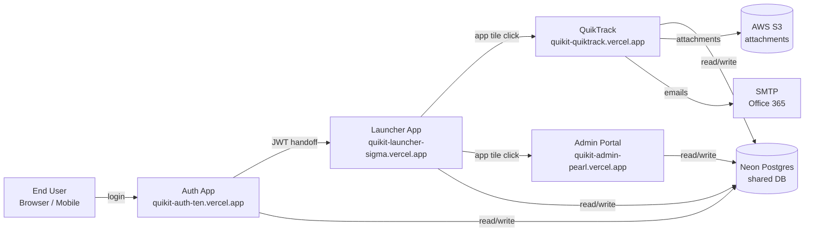
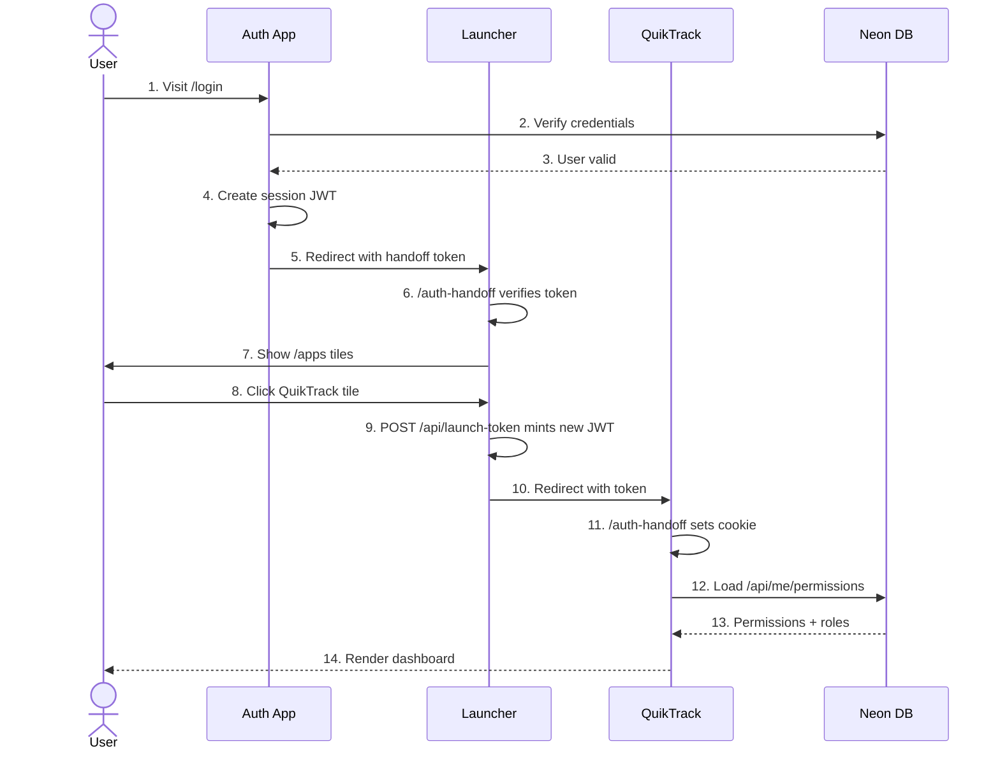
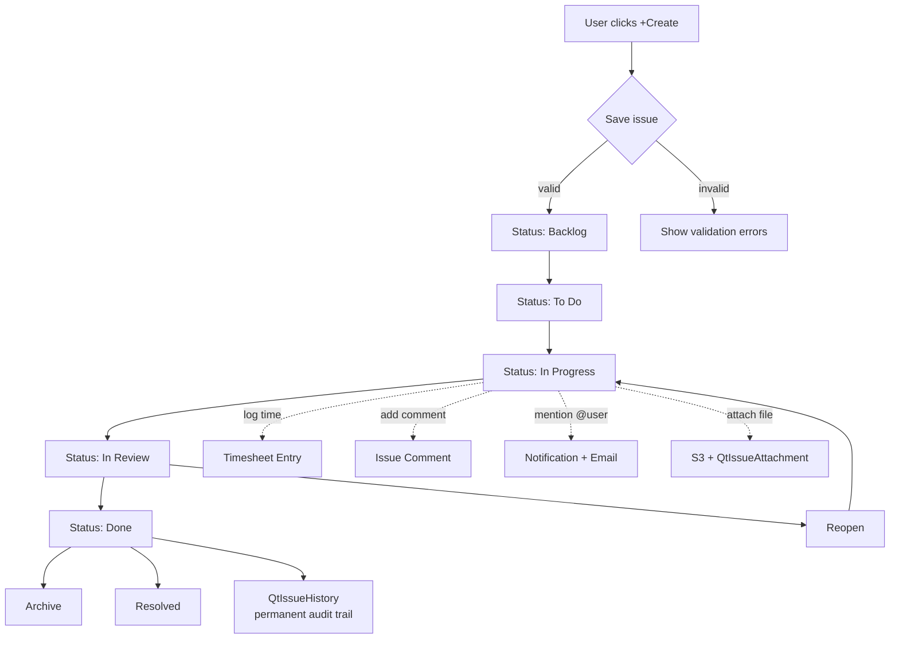
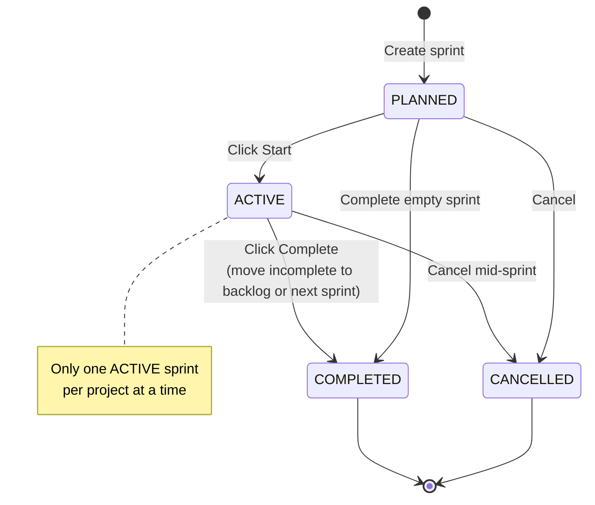
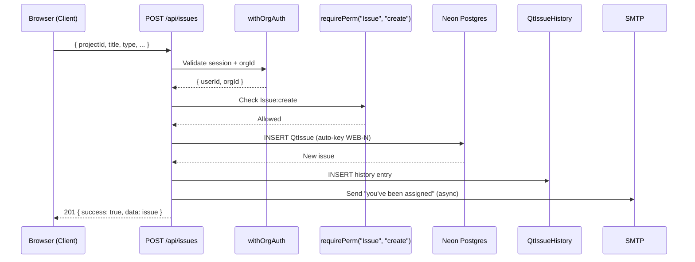
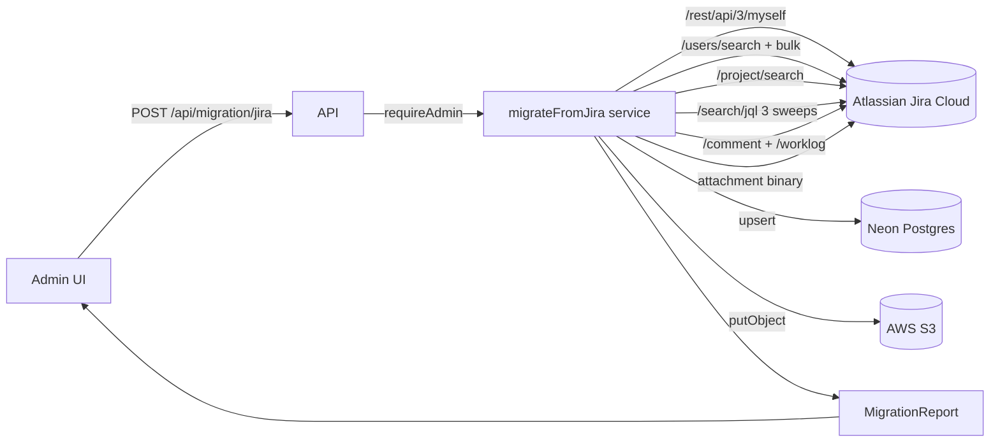

# Table of Contents

| # | Section |
|---|---|
| 1 | **Platform Overview & System Flow** |
| 2 | **Feature Catalog** — every working feature with description |
| 3 | **Use Cases & Workflows** — 63 end-to-end persona journeys |
| 4 | **Test Scenarios** — 60-section QA matrix (best + worst case) |
| 5 | **API Reference** — every endpoint, method, body, response |
| 6 | **Jira Migration Guide** — how data flows from Atlassian Jira Cloud into QuikTrack |

---

# 1. Platform Overview & System Flow

QuikTrack is the work-management module of the **QuikIT** platform — a multi-tenant SaaS for project, sprint, and issue tracking. It shares identity, organization data, and navigation with sibling apps (QuikScale, Admin Portal, Auth App, and others).

## 1.1 Platform Architecture

**Key properties:**
- **Single sign-on:** one login, every app authenticated via cross-domain JWT handoff.
- **Shared identity:** users, orgs, memberships live in shared `auth` + `quikit` Postgres schemas.
- **Per-app data:** quiktrack-specific data lives in `app_quiktrack` schema for clean isolation.
- **Multi-tenant:** every row is scoped by `orgId`; tenant-isolation enforced on every API call.

---

## 1.2 User Authentication & Cross-App Flow

Because `*.vercel.app` is on the Public Suffix List, cookies can't be shared across subdomains. The platform bridges sessions using **short-lived (120s) HS256 JWTs signed with a shared `INTERNAL_SECRET`** — each consumer app's `/auth-handoff` endpoint exchanges the token for its own domain-scoped NextAuth cookie.

---

## 1.3 Issue Lifecycle Flow

---

## 1.4 Sprint Lifecycle

---

## 1.5 Data Flow — Create Issue API

---

## 1.6 Migration Flow Overview (Jira → QuikTrack)

Detailed in Section 6 of this document.

---
