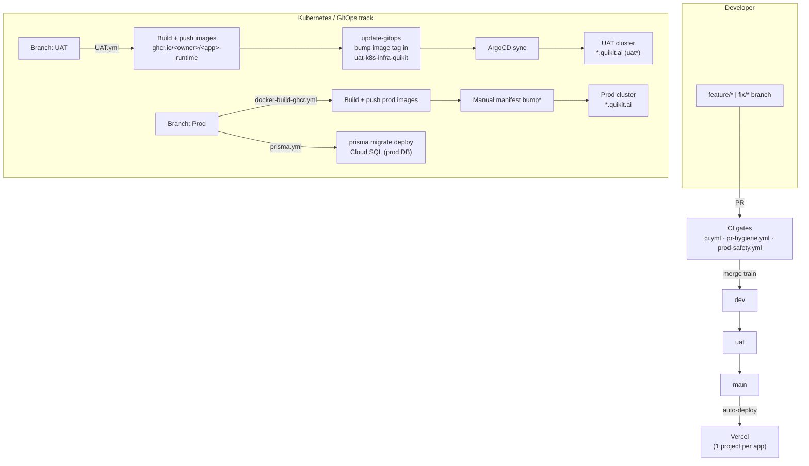

# 14 — UAT & Production Deployment Guide

> **Audience:** Every engineer who needs to ship QuikIT code to **UAT** or
> **Production**. This is the single, authoritative, self-serve runbook — read
> it end-to-end once, then use it as a checklist per deploy. You should be able
> to perform both a UAT and a Production deployment by following this document
> alone.
>
> **Prerequisite reading:** [`00-getting-started.md`](./00-getting-started.md),
> [`02-integration-protocol.md`](./02-integration-protocol.md), and the root
> [`CLAUDE.md`](../CLAUDE.md) Git Workflow section.
>
> _Last updated: 2026-07-21._

---

## Table of Contents

1. [Overview & audience](#1-overview--audience)
2. [Deployment architecture at a glance](#2-deployment-architecture-at-a-glance)
3. [Repository & branch strategy](#3-repository--branch-strategy)
4. [Prerequisites & required access](#4-prerequisites--required-access)
5. [Branch naming conventions](#5-branch-naming-conventions)
6. [Git workflow (pull, branch, merge, push)](#6-git-workflow-pull-branch-merge-push)
7. [GitHub Actions / CI-CD reference](#7-github-actions--ci-cd-reference)
8. [UAT deployment — step by step](#8-uat-deployment--step-by-step)
9. [Production deployment — step by step](#9-production-deployment--step-by-step)
10. [Docker image build & registry](#10-docker-image-build--registry)
11. [Kubernetes deployment](#11-kubernetes-deployment)
12. [Build verification steps](#12-build-verification-steps)
13. [Environment variables & secrets overview](#13-environment-variables--secrets-overview)
14. [Rollback procedure](#14-rollback-procedure)
15. [Pre-deployment checklist](#15-pre-deployment-checklist)
16. [Post-deployment / verification checklist](#16-post-deployment--verification-checklist)
17. [Common issues & troubleshooting](#17-common-issues--troubleshooting)
18. [Best practices & precautions](#18-best-practices--precautions)
19. [Frequently asked questions (FAQ)](#19-frequently-asked-questions-faq)
20. [Appendix — app → image → GitOps file → domain reference](#20-appendix--app--image--gitops-file--domain-reference)

---

## 1. Overview & audience

QuikIT is a **Turborepo monorepo** of Next.js apps (`apps/*`), shared packages
(`packages/*`), and standalone services (`services/*`). It ships through **two
parallel deployment tracks**. Understanding which is which is the single most
important thing in this guide:

| Track | What it deploys | Trigger branch | Status |
|---|---|---|---|
| **Docker → GHCR → Kubernetes (GitOps)** | Container images for every app + the realtime gateway, run on a Kubernetes cluster | **`UAT`** (→ UAT cluster) and **`Prod`** (→ prod images + DB migrations) | **Primary / current** — this is the path this guide is built around |
| **Vercel** | The same Next.js apps as serverless deployments, one Vercel project per app | **`main`** | **Parallel / legacy** — auto-deploys, documented here for completeness |

> ⚠️ **Do not confuse the branches.** The feature-integration flow
> (`dev → uat → main`) and the container-deploy branches (`UAT`, `Prod`) are
> **different branches** with **different casing**. See
> [§3](#3-repository--branch-strategy).

This guide centers on the **Kubernetes/GitOps track** (Docker, GHCR,
Kubernetes, rollback) and cross-links the Vercel details rather than
duplicating them.

---

## 2. Deployment architecture at a glance



> `*` The prod pipeline builds and pushes images automatically but — unlike
> UAT — has **no automated GitOps bump**. See [§9](#9-production-deployment--step-by-step).

> 📸 _Screenshot placeholder: GitHub → Actions tab showing a green
> "UAT-pipeline" run with the `detect-changes → build → update-gitops` job graph._

> 📸 _Screenshot placeholder: ArgoCD dashboard showing the `quikit` application
> group **Synced / Healthy**._

---

## 3. Repository & branch strategy

### 3.1 The two branch families

**A. Integration/release branches (feature flow — from root `CLAUDE.md`):**

```
feature/* | fix/* | chore/* | refactor/*   →  dev  →  uat  →  main
```

- Merges to `dev` use `--no-ff`; `uat` and `main` are **fast-forward only**.
- **Never** hand-commit to `dev`, `uat`, or `main` — they only receive merges.
- `main` is what auto-deploys to **Vercel** (production for the Vercel track).

**B. Container-deploy branches (Kubernetes track):**

| Branch | Casing | Deploys | Workflow(s) |
|---|---|---|---|
| **`UAT`** | UPPER | UAT Kubernetes cluster | `UAT.yml` |
| **`Prod`** | Title | Prod container images + prod DB migrations | `docker-build-ghcr.yml`, `prisma.yml` |

> ⚠️ **Casing matters.** `uat` (lowercase, integration branch) and `UAT`
> (uppercase, deploy branch) are **two different branches**. GitHub branch
> names are case-sensitive. The CI gates run on `dev/uat/main`; the container
> pipelines run on `UAT/Prod`.

### 3.2 How code flows to a cluster

1. You merge your feature through the normal train to a release branch.
2. To deploy to **UAT**, the release content is brought onto the **`UAT`**
   branch (see [§8](#8-uat-deployment--step-by-step)).
3. To deploy to **Production**, it is brought onto the **`Prod`** branch (see
   [§9](#9-production-deployment--step-by-step)).

> Confirm your team's exact promotion mapping (which release branch feeds
> `UAT`/`Prod`) with the platform owner — the pipelines only care that code
> lands on `UAT`/`Prod`, not how it got there.

---

## 4. Prerequisites & required access

Before your first deployment, request the following. "Who to ask" = the
platform/integration owner unless noted.

| # | Access | Needed for | How to verify you have it |
|---|---|---|---|
| 1 | **Write access to this GitHub repo** | Push deploy branches, run workflows | You can see the **Actions** tab and the **Run workflow** button |
| 2 | **GHCR (GitHub Container Registry) read/write** | Pull/inspect built images | `docker login ghcr.io` succeeds with your GitHub PAT (scope `write:packages`) |
| 3 | **Access to the GitOps repo** `akhileshgandhi/uat-k8s-infra-quikit` | Inspect/rollback UAT (and prod) K8s manifests | You can clone it |
| 4 | **Kubernetes cluster access** (`kubeconfig`) | Inspect pods, roll back, read logs | `kubectl get pods -n <namespace>` returns rows |
| 5 | **ArgoCD access** (if used for sync) | Watch/trigger sync, see health | You can log into the ArgoCD UI |
| 6 | **GCP / Cloud SQL access** | Prod DB migrations & inspection | You can start the Cloud SQL Auth Proxy against `red-seeker-477810-i0:asia-south1:quikit-db` |
| 7 | **Vercel team access** (parallel track only) | Vercel deploys / rollbacks | You appear in the Vercel team `quikit` |
| 8 | **Repository/Actions secrets** are already set (see [§13](#13-environment-variables--secrets-overview)) | CI to build & deploy | You don't manage these day-to-day; the owner does |

**Local tooling:** `git`, `node 20`, `npm 11.x`, `docker` (with BuildKit),
`kubectl`, optionally `yq`, and the Vercel CLI if you touch the Vercel track.

> 📸 _Screenshot placeholder: GitHub → Settings → Secrets and variables →
> Actions, showing the repository secrets list (names only)._

---

## 5. Branch naming conventions

Enforced by [`pr-hygiene.yml`](../.github/workflows/pr-hygiene.yml) on every PR
to `dev/uat/main`:

| Prefix | Use for |
|---|---|
| `feature/<short-description>` | New functionality |
| `fix/<short-description>` | Bug fixes |
| `chore/<short-description>` | Maintenance, docs, non-code |
| `refactor/<short-description>` | Structural changes, no behavior change |
| `integrate-*` | Reserved for the integration owner (`integrate-app.sh`) |

**Commit messages** must follow **Conventional Commits** (also enforced by
`pr-hygiene.yml`):

```
type(scope): subject

# examples
feat(quikscale): add KPI export button
fix(quikcrm): debounce lead search input
chore(docs): add deployment guide
```

Valid types: `feat|fix|chore|refactor|docs|test|perf|build|ci`. Merge commits
(starting with `Merge`) are exempt.

---

## 6. Git workflow (pull, branch, merge, push)

### 6.1 Start every change on a fresh branch

```bash
git checkout dev
git pull --ff-only origin dev
git checkout -b feature/my-change      # never edit on dev/uat/main directly
```

Confirm you are not on a protected branch before editing:

```bash
git branch --show-current
```

### 6.2 Standard merge train

```
feature/* | fix/*   →  dev (--no-ff)  →  uat (ff-only)  →  main (ff-only)
```

### 6.3 Pre-push deploy-impact check (MANDATORY)

Before **any** `git push`, compute which apps/packages your commits touch and
report the deploy impact. Use the helper:

```bash
node scripts/affected-apps.mjs <from-ref> <to-ref>
```

It groups changes into `quikit | quikscale | admin | packages/<name> | other`.
A change under `packages/**` (or root `package.json`/`turbo.json`) is a
**shared** change and rebuilds **every** app.

> **Why:** on the Vercel track, only `main` redeploys; on the Kubernetes track,
> a shared change makes `UAT.yml` / `docker-build-ghcr.yml` build **all** apps.
> Announce the blast radius before pushing.

### 6.4 After the merge train reaches `main`

Delete the feature branch locally and on origin:

```bash
git branch -d <branch>
git push origin --delete <branch>
```

---

## 7. GitHub Actions / CI-CD reference

All workflows live in [`.github/workflows/`](../.github/workflows/).

| Workflow (file) | Trigger | What it does | Outcome |
|---|---|---|---|
| **CI** (`ci.yml`) | PR + push to `dev/uat/main` | `npm ci` → `db:generate` → turbo `lint`/`typecheck`/`test` → quikscale coverage + `coverage-ratchet.mjs` → `npm audit` (soft) → `prisma migrate status`. Separate **e2e** job (Postgres 16 + Playwright) runs **only on push to `main`**. | Green = safe to merge |
| **PR Hygiene** (`pr-hygiene.yml`) | PR to `dev/uat/main` | Branch-name regex, Conventional-Commits check, flags any `packages/` change | Blocks bad branch/commit names |
| **Prod safety gate** (`prod-safety.yml`) | PR + push to `dev/uat/main` | `node scripts/check-prod-urls.mjs` — fails if `localhost`/`127.0.0.1` appears in prod code paths | Blocks localhost leaking to prod |
| **E2E** (`e2e.yml`) | Nightly cron `0 3 * * *` + manual dispatch | Full Playwright suite against a seeded Postgres | Nightly regression signal (not a PR gate) |
| **UAT-pipeline** (`UAT.yml`) | Push to **`UAT`** + manual dispatch | Detect changed apps → build & push Docker images to GHCR → **bump image tags in the GitOps repo** | **Deploys to UAT cluster** |
| **Docker Build and Push to GHCR** (`docker-build-ghcr.yml`) | Push to **`Prod`** + manual dispatch | Detect changed apps → build & push **prod** Docker images to GHCR | Prod images published (manifest bump is manual) |
| **Prisma — migrate deploy** (`prisma.yml`) | Push to **`Prod`** + manual dispatch | GCP auth → Cloud SQL Auth Proxy → `prisma migrate deploy` → `migrate status` | **Applies migrations to prod DB** |

> There is also `dev-repo-ci.yml.template` — a template copied into per-developer
> repos during onboarding; it is **not** an active workflow here.

**Change detection:** both deploy workflows use
[`dorny/paths-filter`](https://github.com/dorny/paths-filter). A change to
`packages/**`, root `package.json`, `package-lock.json`, or `turbo.json` (the
`shared` filter) — or a **manual `workflow_dispatch`** — rebuilds **all** apps.
Otherwise only the apps whose `apps/<app>/**` (or `services/realtime/**`)
changed are built.

> 📸 _Screenshot placeholder: the "Run workflow" dropdown on the Actions tab for
> the UAT-pipeline (workflow_dispatch)._

---

## 8. UAT deployment — step by step

**Goal:** get the latest code running on the UAT Kubernetes cluster
(`*.quikit.ai` on the `uat*` hostnames).

### Step 1 — Make sure CI is green

Your change must already have passed the CI gates (§7) on its PR/merge. Do not
deploy red code.

### Step 2 — Land the code on the `UAT` branch

Bring the release content onto the **`UAT`** branch (uppercase). Typical flow:

```bash
git fetch origin
git checkout UAT
git pull --ff-only origin UAT
git merge --ff-only origin/uat      # or your team's promotion source
git push origin UAT
```

> Confirm the exact source branch that feeds `UAT` with the platform owner if
> your team promotes differently. The pipeline only requires that the code
> lands on `UAT`.

The push to `UAT` triggers **UAT-pipeline** (`UAT.yml`). You can also run it
manually: **Actions → UAT-pipeline → Run workflow** (a manual run rebuilds
**all** apps).

### Step 3 — Watch the pipeline

**Actions → UAT-pipeline** → open the latest run. Three job stages:

1. **Detect Changed Apps** — prints the app matrix that will build.
2. **Build `<app>`** (one per changed app) — builds the Docker image and pushes
   to `ghcr.io/<owner>/<app>-runtime` with tags `build-<run_number>` and
   `sha-<short-sha>`. UAT `NEXT_PUBLIC_*` values are baked in as build args
   (e.g. `uatscale.quikit.ai`, `ws://uatsockets.quikit.ai`).
3. **Update GitOps Repository** — checks out `akhileshgandhi/uat-k8s-infra-quikit`,
   rewrites the image tag in each app's `quikit/<file>-deployment.yaml` to
   `sha-<short-sha>`, commits, and pushes.

### Step 4 — Verify the image reached GHCR

```bash
# List tags for an app image (needs a GHCR-scoped token)
docker pull ghcr.io/akhileshgandhi/quikscale-runtime:sha-<short-sha>
```

Or browse **GitHub → Packages** and confirm the new `sha-*` tag exists.

### Step 5 — Confirm the GitOps commit & ArgoCD sync

- In `uat-k8s-infra-quikit`, confirm the auto-commit
  `Update UAT images to sha-<short-sha>` bumped the right
  `quikit/<file>-deployment.yaml`.
- In **ArgoCD**, wait for the `quikit` app group to go **Synced / Healthy**
  (or trigger a manual sync). ArgoCD applies the manifest change to the cluster.

```bash
# If you use kubectl directly:
kubectl -n <uat-namespace> rollout status deploy/<app>
kubectl -n <uat-namespace> get pods -l app=<app>
```

### Step 6 — Smoke test the UAT URL

Open the relevant UAT hostname (see [§20](#20-appendix--app--image--gitops-file--domain-reference)),
log in, and exercise the changed feature. Run the
[post-deployment checklist](#16-post-deployment--verification-checklist).

> 📸 _Screenshot placeholder: the UAT-pipeline run summary with all three jobs
> green and the GitOps commit link._

---

## 9. Production deployment — step by step

**Goal:** ship to production. Prod involves **two** workflows (images **and**
DB migrations) plus a **manual manifest step**. Do them in order.

> ⚠️ **Migrations first, then images.** Deploying new code that expects a
> column that doesn't exist yet causes runtime errors. Run the Prisma migration
> before (or alongside) the image rollout, using an expand→contract strategy
> for breaking changes.

### Step 1 — Pre-flight

- CI green on the release branch.
- UAT has been validated (§8) with the same commit.
- Review pending migrations locally:
  ```bash
  npm run db:migrate:status
  ```
- Complete the [pre-deployment checklist](#15-pre-deployment-checklist).

### Step 2 — Apply prod database migrations

Push to `Prod` triggers `prisma.yml` automatically, **or** run it on demand:
**Actions → "Prisma — migrate deploy" → Run workflow**.

It authenticates to GCP (`GCP_SA_KEY`), starts the **Cloud SQL Auth Proxy**
against `red-seeker-477810-i0:asia-south1:quikit-db`, then runs:

```bash
npx prisma migrate deploy --schema=packages/database/prisma/schema.prisma
npx prisma migrate status  --schema=packages/database/prisma/schema.prisma
```

Confirm the run ends with **"Database schema is up to date"**.

### Step 3 — Land the code on the `Prod` branch (builds images)

```bash
git fetch origin
git checkout Prod
git pull --ff-only origin Prod
git merge --ff-only origin/main     # or your team's promotion source
git push origin Prod
```

The push triggers **"Docker Build and Push to GHCR"** (`docker-build-ghcr.yml`):
detect changed apps → build & push **prod** images to
`ghcr.io/<owner>/<app>-runtime` with prod `NEXT_PUBLIC_*` build args
(`scale.quikit.ai`, `authn.quikit.ai`, etc.).

> ⚠️ **Known gap:** the prod docker workflow currently builds
> `quikit, auth, admin, quikscale, quiktrack, quikinfra, quikcrm, quikhrms,
> quiksupport, quikasset` — it does **not** include `quikchat` or the
> `realtime` gateway (those are only in the UAT pipeline today). If you are
> deploying chat/realtime to prod, coordinate with the platform owner.

### Step 4 — Promote the images to the prod cluster (manual)

Unlike UAT, **there is no automated `update-gitops` step for prod**. After the
prod images are in GHCR, the prod Kubernetes manifests must be updated to the
new `sha-<short-sha>` tag. Confirm the current process with the platform owner —
typically one of:

- Editing the prod app manifests in the GitOps repo (bump
  `.spec.template.spec.containers[0].image` to the new tag) and letting ArgoCD
  sync, **or**
- `kubectl -n <prod-namespace> set image deploy/<app> <container>=ghcr.io/akhileshgandhi/<app>-runtime:sha-<short-sha>`

```bash
kubectl -n <prod-namespace> rollout status deploy/<app>
```

### Step 5 — Verify & smoke test

- ArgoCD `quikit` group **Synced / Healthy** (or `kubectl rollout status` clean).
- Open the production hostname (see [§20](#20-appendix--app--image--gitops-file--domain-reference)),
  log in, exercise the change.
- Run the [post-deployment checklist](#16-post-deployment--verification-checklist).

### Vercel (parallel track)

If the app is served via Vercel in production, merging to **`main`**
auto-deploys it (per-app `vercel.json`, gated so only `main` builds). No manual
action needed. For a one-off preview: `vercel --prod=false`. Ad-hoc REST-based
deploys exist under `scripts/_deploy-api.mjs` / `_create-deploy.mjs` (owner
tooling — not the normal path).

---

## 10. Docker image build & registry

### 10.1 Registry & naming

- **Registry:** GitHub Container Registry — `ghcr.io`.
- **Image name:** `ghcr.io/<owner>/<app>-runtime` (owner lowercased;
  effectively `ghcr.io/akhileshgandhi/<app>-runtime`).
- **Tags per build:** `build-<github_run_number>` and `sha-<short-sha>`. The
  GitOps deploy references the **`sha-*`** tag (immutable, traceable to a commit).

### 10.2 Dockerfile pattern (all apps + realtime)

Every image uses the same multi-stage `node:20-alpine` build (see e.g.
[`apps/quikscale/Dockerfile`](../apps/quikscale/Dockerfile) and
[`services/realtime/Dockerfile`](../services/realtime/Dockerfile)):

1. **builder** — `npm i -g turbo`, `COPY . .`, then
   `turbo prune <target> --docker` to slice the monorepo down to just that
   target and its workspace deps.
2. **installer** — `npm ci --ignore-scripts` on the pruned deps →
   `npx prisma generate --schema=packages/database/prisma/schema.prisma` →
   `npx turbo build --filter=<target>`. Build-time `DATABASE_URL` and
   `NEXTAUTH_*` are **placeholders** (Prisma/Next initialize at build but never
   connect to a real DB). For Next apps, `NEXT_PUBLIC_*` build args are written
   into `.env.production` so they get baked into the client bundle.
3. **runner** — minimal Alpine + `openssl`, **non-root** user (uid 1001).
   Next apps copy the `standalone` server + static + public + Prisma engines and
   run `node apps/<app>/server.js`. The realtime gateway copies the esbuild
   `dist/` and runs `node dist/index.js` with a `/health` `HEALTHCHECK`.

**Ports:** Next standalone apps bind their own port (e.g. quikscale `3003`);
the realtime gateway listens on `9100`.

### 10.3 Build an image locally (from the monorepo root)

```bash
# A Next.js app
docker build -f apps/quikscale/Dockerfile -t quikscale-runtime:local .

# The realtime gateway
docker build -f services/realtime/Dockerfile -t realtime-gateway:local .

# Optional: pass a real DATABASE_URL (defaults to a build-time placeholder)
docker build --build-arg DATABASE_URL="postgresql://..." \
  -f apps/quikscale/Dockerfile -t quikscale-runtime:local .
```

The [`.dockerignore`](../.dockerignore) at the repo root keeps `node_modules`,
`.next`, `.turbo`, `.env*` (except examples), and `.git` out of the build
context.

---

## 11. Kubernetes deployment

### 11.1 Where the manifests live

**There are no Kubernetes manifests in this repository.** The cluster
definitions (Deployments/Services/Ingress/Secrets) live in the external GitOps
repo **`akhileshgandhi/uat-k8s-infra-quikit`**, under `quikit/`.

`UAT.yml`'s `update-gitops` job edits the `image:` field of each app's
`quikit/<file>-deployment.yaml` there, and **ArgoCD** reconciles the cluster to
match the repo (GitOps model — the repo is the source of truth).

### 11.2 The app → manifest filename map

The manifest filenames don't all match the app names — use this map (from
`UAT.yml`):

| App | GitOps deployment file |
|---|---|
| auth | `auth-deployment.yaml` |
| admin | `admin-deployment.yaml` |
| quikit | `quikit-deployment.yaml` |
| quiktrack | `quikittrack-deployment.yaml` |
| quikscale | `quikitscale-deployment.yaml` |
| quikinfra | `quikitinfra-deployment.yaml` |
| quikcrm | `crm-deployment.yaml` |
| quikhrms | `hrms-deployment.yaml` |
| quiksupport | `support-deployment.yaml` |
| quikasset | `asset-deployment.yaml` |
| quikchat | `chat-deployment.yaml` |
| realtime | `socket-deployment.yaml` |

### 11.3 Useful inspection commands

```bash
# Pods and rollout status
kubectl -n <namespace> get pods
kubectl -n <namespace> rollout status deploy/<app>

# Which image tag is currently running?
kubectl -n <namespace> get deploy/<app> -o jsonpath='{.spec.template.spec.containers[0].image}'

# Logs (add -f to follow)
kubectl -n <namespace> logs deploy/<app> --tail=100

# Realtime gateway health (port 9100 inside the pod)
kubectl -n <namespace> port-forward deploy/realtime 9100:9100
curl -s http://localhost:9100/health
```

### 11.4 Companion worker processes

Some apps ship a **second long-running process** beyond the web server that
needs its own deployment/scaling (built from the same app image, different
command):

| App | Worker | Purpose |
|---|---|---|
| quikcrm | `npm run worker` (BullMQ) | Imports, SLA checks, notification crons — requires `REDIS_URL` |
| quiksupport | email worker (`workers/email-worker.ts`) | Async ticket email; without it, email is a no-op (ticket still saves) |

When deploying these apps, confirm the worker Deployment exists and points at
the same image tag as the web Deployment.

> 📸 _Screenshot placeholder: `kubectl get pods` output for the UAT namespace,
> all pods `Running`._

---

## 12. Build verification steps

Run these **before** pushing to a deploy branch — they catch what CI would
catch, faster:

```bash
npm ci                     # clean install
npm run db:generate        # generate Prisma client
npx turbo run lint         # lint all workspaces
npx turbo run typecheck    # tsc --noEmit across workspaces
npx turbo run test         # unit/component/API tests
npm run db:migrate:status  # any un-applied migrations?
```

**Verify the container actually builds** (this is what the deploy pipeline
does):

```bash
docker build -f apps/<app>/Dockerfile -t <app>-runtime:local .
docker run --rm -p 3003:3003 --env-file apps/<app>/.env.local <app>-runtime:local
# then hit http://localhost:<port> and the app's health/login page
```

Prod-safety locally (no localhost leaking to prod code):

```bash
node scripts/check-prod-urls.mjs
```

---

## 13. Environment variables & secrets overview

There are **three** distinct places configuration lives. Keep them straight.

### 13.1 GitHub Actions secrets (used by the pipelines)

| Secret | Used by | Purpose |
|---|---|---|
| `GITHUB_TOKEN` (built-in) | `UAT.yml`, `docker-build-ghcr.yml` | Push images to GHCR |
| `K8S_REPO_TOKEN` | `UAT.yml` | Push image-tag bump to the GitOps repo |
| `GCP_SA_KEY` | `prisma.yml` | Authenticate to Google Cloud for Cloud SQL |
| `PROD_DATABASE_URL` | `prisma.yml` | Prod DB connection for `migrate deploy` |
| `DATABASE_URL` | `ci.yml` | `prisma migrate status` in CI |

> These are configured under **GitHub → Settings → Secrets and variables →
> Actions** by the owner. You don't edit them per deploy.

### 13.2 Build-time env (baked into images)

`NEXT_PUBLIC_*` values (and `NEXTAUTH_URL`) are **compiled into** each image at
build time via the workflows' `build-args`. That means **the environment a build
targets is fixed when the image is built** — a UAT image points at `uat*.quikit.ai`,
a prod image at `*.quikit.ai`. You cannot repoint a `NEXT_PUBLIC_*` value at
runtime; you rebuild.

### 13.3 Runtime env (Kubernetes Secrets / Vercel env)

Server-only secrets are injected at **runtime** — as Kubernetes `Secret`s in the
GitOps repo (K8s track) or Vercel project env vars (Vercel track):
`DATABASE_URL` / `DATABASE_URL_DIRECT`, `NEXTAUTH_SECRET`, `INTERNAL_SECRET`,
`REDIS_URL`, `SMTP_*`, per-app OAuth client secrets, etc.

**Critical invariants** (from
[`docs/13-app-ports-and-env.md`](./13-app-ports-and-env.md)):

- `NEXTAUTH_SECRET` and `INTERNAL_SECRET` **must be identical across every app**
  — a mismatch silently breaks SSO.
- `DATABASE_URL` is the **pooled** URL; `DATABASE_URL_DIRECT` **bypasses the
  pooler** and is what migrations use.
- `REDIS_URL` must be shared correctly; for the realtime gateway it **must be
  the same Redis instance** that `apps/quikchat` publishes to.

**Realtime gateway contract** (`services/realtime/.env.example`):

| Var | Notes |
|---|---|
| `REALTIME_TOKEN_SECRET` | **Required** — the process exits on boot if unset |
| `REDIS_URL` | Must match the `apps/quikchat` publisher instance |
| `REALTIME_ALLOWED_ORIGINS` | CSV of allowed Socket.IO CORS origins |
| `PORT` | Default `9100` (`REALTIME_PORT` also accepted) |
| `DATABASE_URL` / `DATABASE_URL_DIRECT` | Membership / presence reads |
| `REALTIME_MAX_BUFFER_BYTES` | Max inbound frame size (default 1 MB) |

**Full references (do not duplicate — link):**
[`docs/13-app-ports-and-env.md`](./13-app-ports-and-env.md) (every app, every
var) and [`docs/PRODUCTION_ENV_VARS.md`](./PRODUCTION_ENV_VARS.md) (prod/Vercel
checklist + post-deploy sanity checks).

> 🔒 **Never print or commit secret *values*.** This guide lists names only.

---

## 14. Rollback procedure

### 14.1 Kubernetes (UAT & Prod) — roll back the image

Because every build is tagged with an immutable `sha-<short-sha>`, rolling back
= pointing the Deployment at the previous good tag.

**Option A — GitOps (preferred, keeps repo as source of truth):**
In `uat-k8s-infra-quikit`, edit the app's `quikit/<file>-deployment.yaml`,
set `image:` back to the previous `ghcr.io/akhileshgandhi/<app>-runtime:sha-<old>`,
commit & push. ArgoCD syncs the cluster back.

**Option B — imperative (fast, for incidents; reconcile the repo afterward):**

```bash
# Roll back to the previous ReplicaSet
kubectl -n <namespace> rollout undo deploy/<app>

# Or pin an explicit previous tag
kubectl -n <namespace> set image deploy/<app> \
  <container>=ghcr.io/akhileshgandhi/<app>-runtime:sha-<old-sha>

kubectl -n <namespace> rollout status deploy/<app>
```

> ⚠️ If you use Option B during an incident, **update the GitOps repo to match**
> afterward, or ArgoCD will re-sync forward to the broken image.

### 14.2 Database migrations

Prisma `migrate deploy` is **forward-only** — there is no automatic "down".
- Prefer **expand → contract**: additive migrations that are backward
  compatible, so rolling back the app does not require rolling back the schema.
- If a migration must be reversed, write a **new** compensating migration and
  deploy it through `prisma.yml`. Coordinate with the DB owner; take a Cloud SQL
  backup/snapshot first.

### 14.3 Vercel (parallel track)

**Vercel dashboard → project → Deployments → (a previous production
deployment) → Promote to Production**, or `vercel rollback <url>`.

---

## 15. Pre-deployment checklist

- [ ] On a `feature/*|fix/*|chore/*|refactor/*` branch (not `dev/uat/main`).
- [ ] CI green (lint, typecheck, test, coverage ratchet, prod-safety).
- [ ] `npm run db:migrate:status` reviewed — you know which migrations will run.
- [ ] Migrations are backward-compatible (expand→contract) or a plan exists.
- [ ] `node scripts/affected-apps.mjs <base> <head>` run; deploy blast radius
      announced.
- [ ] Any new/changed **runtime** env vars are set in the target
      (K8s Secret / Vercel env) — see [§13](#13-environment-variables--secrets-overview).
- [ ] For UAT: change validated in a PR review.
- [ ] For Prod: the **same commit** already validated on UAT.
- [ ] Deploy window / stakeholders informed if user-facing.

---

## 16. Post-deployment / verification checklist

- [ ] Target workflow run is **green** (UAT-pipeline / docker-build-ghcr / prisma).
- [ ] New `sha-<short-sha>` image tag exists in GHCR.
- [ ] (UAT) GitOps auto-commit present; (Prod) manifest bumped manually.
- [ ] ArgoCD `quikit` group **Synced / Healthy** (or `kubectl rollout status` clean).
- [ ] `kubectl get deploy/<app> -o jsonpath='{...image}'` shows the new tag.
- [ ] App loads on the correct hostname (see [§20](#20-appendix--app--image--gitops-file--domain-reference)); **login works** (SSO cookie decodes → `NEXTAUTH_SECRET` correct across apps).
- [ ] The specific changed feature works end-to-end.
- [ ] No error spikes in logs (`kubectl logs` / Sentry if configured).
- [ ] Realtime features (chat/presence) connect if `realtime` was deployed
      (`/health` OK, WS handshake succeeds).
- [ ] Prod sanity checks from [`PRODUCTION_ENV_VARS.md` §5](./PRODUCTION_ENV_VARS.md)
      (CORS allow-list, email link origins, Redis connectivity).

---

## 17. Common issues & troubleshooting

| Symptom | Likely cause | Fix |
|---|---|---|
| **My app didn't build in the pipeline** | `paths-filter` saw no change under `apps/<app>/**` | Trigger a manual `workflow_dispatch` run (rebuilds all), or ensure your commit actually touched the app |
| **Image built but the cluster still runs old code** | GitOps not synced / (prod) manifest not bumped | Check the GitOps commit; trigger ArgoCD sync; for prod, do the manual manifest bump (§9 step 4) |
| **`NEXT_PUBLIC_*` value is wrong / points at localhost** | It's **build-time** baked; changing runtime env won't fix it | Rebuild the image with correct build-args (the workflows set these); check `prod-safety` |
| **BuildKit reused a stale layer; new env didn't reach the bundle** | Build-arg cache-bust missed | The Dockerfiles bake `NEXT_PUBLIC_*` into `.env.production` + a cache-bust `RUN echo` — verify those lines; clear GHA cache if needed |
| **Prisma engine error on Alpine at runtime** (`libssl` / query engine) | Missing `linux-musl-openssl` binary target or `openssl` pkg | Ensure `openssl` in the runner stage and the `binaryTargets` in `schema.prisma`; both realtime & app Dockerfiles install `openssl` |
| **`prisma migrate deploy` fails / drift** | Migrations out of order or applied out-of-band | Check `prisma migrate status`; never edit prod DB by hand; write a corrective migration |
| **Login loops / bounced to `/login` everywhere** | `NEXTAUTH_SECRET` or `INTERNAL_SECRET` mismatch across apps | Make the secret identical across every app + redeploy all |
| **CORS blocked on `/api/auth/forgot-password`** | `AUTH_CORS_ORIGINS` not set for prod origins | Set the CSV allow-list (see `PRODUCTION_ENV_VARS.md`) |
| **`prod-safety` gate failing** | `localhost`/`127.0.0.1` in a runtime code path | Run `node scripts/check-prod-urls.mjs` locally; drive the URL from env |
| **Realtime clients can't connect** | Gateway `REDIS_URL` ≠ quikchat publisher, or `REALTIME_TOKEN_SECRET` unset (pod crash-loops) | Align Redis instances; set the token secret; check `/health` |
| **Vercel deployed a non-`main` branch** | Misconfigured project | Only `main` should build — `vercel.json` `ignoreCommand` enforces this per app |

---

## 18. Best practices & precautions

- **Never hand-commit to `dev`, `uat`, `main`** (integration branches) — they
  only receive merges. `UAT`/`Prod` receive promotion pushes per the pipeline.
- **Migrations before images**, and prefer **expand→contract** so app rollbacks
  don't need schema rollbacks.
- **Deploy the same commit to prod that you validated on UAT** — don't
  hand-assemble a different tree for prod.
- **Announce blast radius**: a `packages/**` change rebuilds/redeploys *every*
  app. Run `scripts/affected-apps.mjs` first.
- **Rotate `NEXTAUTH_SECRET`/`INTERNAL_SECRET` across all apps together** and
  redeploy them all — a partial rotation breaks SSO.
- **Take a DB backup/snapshot before risky migrations.**
- **Keep the GitOps repo as the source of truth** — reconcile any imperative
  `kubectl` change back into it, or ArgoCD will fight you.
- **Secrets are names-only in docs** — never paste values into PRs, logs, or
  this guide.
- **Watch the run to green** — don't push and walk away; deployments can fail at
  build, migration, or sync.

---

## 19. Frequently asked questions (FAQ)

**Q: What's the difference between `uat` and `UAT`?**
`uat` (lowercase) is an integration/release branch in the `dev→uat→main` train
and a CI-gate target. `UAT` (uppercase) is the deploy branch that triggers the
Kubernetes UAT pipeline. They are different, case-sensitive branches.

**Q: Do I deploy to Vercel or Kubernetes?**
The Kubernetes/GitOps track (this guide) is primary. Vercel still auto-deploys
`main` as a parallel track. Confirm with the platform owner which is
authoritative for the specific app you're shipping.

**Q: How do I deploy just one app?**
Push a change that only touches `apps/<app>/**` — `paths-filter` builds just
that app. A manual `workflow_dispatch` run builds **all** apps.

**Q: Why did all apps rebuild when I only changed one file?**
You touched a `shared` path (`packages/**`, root `package.json`,
`package-lock.json`, or `turbo.json`), which forces a full rebuild.

**Q: The prod images built — why is prod still on the old version?**
The prod pipeline has no automated GitOps bump. You must promote the new image
tag to the prod cluster manually (§9 step 4).

**Q: Does the realtime gateway deploy to prod?**
Not via `docker-build-ghcr.yml` today — it (and `quikchat`) are only in the UAT
pipeline. Coordinate a prod plan with the platform owner.

**Q: How do I roll back fast?**
`kubectl -n <ns> rollout undo deploy/<app>` for an immediate revert, then
reconcile the GitOps repo. For Vercel, promote the previous deployment.

**Q: Where are the K8s manifests?**
In the external repo `akhileshgandhi/uat-k8s-infra-quikit`, not here.

**Q: Where's the full env-var list?**
[`docs/13-app-ports-and-env.md`](./13-app-ports-and-env.md) and
[`docs/PRODUCTION_ENV_VARS.md`](./PRODUCTION_ENV_VARS.md).

---

## 20. Appendix — app → image → GitOps file → domain reference

Image = `ghcr.io/akhileshgandhi/<name>-runtime`. Domains are illustrative of the
pattern the build-args encode; confirm exact hostnames/namespaces with the
platform owner.

| App / service | GHCR image | GitOps file | UAT domain | Prod domain |
|---|---|---|---|---|
| quikit (launcher/IdP) | `quikit-runtime` | `quikit-deployment.yaml` | `uatapps.quikit.ai` | `apps.quikit.ai` |
| auth | `auth-runtime` | `auth-deployment.yaml` | `uatauthn.quikit.ai` | `authn.quikit.ai` |
| admin | `admin-runtime` | `admin-deployment.yaml` | `uatorgadmin.quikit.ai` | `orgadmin.quikit.ai` |
| quikscale | `quikscale-runtime` | `quikitscale-deployment.yaml` | `uatscale.quikit.ai` | `scale.quikit.ai` |
| quiktrack | `quiktrack-runtime` | `quikittrack-deployment.yaml` | — | — |
| quikinsight | `quikinsight-runtime` | `quikinsight-deployment.yaml` | `uatinsights.quikit.ai` | `insights.quikit.ai` |
| quikinfra | `quikinfra-runtime` | `quikitinfra-deployment.yaml` | `uatinfra.quikit.ai` | `infra.quikit.ai` |
| quikcrm | `quikcrm-runtime` | `crm-deployment.yaml` | `uatcrm.quikit.ai` | `crm.quikit.ai` |
| quikhrms | `quikhrms-runtime` | `hrms-deployment.yaml` | `uatpeople.quikit.ai` | `people.quikit.ai` |
| quiksupport | `quiksupport-runtime` | `support-deployment.yaml` | `uatsupport.quikit.ai` | `support.quikit.ai` |
| quikasset | `quikasset-runtime` | `asset-deployment.yaml` | `uatasset.quikit.ai` | `asset.quikit.ai` |
| quikchat | `quikchat-runtime` | `chat-deployment.yaml` | `uatchat.quikit.ai` | _(UAT only today)_ |
| realtime (WS gateway) | `realtime-runtime` | `socket-deployment.yaml` | `uatsockets.quikit.ai` | _(UAT only today)_ |

---

_Questions this guide didn't answer? Update it — see
[`docs/README.md` → "Updating these docs"](./README.md). Fix the doc; don't
repeat the explanation in ten deploy threads._
